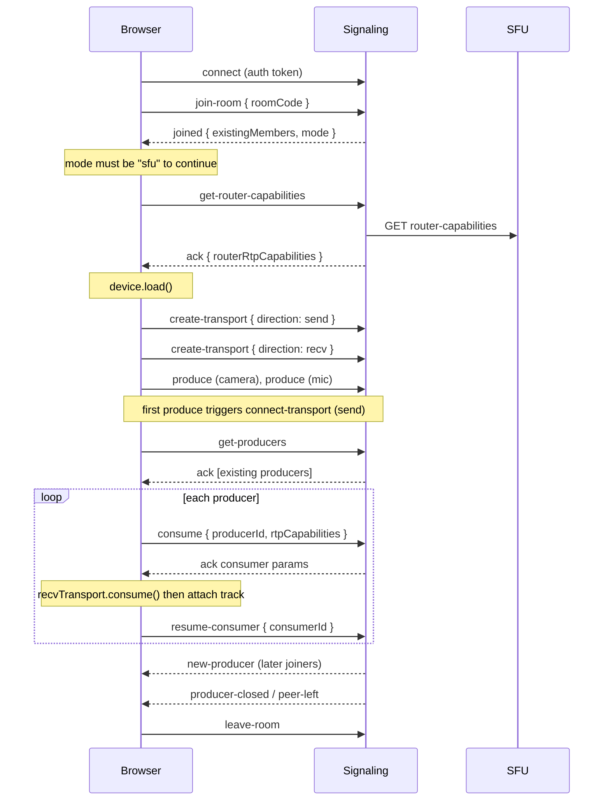

# Phase 9 — SFU Frontend Guide (Step 13)

> **Status:** ⏸ Not started. Build this **after all backend work is finished**.
> **Backend status:** SFU service, signaling integration and room mode are done and tested. See `phase-9-sfu-service.md`.
> **Only frontend work so far:** test pages (`test-client/sfu-one-click.html` and the mesh test client). There is no React app yet.
> **Libraries:** `mediasoup-client` (v3), `socket.io-client`, React. Adapt the snippets to your language (TypeScript or JavaScript) and state tool.

---

## 1. Goal and scope

**Goal:** a real call screen where every user sees and hears every other user through the SFU.

**In scope**

- Socket.io connection to Signaling with the JWT.
- Join, leave, rejoin.
- Load a mediasoup `Device`, create the send and receive transports.
- Publish camera and mic (and optionally screen share).
- Consume every other peer's streams, including late joiners and new producers.
- Video tiles, controls, error and reconnect handling.
- Respect the room `mode` (`sfu` or `mesh`).

**Out of scope for now (backend does not support it yet, see section 8)**

- Server-synced mute state, active speaker, display names for existing peers, simulcast, recording.

---

## 2. What the backend gives you (the contract)

### 2.1 Connection

```ts
const socket = io('http://localhost:4004', { auth: { token } });
```

- The token is the same access JWT as the REST API. It **expires after 15 minutes**. An expired token fails the handshake with `connect_error: Invalid or expired token`.
- `socket.id` is your `peerId` everywhere. You never send `peerId` or `roomId`. The server uses `socket.id` and the room you joined.

### 2.2 Events you send (request/response with an ack callback)

| Event                       | Payload                                          | Ack`data`                                                 |
| :-------------------------- | :----------------------------------------------- | :---------------------------------------------------------- |
| `join-room`               | `{ roomCode }`                                 | none, the server emits`joined`                            |
| `leave-room`              | none                                             | none                                                        |
| `get-router-capabilities` | none                                             | `{ routerRtpCapabilities }`                               |
| `create-transport`        | `{ direction: 'send' \| 'recv' }`               | `{ id, iceParameters, iceCandidates, dtlsParameters }`    |
| `connect-transport`       | `{ transportId, dtlsParameters }`              | `{ connected: true }`                                     |
| `produce`                 | `{ transportId, kind, rtpParameters, source }` | `{ producerId }`                                          |
| `get-producers`           | none                                             | `[{ producerId, peerId, kind, source }]`                  |
| `consume`                 | `{ producerId, rtpCapabilities }`              | `{ id, producerId, peerId, kind, source, rtpParameters }` |
| `resume-consumer`         | `{ consumerId }`                               | `{ resumed: true }`                                       |

**Ack shape:**

- Success: `{ success: true, data }`
- Failure: `{ success: false, statusCode, message }`

### 2.3 Events you receive

| Event               | Payload                                    | What to do                                                                                 |
| :------------------ | :----------------------------------------- | :----------------------------------------------------------------------------------------- |
| `joined`          | `{ existingMembers: string[], mode }`    | Read`mode`. If `sfu`, start the SFU flow. If `mesh`, use the old mesh code           |
| `join-error`      | `string`                                 | Show the message (`Room not found or has ended`, `Already in a room. Leave it first.`) |
| `peer-joined`     | `{ socketId, userId }`                   | Remember`userId` for this `socketId`                                                   |
| `peer-left`       | `{ socketId }`                           | Remove that peer's tile and close its consumers                                            |
| `new-producer`    | `{ producerId, socketId, kind, source }` | Consume it (queue it if the Device is not ready)                                           |
| `producer-closed` | `{ producerId, socketId }`               | Close that consumer and remove its track                                                   |

### 2.4 Error codes you can get in an ack

|  `statusCode`  | Meaning                                                         | UI reaction                                             |
| :---------------: | :-------------------------------------------------------------- | :------------------------------------------------------ |
|        400        | Bad input, or incompatible codecs, or consuming your own stream | Log it. Usually a bug in the frontend                   |
|        403        | `Join a room first`                                           | You called an SFU event before`joined`. Fix the order |
|        404        | Producer, transport or room not found                           | The producer closed meanwhile. Skip it                  |
|        409        | Duplicate transport, already consuming, or connect failed       | Treat "already consuming" as success. Otherwise log it  |
|        503        | SFU service unreachable                                         | Show "Connection problem", offer to retry or rejoin     |
| 408 (client side) | Your own ack timeout                                            | Same as 503                                             |

### 2.5 Media ports

Browser media goes **directly** to the SFU on UDP/TCP `40000-40100`. If video never appears, check `ANNOUNCED_IP` and the published ports (see `phase-9-sfu-service.md`, section 7).

---

## 3. Call flow



**Order rules**

1. `get-router-capabilities` **must come first**. `create-transport` returns 404 if the room's Router does not exist yet.
2. Create the **recv** transport before the first `consume`. The server returns 400 without it.
3. Every `consume` must be followed by `resume-consumer`, or the video stays black (consumers start paused).
4. The send transport's `connect` fires on the first `produce`. The recv transport's `connect` fires on the first `consume`.

---

## 4. What to implement (checklist)

### 4.1 Socket layer

- [ ] One shared socket (React context or a small module). Connect with `auth: { token }`.
- [ ] `emitAck(event, payload)` helper: returns a Promise, rejects with `statusCode` and `message`, has a timeout (8 s).
- [ ] Listeners for `joined`, `join-error`, `peer-joined`, `peer-left`, `new-producer`, `producer-closed`, `connect_error`, `disconnect`.
- [ ] Token refresh: before the 15 minute expiry, get a new token and reconnect (see 6.5).

### 4.2 Join and leave

- [ ] Always emit `leave-room` before a new `join-room` (otherwise `join-error`).
- [ ] After `joined`, branch on `mode`: `sfu` → SFU flow, `mesh` → existing mesh code.
- [ ] On leave: stop local tracks, close both transports, close all consumers, clear state, emit `leave-room`.

### 4.3 Device and transports

- [ ] `new Device()`, `await device.load({ routerRtpCapabilities })`.
- [ ] Check `device.canProduce('video')` and `device.canProduce('audio')`. Show an error if false.
- [ ] Create the send transport with `device.createSendTransport(transportOptions)` and the recv transport with `device.createRecvTransport(transportOptions)`. Pass the ack `data` straight in.
- [ ] Wire `connect` (and `produce` on the send transport) to the socket (section 6.2).
- [ ] Log `connectionstatechange`. On `failed`, show an error and offer to rejoin.

### 4.4 Publishing (send side)

- [ ] `getUserMedia({ video: true, audio: true })`, handle permission denied.
- [ ] `sendTransport.produce({ track, appData: { source: 'camera' } })` for video, `source: 'mic'` for audio.
- [ ] Screen share: `getDisplayMedia`, produce with `source: 'screen'` (kind `video`). Close that producer when sharing stops.
- [ ] Mic and camera toggle: `producer.pause()` / `producer.resume()` plus `track.enabled` (local only, see section 8).

### 4.5 Receiving (consume side)

- [ ] After the transports exist, `get-producers` and consume each one.
- [ ] On `new-producer`, consume it. If the Device is not loaded yet, **queue it** and drain the queue after setup.
- [ ] For each producer: `consume` (socket) → `recvTransport.consume({ id, producerId, kind, rtpParameters })` → `resume-consumer` (socket) → add the track to that peer's `MediaStream`.
- [ ] **Idempotent:** keep a `Set` of consumed `producerId`s and skip repeats. Treat a 409 "Already consuming" as success.
- [ ] On `producer-closed`: close the matching consumer and remove its track.
- [ ] On `peer-left`: close all consumers of that peer and remove the tile.

### 4.6 State

- [ ] `peers: Map<socketId, { stream: MediaStream, userId?: string, producers: Map<producerId, { consumerId, kind, source }> }>`.
- [ ] Key everything by **`socketId`**. In the `consume` ack, `peerId` is the producer owner's `socketId`.
- [ ] One `MediaStream` per remote peer, with their audio and video tracks. Screen share is a separate tile (`source: 'screen'`).
- [ ] Keep refs for `socket`, `device`, `sendTransport`, `recvTransport`, local `MediaStream`, local producers.

### 4.7 UI

- [ ] Video grid with one `VideoTile` per peer, `<video autoPlay playsInline>`. Local tile is `muted`.
- [ ] Controls: mic, camera, screen share, leave.
- [ ] Status banner: connecting, connected, reconnecting, SFU unreachable.
- [ ] Error toasts for `join-error` and failed acks.
- [ ] Autoplay policy: remote audio can be blocked until a user click. Joining via a button click normally satisfies this. Otherwise show a "Click to enable audio" overlay.

### 4.8 Lifecycle

- [ ] `useEffect` cleanup on unmount: same as leave.
- [ ] Handle `disconnect`: the server already removed you. Local state is stale, so run the full leave cleanup, then rejoin from scratch (new `socket.id`, new transports).
- [ ] Handle `beforeunload` by closing the socket (the server cleans up on `disconnect`).
- [ ] React StrictMode runs effects twice in development. Guard the join so it does not run twice (or you get `Already in a room`).

---

## 5. Suggested file layout

```
src/
├── lib/sfu/
│   ├── emitAck.ts            ← ack helper + SfuAckError
│   ├── SfuClient.ts          ← device, transports, produce, consume (no React)
│   └── types.ts              ← event payload types
├── context/
│   └── SocketContext.tsx     ← one socket for the app, token handling
├── hooks/
│   └── useSfuCall.ts         ← join/leave, peers state, controls
├── components/call/
│   ├── CallScreen.tsx
│   ├── VideoGrid.tsx
│   ├── VideoTile.tsx
│   └── CallControls.tsx
```

Keeping `SfuClient` free of React makes it testable and lets you reuse the proven logic from `sfu-one-click.html`.

---

## 6. Reference snippets

### 6.1 Ack helper

```ts
// src/lib/sfu/emitAck.ts
import type { Socket } from 'socket.io-client';

/**
 * emitAck(socket, event, payload, timeoutMs)
 *
 * STEP 1: Emit the event with an ack callback.
 * STEP 2: Reject on timeout, so the UI never waits forever.
 * STEP 3: The server answers { success, data } or { success: false, statusCode, message }.
 *         Resolve with data, reject with an error that keeps statusCode.
 */
export class SfuAckError extends Error {
  statusCode: number;
  constructor(message: string, statusCode: number) {
    super(message);
    this.statusCode = statusCode;
  }
}

export function emitAck<T = any>(
  socket: Socket,
  event: string,
  payload: object = {},
  timeoutMs = 8000,
): Promise<T> {
  return new Promise<T>((resolve, reject) => {
    const timer = setTimeout(() => reject(new SfuAckError('Request timed out', 408)), timeoutMs);

    socket.emit(event, payload, (res: any) => {
      clearTimeout(timer);
      if (res?.success) resolve(res.data as T);
      else reject(new SfuAckError(res?.message ?? 'Request failed', res?.statusCode ?? 500));
    });
  });
}
```

### 6.2 Setup: Device and transports

```ts
// src/lib/sfu/SfuClient.ts (core of setup)
import { Device } from 'mediasoup-client';
import { emitAck } from './emitAck';

/**
 * setup()
 *
 * STEP 1: Get router capabilities FIRST (creates the Router if needed).
 * STEP 2: Load the Device with them.
 * STEP 3: Create the send transport. Its "connect" runs on the first produce,
 *         and "produce" forwards each track to the server.
 * STEP 4: Create the recv transport. Its "connect" runs on the first consume.
 */
async function setup(socket: Socket) {
  // STEP 1
  const { routerRtpCapabilities } = await emitAck(socket, 'get-router-capabilities');

  // STEP 2
  const device = new Device();
  await device.load({ routerRtpCapabilities });

  // STEP 3
  const sendOpts = await emitAck(socket, 'create-transport', { direction: 'send' });
  const sendTransport = device.createSendTransport(sendOpts);

  sendTransport.on('connect', ({ dtlsParameters }, done, fail) => {
    emitAck(socket, 'connect-transport', { transportId: sendTransport.id, dtlsParameters })
      .then(() => done())
      .catch(fail);
  });

  sendTransport.on('produce', ({ kind, rtpParameters, appData }, done, fail) => {
    emitAck<{ producerId: string }>(socket, 'produce', {
      transportId: sendTransport.id,
      kind,
      rtpParameters,
      source: appData.source,            // 'camera' | 'mic' | 'screen'
    })
      .then(({ producerId }) => done({ id: producerId }))
      .catch(fail);
  });

  // STEP 4
  const recvOpts = await emitAck(socket, 'create-transport', { direction: 'recv' });
  const recvTransport = device.createRecvTransport(recvOpts);

  recvTransport.on('connect', ({ dtlsParameters }, done, fail) => {
    emitAck(socket, 'connect-transport', { transportId: recvTransport.id, dtlsParameters })
      .then(() => done())
      .catch(fail);
  });

  return { device, sendTransport, recvTransport };
}
```

### 6.3 Consume with queue and dedupe

```ts
/**
 * consumeProducer(producerId)
 *
 * STEP 1: Skip if already consumed (dedupe by producerId).
 * STEP 2: Ask the server to consume. Send OUR device.rtpCapabilities.
 * STEP 3: Create the local consumer on the recv transport.
 * STEP 4: Resume on the server (consumers start paused), then attach the track
 *         to that peer's MediaStream, keyed by socketId (d.peerId).
 * STEP 5: A 409 "already consuming" means another call won the race. Ignore it.
 */
const consumed = new Set<string>();

async function consumeProducer(producerId: string) {
  if (consumed.has(producerId)) return;                       // STEP 1
  consumed.add(producerId);

  try {
    const d = await emitAck(socket, 'consume', {              // STEP 2
      producerId,
      rtpCapabilities: device.rtpCapabilities,
    });

    const consumer = await recvTransport.consume({            // STEP 3
      id: d.id,
      producerId: d.producerId,
      kind: d.kind,
      rtpParameters: d.rtpParameters,
    });

    await emitAck(socket, 'resume-consumer', { consumerId: consumer.id });   // STEP 4
    addTrackToPeer(d.peerId, consumer.track, { producerId, consumerId: consumer.id, source: d.source });
  } catch (err: any) {
    if (err.statusCode === 409) return;                       // STEP 5
    consumed.delete(producerId);                              // allow a retry
    throw err;
  }
}

// new-producer can arrive BEFORE setup() finished. Queue it.
let ready = false;
const queue: string[] = [];

socket.on('new-producer', ({ producerId }) => {
  if (!ready) queue.push(producerId);
  else consumeProducer(producerId);
});

// after setup: consume existing producers, then drain the queue
async function afterSetup() {
  const existing = await emitAck<{ producerId: string }[]>(socket, 'get-producers');
  for (const p of existing) await consumeProducer(p.producerId);
  ready = true;
  for (const id of queue.splice(0)) await consumeProducer(id);
}
```

### 6.4 Leave and cleanup

```ts
/**
 * leaveCall()
 *
 * STEP 1: Stop local camera/mic so the browser light turns off.
 * STEP 2: Close both transports (closes producers and consumers locally).
 * STEP 3: Clear peers, consumed set, and queue.
 * STEP 4: Tell the server. It closes everything on the SFU and notifies the others.
 */
function leaveCall() {
  localStream?.getTracks().forEach((t) => t.stop());   // STEP 1
  sendTransport?.close();                              // STEP 2
  recvTransport?.close();
  peers.clear(); consumed.clear(); queue.length = 0;   // STEP 3
  ready = false;
  socket.emit('leave-room');                           // STEP 4
}
```

### 6.5 Token refresh and reconnect (outline)

- Keep the token in memory or your auth store. Before it expires (or on `connect_error: Invalid or expired token`), request a new access token from the Auth service.
- Set `socket.auth = { token: newToken }`, then `socket.connect()`.
- After a reconnect you have a **new `socket.id`**. Rebuild everything: `join-room` → `setup()` → publish → `afterSetup()`.

---

## 7. Mapping from `sfu-one-click.html` to the real app

| Test page (HTTP, direct)                 | Real app (Socket.io, through Signaling)                              |
| :--------------------------------------- | :------------------------------------------------------------------- |
| `GET /router-capabilities/:roomId`     | `emitAck('get-router-capabilities')`                               |
| `POST /transports`                     | `emitAck('create-transport', { direction })`                       |
| `POST /transports/connect`             | `emitAck('connect-transport', { transportId, dtlsParameters })`    |
| `POST /produce`                        | `emitAck('produce', { transportId, kind, rtpParameters, source })` |
| `GET /producers/:roomId?exceptPeerId=` | `emitAck('get-producers')`                                         |
| `POST /consume`                        | `emitAck('consume', { producerId, rtpCapabilities })`              |
| `POST /consumer/resume`                | `emitAck('resume-consumer', { consumerId })`                       |
| `POST /peers/leave`                    | `socket.emit('leave-room')` (or just disconnect)                   |
| `roomId`, `peerId` in every body     | **Removed.** The server uses the joined room and `socket.id` |
| `x-internal-secret` header             | **Removed.** Only Signaling holds the secret                   |

---

## 8. Backend gaps (things the frontend cannot do yet)

These need a small backend change first. Decide later which ones you want.

| Feature                                  | What is missing                                                                                                                      | Suggested backend change                                                                                                                 |
| :--------------------------------------- | :----------------------------------------------------------------------------------------------------------------------------------- | :--------------------------------------------------------------------------------------------------------------------------------------- |
| Show names of people already in the room | `joined.existingMembers` has only socket ids. `peer-joined` has `userId`, but late joiners never see earlier peers' `userId` | Send`existingMembers` as `[{ socketId, userId }]`, store `userId` in the Redis members data                                        |
| Mute indicator for other users           | `producer.pause()` on the client does not tell the server or the other peers                                                       | Add`pause-producer` / `resume-producer` socket events → SFU pause endpoints → broadcast `producer-paused` / `producer-resumed` |
| Active speaker highlight                 | No audio level data                                                                                                                  | Add an`AudioLevelObserver` per Router in the SFU, broadcast the loudest peer                                                           |
| Simulcast / bandwidth adaptation         | Producers are single-layer                                                                                                           | Pass`encodings` on produce, handle layer selection                                                                                     |
| Chat room check                          | `chatMessage.ts` trusts a client-sent `roomId`                                                                                   | Use`socket.data.roomCode` (not a frontend task, but fix it before launch)                                                              |

Until then, a mute button only stops sending locally. Other users see a frozen frame or silence but no indicator.

---

## 9. Rules and gotchas

1. **Key tiles by `socketId`**, never by array index or `userId` (one user can join from two tabs).
2. **Never send `peerId` or `roomId`.** The server ignores or rejects them.
3. **`new-producer` can arrive before the Device is loaded.** Queue it.
4. **Consume must be idempotent.** Use a `Set` of `producerId`s. A 409 "Already consuming" is not an error for the user.
5. **Always `resume-consumer`.** Without it the video is black.
6. **`leave-room` before `join-room`** when switching rooms.
7. **React StrictMode** double-runs effects in development. Guard join and cleanup.
8. **`getUserMedia` needs HTTPS or `localhost`.** For LAN tests from another device use HTTPS or a browser flag.
9. **Use the same Device and transports for the whole call.** Do not create a new send transport per track (the server allows only 1 send and 1 recv transport per peer, a duplicate gives 409).
10. **After `disconnect` or an SFU restart, state is gone.** Rejoin from scratch.
11. **JWT lasts 15 minutes.** Plan the refresh before building the UI.
12. **Test with two different users** (two tokens). One user in two tabs also works, because each tab has its own `socket.id`.

---

## 10. Test plan (the deferred Step 15 items)

Run all of these in real browsers once the UI exists.

- [ ] 2 tabs: both see and hear each other.
- [ ] 3 tabs: every tab sees the other two. No duplicate tiles.
- [ ] 4–5 tabs: everyone sees everyone.
- [ ] A user leaves: the others keep going and that tile disappears.
- [ ] Everyone leaves: SFU logs `Router closed`, `redis-cli keys "room:*"` is empty.
- [ ] Browser refresh: clean rejoin, correct peer count, no ghost tile for the old tab.
- [ ] Tab kill without leaving: the others get `peer-left` through `disconnect`.
- [ ] Late joiner sees existing streams (`get-producers` path).
- [ ] New producer after join (screen share started later) appears for everyone (`new-producer` path).
- [ ] SFU restart during a call: the app shows an error and can rejoin. Signaling stays up.
- [ ] Token expiry: the app refreshes or shows a clear message.
- [ ] LAN device: set `ANNOUNCED_IP` to the laptop's LAN IP, join from a phone or second laptop.
- [ ] Mesh fallback: `DEFAULT_ROOM_MODE=mesh` still works with the old mesh code.

---

## 11. Definition of done

- Two to five browsers in one room see and hear each other through the SFU.
- Leave, refresh, and tab kill leave no ghost tiles and no leftover SFU peers.
- The app handles an expired token, an SFU outage, and a failed `join-room` with a clear message.
- The 4–5 tab test and the LAN device test pass.
- Then, and only then: mark Phase 9 ✅ in the main checklist and keep `P9` green in the diagram.
