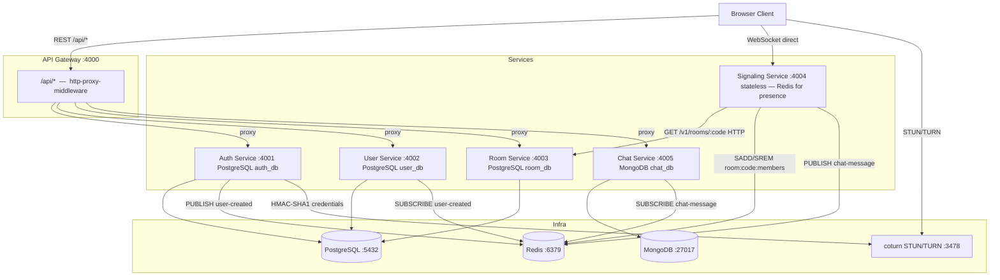


# Google Meet Clone — Microservices Video Calling App

A Node.js/TypeScript microservices application for real-time video calling. Clients connect to a single API Gateway for HTTP; the Signaling Service is accessed directly (bypasses the Gateway) via WebSocket for WebRTC signaling.

---

## Architecture



> **Redis pub/sub flows:**
> - `auth-service` PUBLISHes `user-created { userId }` → `user-service` SUBSCRIBEs and auto-creates a `Profile` row
> - `signaling-service` PUBLISHes `chat-message { roomId, senderId, senderName, text }` → `chat-service` SUBSCRIBEs and persists to MongoDB

---

## Service Overview

| Service | Port | Database | Status |
|---|---|---|---|
| api-gateway | 4000 | None | ✅ Active |
| auth-service | 4001 | PostgreSQL (`auth_db`) | ✅ Active |
| user-service | 4002 | PostgreSQL (`user_db`) | ✅ Active |
| room-service | 4003 | PostgreSQL (`room_db`) | ✅ Active |
| signaling-service | 4004 | None (Redis for presence) | ✅ Active |
| chat-service | 4005 | MongoDB (`chat_db`) | ✅ Active |
| coturn | 3478 UDP | — | ✅ Defined in docker-compose |

---

## Client-Facing Route Map (through the Gateway)

All client URLs are prefixed `/api`. Source: `services/api-gateway/src/routes/proxyRoutes.ts`.

### Auth Service → :4001

| Client URL | `gatewayAuth`? | Forwards to (auth-service) |
|---|---|---|
| `POST /api/auth/signup` | ❌ No | `POST /api/v1/auth/signup` |
| `POST /api/auth/login` | ❌ No | `POST /api/v1/auth/login` |
| `POST /api/auth/refresh` | ❌ No | `POST /api/v1/auth/refresh` |
| `POST /api/auth/logout` | ✅ Yes | `POST /api/v1/auth/logout` |
| `GET  /api/auth/me` | ✅ Yes | `GET  /api/v1/auth/me` |
| `GET  /api/auth/turn-credentials` | ✅ Yes | `GET  /api/v1/auth/turn-credentials` |

Rewrite rule: `^/auth` → `/api/v1/auth`

### User Service → :4002

| Client URL | `gatewayAuth`? | Forwards to (user-service) |
|---|---|---|
| `GET   /api/users/me` | ✅ Yes | `GET   /me` |
| `PATCH /api/users/me` | ✅ Yes | `PATCH /me` |

Rewrite rule: `^/users` → `''` (strips `/users`; user-service mounts routes at `/`)

### Room Service → :4003

| Client URL | `gatewayAuth`? | Forwards to (room-service) |
|---|---|---|
| `POST /api/v1/rooms` | ✅ Yes | `POST /v1/rooms` |
| `GET  /api/v1/rooms/:code` | ✅ Yes | `GET  /v1/rooms/:code` |
| `POST /api/v1/rooms/:code/join` | ✅ Yes | `POST /v1/rooms/:code/join` |
| `POST /api/v1/rooms/:code/leave` | ✅ Yes | `POST /v1/rooms/:code/leave` |
| `POST /api/v1/rooms/:code/end` | ✅ Yes | `POST /v1/rooms/:code/end` |

Rewrite rule: `^/v1/rooms` → `/v1/rooms` (no-op — path forwarded unchanged)

### Chat Service → :4005

| Client URL | `gatewayAuth`? | Forwards to (chat-service) |
|---|---|---|
| `GET /api/chat/:roomId/messages` | ✅ Yes | `GET /api/v1/chat/:roomId/messages` |

Rewrite rule: `^/chat` → `/api/v1/chat`

### Signaling Service — Direct WebSocket (bypasses Gateway)

```js
io("http://localhost:4004", { auth: { token: accessToken } })
```

---

## JWT Authentication Pattern

Every service verifies JWTs **locally** using the shared `JWT_ACCESS_SECRET`. No service calls another service's `/internal/verify-token` endpoint for its own route guards.

| Service | Mechanism | Notes |
|---|---|---|
| API Gateway (`gatewayAuth.ts`) | `jwt.verify` local | Sets `x-user-id` header forwarded downstream |
| Auth Service (`authGuard.ts`) | `jwt.verify` local | Guards `/me` and `/turn-credentials` |
| User Service (`authGuard.ts`) | `jwt.verify` local | Double-verifies (Gateway already checked) |
| Room Service (`authGuard.ts`) | `jwt.verify` local | Double-verifies |
| Chat Service (`authGuard.ts`) | `jwt.verify` local | Double-verifies |
| Signaling Service (`socketAuth.ts`) | `jwt.verify` local | Reads token from `handshake.auth.token` or `handshake.query.token` |
| Auth Service `/api/v1/internal/verify-token` | `jwt.verify` local | Exists but **not called by any other service** currently |

---

## Known Inconsistencies

### 1. Room Service is the only service where `/v1` is visible in the client URL

| Service | Client path prefix | `/v1` visible to client? |
|---|---|---|
| auth-service | `/api/auth/...` | No — injected by Gateway rewrite |
| user-service | `/api/users/...` | No — no version prefix anywhere |
| room-service | `/api/v1/rooms/...` | **Yes** — must be in the client URL |
| chat-service | `/api/chat/...` | No — injected by Gateway rewrite |

**Why:** `room-service` mounts `app.use('/v1', roomRoutes)`. The Gateway's pathRewrite for rooms is `'^/v1/rooms' → '/v1/rooms'` — a no-op that forwards the path unchanged, so `/v1` stays in the client-facing URL. All other services hide their internal versioning behind a Gateway rewrite.

### 2. `GET /api/auth/me` returns only `{ userId }`, not a full user object

`auth-service`'s `meController` returns `{ userId: req.userId }` only. For a full profile (displayName, avatarUrl, etc.) use `GET /api/users/me` (user-service).

### 3. `​.env.example` in api-gateway is incomplete

`​.env.example` is missing `JWT_ACCESS_SECRET` and `CHAT_SERVICE_URL`, both required by `env.ts`. Use `.env.docker` as the complete variable reference.

### 4. Chat-service `.env.docker` has unused variables

`GATEWAY_SECRET`, `AUTH_SERVICE_URL`, and `JWT_REFRESH_SECRET` appear in `.env.docker` but no active code path in chat-service reads them. Only `JWT_ACCESS_SECRET`, `MONGO_URI`, `REDIS_URL`, `PORT`, and `NODE_ENV` are consumed.

---

## Local Development

All services use `tsx watch server.ts`. Do **not** run `node server.ts` directly on `.ts` files.

```bash
cd services/api-gateway       && npm install && npm run dev   # :4000
cd services/auth-service      && npm install && npm run dev   # :4001
cd services/user-service      && npm install && npm run dev   # :4002
cd services/room-service      && npm install && npm run dev   # :4003
cd services/signaling-service && npm install && npm run dev   # :4004
cd services/chat-service      && npm install && npm run dev   # :4005
```

Each service reads its own `.env`. Copy `.env.docker` to `.env` and replace Docker hostnames with `localhost`.

Run Prisma migrations before first start for auth, user, and room services:
```bash
npx prisma migrate deploy
```

---

## Docker

```bash
docker compose up --build    # start all
docker compose down          # stop (keeps volumes)
docker compose down -v       # stop and delete all data
```

---

## Manual Test Sequence

```bash
# 1. Signup
curl -s -X POST http://localhost:4000/api/auth/signup \
  -H "Content-Type: application/json" \
  -d '{"email":"test@example.com","password":"password123"}' | jq

# 2. Login — capture token
TOKEN=$(curl -s -X POST http://localhost:4000/api/auth/login \
  -H "Content-Type: application/json" \
  -d '{"email":"test@example.com","password":"password123"}' | jq -r '.data.accessToken')

# 3. Get profile (user-service)
curl -s http://localhost:4000/api/users/me \
  -H "Authorization: Bearer $TOKEN" | jq

# 4. Create room — capture room code
ROOM_CODE=$(curl -s -X POST http://localhost:4000/api/v1/rooms \
  -H "Authorization: Bearer $TOKEN" \
  -H "Content-Type: application/json" \
  -d '{"title":"Test Room"}' | jq -r '.data.room.code')

# 5. Join room
curl -s -X POST "http://localhost:4000/api/v1/rooms/$ROOM_CODE/join" \
  -H "Authorization: Bearer $TOKEN" | jq

# 6. Get TURN credentials
curl -s http://localhost:4000/api/auth/turn-credentials \
  -H "Authorization: Bearer $TOKEN" | jq

# 7. Get chat messages
curl -s "http://localhost:4000/api/chat/$ROOM_CODE/messages?limit=20" \
  -H "Authorization: Bearer $TOKEN" | jq
```

---

## Folder Structure

```
GOOGLE_MEET/
├── docker-compose.yml
├── infra/
│   ├── coturn/turnserver.conf
│   └── postgres-init/           # SQL init scripts (creates separate DBs)
├── services/
│   ├── api-gateway/             # :4000 — reverse proxy + JWT gate
│   ├── auth-service/            # :4001 — signup/login/tokens/TURN creds
│   ├── user-service/            # :4002 — profile CRUD
│   ├── room-service/            # :4003 — room lifecycle
│   ├── signaling-service/       # :4004 — Socket.io WebRTC relay
│   └── chat-service/            # :4005 — chat history (MongoDB)
├── shared/
└── test-client/
    ├── index.html
    └── app.js
```
