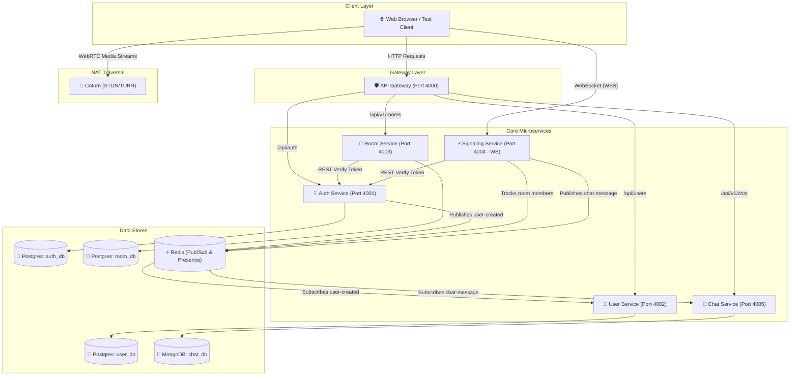

# Video Meet App — Comprehensive Services & Architecture Status Report

> **Generated Date:** September 23, 2026  
> **Based on:** Codebase Analysis & [`STEP.MD`](file:///c:/Users/swaru/OneDrive/Desktop/PROJECT/GOOGLE_MEET/STEP.MD)

---

## 📊 1. Executive Summary & Progress Checklist

According to the master implementation plan in [`STEP.MD`](file:///c:/Users/swaru/OneDrive/Desktop/PROJECT/GOOGLE_MEET/STEP.MD), the project follows a **16-Phase Microservices Build Order**. 

### Status Overview
* **Phases 0 through 8** are **COMPLETED** (Infrastructure, API Gateway, Auth, User, Room, Signaling, WebRTC Verification Client, STUN/TURN, and Chat Services).
* **Phase 9** (SFU Service) has a folder skeleton created, awaiting `mediasoup` implementation.
* **Phases 10 through 16** are pending implementation.

| Phase | Service / Component | Status | Storage / Tech Stack | Primary Responsibility |
| :--- | :--- | :---: | :--- | :--- |
| **Phase 0** | **Infra Skeleton** | ✅ Completed | Docker Compose, Postgres, Mongo, Redis | Container orchestration & database provisioning |
| **Phase 1** | **API Gateway** | ✅ Completed | Node.js, Express, `http-proxy-middleware` | Central entrypoint, routing, CORS, security headers |
| **Phase 2** | **Auth Service** | ✅ Completed | Postgres (`auth_db`), Prisma, JWT, Bcrypt | User registration, login, JWT validation, TURN credentials |
| **Phase 3** | **User Service** | ✅ Completed | Postgres (`user_db`), Prisma, Redis Pub/Sub | User profiles, preference updates, auto-provisioning |
| **Phase 4** | **Room Service** | ✅ Completed | Postgres (`room_db`), Prisma, NanoID | Room creation, participant tracking, host management |
| **Phase 5** | **Signaling Service** | ✅ Completed | Socket.io, Node.js, Redis Presence | Real-time WebRTC SDP/ICE relay & socket room state |
| **Phase 6** | **WebRTC Verification** | ✅ Completed | Vanilla JS, WebRTC (`getUserMedia`) | 1:1 call testing tool in `test-client/` |
| **Phase 7** | **TURN/STUN Infra** | ✅ Completed | Coturn (`turnserver.conf`), Auth HMAC | NAT traversal relay for cross-network media streaming |
| **Phase 8** | **Chat Service** | ✅ Completed | MongoDB (`chat_db`), Mongoose, Redis | Async persistent room messaging & history retrieval |
| **Phase 9** | **SFU Service** | ⏳ Skeleton Only | `mediasoup` (Planned) | Multi-party group video calls (3+ participants) |
| **Phase 10**| **Recording Service** | ❌ Pending | FFmpeg, BullMQ, AWS S3 / Blob | Async video recording of meetings |
| **Phase 11**| **Notification Service**| ❌ Pending | Nodemailer, Redis Queue | Email invites and scheduled reminders |
| **Phase 12**| **Gateway Hardening** | ⏳ Partial | `express-rate-limit` | Throttling, centralized validation & security |
| **Phase 13**| **Observability** | ⏳ Partial | Pino HTTP (Prometheus/Grafana planned) | Structured logging, metrics & tracing |
| **Phase 14**| **CI/CD** | ❌ Pending | GitHub Actions | Automated lint, build, test & deploy pipelines |
| **Phase 15**| **Kubernetes (K8s)** | ❌ Pending | K8s Manifests, Helm | Container orchestration for production |
| **Phase 16**| **Load Testing** | ❌ Pending | Artillery, PgBouncer | Concurrency benchmarks & stress testing |

---

## 🛠️ 2. Detailed Breakdown of Completed Services

---

### 1. API Gateway Service (`/services/api-gateway`)
* **Port:** `4000`
* **Tech Stack:** Express, TypeScript, `http-proxy-middleware`, `helmet`, `cors`, `pino-http`
* **Role:** Serves as the single public entrypoint for all client HTTP API requests.
* **Capabilities & Functionality:**
  - **Reverse Proxy Routing:** Dynamically forwards incoming HTTP traffic to downstream microservices based on URL path prefixes:
    - `/api/auth/signup`, `/api/auth/login`, `/api/auth/refresh` → Proxied to Auth Service (`4001`) (Public)
    - `/api/auth/logout`, `/api/auth/me`, `/api/auth/turn-credentials` → Proxied to Auth Service (`4001`) (Protected by Gateway Auth)
    - `/api/users/*` → Proxied to User Service (`4002`) (Protected)
    - `/api/v1/rooms/*` → Proxied to Room Service (`4003`) (Protected)
    - `/api/v1/chat/*` → Proxied to Chat Service (`4005`) (Protected)
  - **Gateway Authentication Middleware (`gatewayAuth`):** Inspects incoming `Authorization: Bearer <token>` headers before forwarding protected requests.
  - **Body Preservation:** Uses `fixRequestBody` from `http-proxy-middleware` to re-stream JSON bodies to target services without truncation.
  - **Security & Logging:** Enforces CORS policies, HTTP security headers (`helmet`), and structured HTTP access logging (`pino-http`).

---

### 2. Auth Service (`/services/auth-service`)
* **Port:** `4001`
* **Database:** PostgreSQL (`auth_db` via Prisma ORM)
* **Tech Stack:** Node.js, Express, TypeScript, Prisma, Bcrypt, JsonWebToken, Joi
* **Role:** Manages identity, authentication tokens, credentials, and user password security.
* **Capabilities & Functionality:**
  - **User Registration (`POST /auth/signup`):** Validates input with Joi, hashes passwords using `bcrypt` (10 salt rounds), creates user record in `auth_db`, and publishes a `user-created` event to Redis Pub/Sub to notify the User Service.
  - **User Login (`POST /auth/login`):** Verifies user credentials, issues short-lived JWT Access Tokens (15m expiry) and long-lived Refresh Tokens stored in PostgreSQL.
  - **Token Refresh (`POST /auth/refresh`):** Validates refresh tokens against `auth_db` to issue fresh JWT access tokens.
  - **User Profile Info (`GET /auth/me`):** Returns authenticated user account metadata.
  - **Internal Token Verification (`GET /internal/verify-token`):** Internal REST endpoint (reachable only inside Docker network) allowing other microservices (Room Service, Signaling Service) to validate JWT access tokens synchronously.
  - **TURN Credentials Generator (`GET /auth/turn-credentials`):** Generates short-lived, HMAC-SHA1 signed TURN server credentials (username, password, expiry) for WebRTC NAT traversal via Coturn.

---

### 3. User Service (`/services/user-service`)
* **Port:** `4002`
* **Database:** PostgreSQL (`user_db` via Prisma ORM)
* **Tech Stack:** Node.js, Express, TypeScript, Prisma, ioredis, Joi
* **Role:** Manages extended user profiles, display names, avatars, and user preferences.
* **Capabilities & Functionality:**
  - **Asynchronous Auto-Provisioning (Redis Subscriber):** Listens to the `user-created` event published on Redis by the Auth Service upon new user signup. Automatically creates a default `Profile` record in `user_db` without blocking the signup HTTP response.
  - **Fetch Profile (`GET /users/me`):** Retrieves display name, avatar URL, and preferences for the authenticated user.
  - **Update Profile (`PATCH /users/me`):** Allows users to update display names, avatar URLs, and custom user settings.

---

### 4. Room Service (`/services/room-service`)
* **Port:** `4003`
* **Database:** PostgreSQL (`room_db` via Prisma ORM - `Room` & `Participant` tables)
* **Tech Stack:** Node.js, Express, TypeScript, Prisma, NanoID, Axios
* **Role:** Handles meeting room lifecycle, room authorization codes, and participant session state.
* **Capabilities & Functionality:**
  - **Create Meeting Room (`POST /v1/rooms`):** Generates a unique, short, human-readable `roomCode` using `nanoid`. Atomically creates a room and assigns the caller as host with `role = "host"` inside a Prisma database transaction.
  - **Get Room Details (`GET /v1/rooms/:code`):** Retrieves meeting room configuration and currently active participants.
  - **Join Room (`POST /v1/rooms/:code/join`):** Records a user's entry into a room by creating a `Participant` record.
  - **Leave Room (`POST /v1/rooms/:code/leave`):** Updates participant state, recording their exit timestamp (`leftAt`).
  - **End Room (`POST /v1/rooms/:code/end`):** Host-only operation to terminate a meeting room session for all participants.
  - **Inter-Service Verification:** Validates caller identity by querying the Auth Service internal `/internal/verify-token` route.

---

### 5. Signaling Service (`/services/signaling-service`)
* **Port:** `4004` (WebSocket Server)
* **State / Presence:** Redis (`ioredis` for socket-to-room presence tracking)
* **Tech Stack:** Node.js, Socket.io, TypeScript, Axios
* **Role:** Manages real-time WebSocket connections and relays WebRTC peer negotiation messages between call participants.
* **Capabilities & Functionality:**
  - **Socket Authentication Middleware:** Verifies JWT access token passed during the Socket.io handshake via Auth Service `/internal/verify-token`.
  - **Room Join Handler (`join-room`):** Registers client socket into Socket.io room and tracks active members in Redis sets (`room:{roomId}:members`). Notifies existing participants with `peer-joined`.
  - **WebRTC Relay Handlers:**
    - `offer` → Relays Session Description Protocol (SDP) offer from caller to target peer socket.
    - `answer` → Relays SDP answer from target peer back to caller.
    - `ice-candidate` → Relays Interactive Connectivity Establishment (ICE) network candidates between peers.
  - **Live Chat Relay (`chat-message`):** Broadcasts real-time chat messages to all connected sockets in a room, and simultaneously publishes the message to Redis Pub/Sub for persistent storage by the Chat Service.
  - **Room Exit & Disconnect Cleanup (`leave-room`, `disconnect`):** Cleans up Redis presence tracking upon disconnect and notifies remaining members with `peer-left`.

---

### 6. Chat Service (`/services/chat-service`)
* **Port:** `4005`
* **Database:** MongoDB (`chat_db` via Mongoose schema)
* **Tech Stack:** Node.js, Express, TypeScript, Mongoose, ioredis
* **Role:** Handles async message persistence and historical chat logs for meeting rooms.
* **Capabilities & Functionality:**
  - **Asynchronous Message Persistence (Redis Subscriber):** Subscribes to the `chat-message` channel on Redis. When a chat message is sent during a call, the Chat Service asynchronously saves it to MongoDB without slowing down real-time WebSocket messaging.
  - **Fetch Chat History (`GET /v1/chat/:roomId/messages`):** Supports paginated historical message retrieval for any meeting room, enabling users to view prior messages upon joining.

---

### 7. STUN/TURN Infrastructure (`/infra/coturn`)
* **Tech Stack:** Coturn (Docker container)
* **Config File:** `infra/coturn/turnserver.conf`
* **Role:** Provides STUN (Session Traversal Utilities for NAT) and TURN (Traversal Using Relays around NAT) capabilities.
* **Capabilities & Functionality:** Enables WebRTC audio/video connections to succeed even across strict firewalls, corporate networks, or cellular connections using HMAC short-lived dynamic credentials.

---

### 8. WebRTC Diagnostic Test Client (`/test-client`)
* **Tech Stack:** HTML5, Vanilla JavaScript, CSS3
* **Role:** Standalone frontend diagnostic tool used to verify WebRTC 1:1 call capability.
* **Capabilities & Functionality:**
  - Interacts with Auth, Room, and Signaling Services.
  - Captures camera/microphone streams (`getUserMedia`).
  - Performs full WebRTC peer connection setup (`RTCPeerConnection`, SDP offer/answer exchange, ICE candidate discovery).
  - Displays local and remote video streams side-by-side with event logs.

---

## 🏗️ 3. Architecture & Data Flow



---

## 🚀 4. Remaining Roadmap (Phases 9 to 16)

To transform this into a production-ready enterprise WebRTC platform, the following phases outlined in [`STEP.MD`](file:///c:/Users/swaru/OneDrive/Desktop/PROJECT/GOOGLE_MEET/STEP.MD) remain to be built:

1. **Phase 9 — SFU Service (`/services/sfu-service`)**:  
   - Integrate `mediasoup` workers and routers.  
   - Enable high-capacity multi-party video conferencing (3+ participants) by routing streams through an SFU server instead of full-mesh peer connections.
2. **Phase 10 — Recording Service**:  
   - Implement mediasoup `PlainTransport` and `fluent-ffmpeg` workers managed via a Redis job queue (`BullMQ`) to export `.mp4` recordings to S3/Blob storage.
3. **Phase 11 — Notification Service**:  
   - Async email notification worker using `nodemailer` for meeting invitations and scheduled reminders.
4. **Phase 12 — Gateway Hardening**:  
   - Add rate limiting (`express-rate-limit`), centralized error sanitization, and WebSocket proxying.
5. **Phase 13 — Observability**:  
   - Export Prometheus metrics (`/metrics`), Grafana dashboards, and OpenTelemetry tracing across all microservices.
6. **Phase 14 — CI/CD Pipeline**:  
   - Setup GitHub Actions workflows to lint, test, build Docker images, and apply database migrations automatically.
7. **Phase 15 — Kubernetes Deployment**:  
   - Provision Helm charts, ingress controllers, HPAs (Horizontal Pod Autoscalers), and StatefulSets for Coturn.
8. **Phase 16 — Load Testing & Security**:  
   - Conduct Artillery load tests and security hardening.

---

## 📌 Summary of How to Run the Completed Stack

1. **Start all infrastructure and completed services:**
   ```bash
   docker-compose up --build -d
   ```
2. **Verify Service Health via Gateway:**
   - Auth Service: `http://localhost:4000/api/auth/health`
   - User Service: `http://localhost:4000/api/users/health`
   - Room Service: `http://localhost:4000/api/v1/rooms/health`
3. **Test WebRTC Video Call:**
   ```bash
   cd test-client
   npx serve .
   ```
   Open `http://localhost:3000` in two browser tabs, paste JWT access tokens & a room code, and join to verify live video/audio streaming.
