# Video Meet App — Detailed File-by-File Build Steps & Execution Checklist

> **Current Implementation Status:** Phases 0 through 8 are **✅ COMPLETED**.
> Phases 9 through 16 are **⏳ NEXT / PENDING**.

---

## 📌 Implementation Status Dashboard

| Phase              | Service / Component            |    Status    | Details & Verification                                                                                   |
| :----------------- | :----------------------------- | :----------: | :------------------------------------------------------------------------------------------------------- |
| **Phase 0**  | **Infra Skeleton**       | ✅ COMPLETED | Docker Compose, Postgres (`auth_db`, `user_db`, `room_db`), Mongo (`chat_db`), Redis (`6379`). |
| **Phase 1**  | **API Gateway**          | ✅ COMPLETED | Port 4000. Express,`http-proxy-middleware`, `gatewayAuth` JWT validation, CORS & Helmet.             |
| **Phase 2**  | **Auth Service**         | ✅ COMPLETED | Port 4001. Postgres, Prisma, bcrypt, JWT access/refresh tokens, HMAC TURN secret generator.              |
| **Phase 3**  | **User Service**         | ✅ COMPLETED | Port 4002. Postgres, Prisma, Redis subscriber for`user-created` auto-profile creation.                 |
| **Phase 4**  | **Room Service**         | ✅ COMPLETED | Port 4003. Postgres, Prisma, NanoID room codes, host/participant creation & room teardown.               |
| **Phase 5**  | **Signaling Service**    | ✅ COMPLETED | Port 4004. Socket.io, Redis presence set tracking, WebRTC offer/answer/ICE candidate relay.              |
| **Phase 6**  | **WebRTC Verification**  | ✅ COMPLETED | `test-client/` standalone client for 1:1 video/audio WebRTC call verification.                         |
| **Phase 7**  | **TURN/STUN**            | ✅ COMPLETED | Coturn container (`infra/coturn/turnserver.conf`) & HMAC credentials endpoint.                         |
| **Phase 8**  | **Chat Service**         | ✅ COMPLETED | Port 4005. MongoDB Mongoose schema, Redis subscriber to`chat-message`, history REST API.               |
| **Phase 9**  | **SFU Service**          |  ⏳ PENDING  | Folder created (`services/sfu-service`); needs `mediasoup` workers for group calls.                  |
| **Phase 10** | **Recording Service**    |  ⏳ PENDING  | FFmpeg + BullMQ worker queue for async video call recordings.                                            |
| **Phase 11** | **Notification Service** |  ⏳ PENDING  | Nodemailer / email worker for scheduled invites & meeting reminders.                                     |
| **Phase 12** | **Gateway Hardening**    |  ⏳ PENDING  | Rate limiting (`express-rate-limit`) & centralized error handler validation.                           |
| **Phase 13** | **Observability**        |  ⏳ PENDING  | Prometheus`/metrics`, Grafana dashboards & OpenTelemetry tracing.                                      |
| **Phase 14** | **CI/CD**                |  ⏳ PENDING  | GitHub Actions automated workflows for linting, testing, and Docker builds.                              |
| **Phase 15** | **Kubernetes (K8s)**     |  ⏳ PENDING  | K8s deployments, ingress routing, HPA for signaling/SFU, Coturn StatefulSet.                             |
| **Phase 16** | **Load Testing**         |  ⏳ PENDING  | Artillery load tests & PgBouncer database connection pooling.                                            |

---

## Table of Contents

- [Phase 0 — Infra Skeleton [✅ COMPLETED]](#phase-0--infra-skeleton--completed)
- [Phase 1 — API Gateway [✅ COMPLETED]](#phase-1--api-gateway--completed)
- [Phase 2 — Auth Service [✅ COMPLETED]](#phase-2--auth-service--completed)
- [Phase 3 — User Service [✅ COMPLETED]](#phase-3--user-service--completed)
- [Phase 4 — Room Service [✅ COMPLETED]](#phase-4--room-service--completed)
- [Phase 5 — Signaling Service [✅ COMPLETED]](#phase-5--signaling-service--completed)
- [Phase 6 — WebRTC Client Verification [✅ COMPLETED]](#phase-6--webrtc-client-verification--completed)
- [Phase 7 — TURN/STUN Infrastructure [✅ COMPLETED]](#phase-7--turnstun-infrastructure--completed)
- [Phase 8 — Chat Service [✅ COMPLETED]](#phase-8--chat-service--completed)
- [Phase 9 — SFU Service (Group Calls) [⏳ PENDING]](#phase-9--sfu-service-group-calls--pending)
- [Phase 10 — Recording Service [⏳ PENDING]](#phase-10--recording-service--pending)
- [Phase 11 — Notification Service [⏳ PENDING]](#phase-11--notification-service--pending)
- [Phase 12 — Gateway Hardening [⏳ PENDING]](#phase-12--gateway-hardening--pending)
- [Phase 13 — Observability [⏳ PENDING]](#phase-13--observability--pending)
- [Phase 14 — CI/CD [⏳ PENDING]](#phase-14--cicd--pending)
- [Phase 15 — Kubernetes Deployment [⏳ PENDING]](#phase-15--kubernetes-deployment--pending)
- [Phase 16 — Load Testing &amp; Security [⏳ PENDING]](#phase-16--load-testing--security--pending)
- [Full Build Order — Architectural Diagram](#full-build-order--architectural-diagram)

---

## Phase 0 — Infra Skeleton [✅ COMPLETED]

**Goal:** Empty services that boot, connected to real databases, before any actual feature exists.
**Tech:** Docker Compose, Node.js 20, Express, Postgres, MongoDB, Redis.

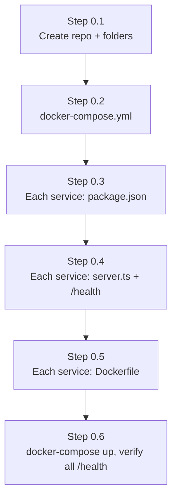

### Verification & Deliverable

- `docker-compose.yml` configures Postgres (`auth_db`, `user_db`, `room_db`), MongoDB (`chat_db`), Redis (`6379`), Coturn (`3478`), and service containers.
- All microservices expose a `/health` REST endpoint returning `{ status: "ok" }`.

---

## Phase 1 — API Gateway [✅ COMPLETED]

**Goal:** Central entry point forwarding client HTTP requests to appropriate backend services.
**Tech:** Express, TypeScript, `http-proxy-middleware`, CORS, Helmet, Pino.

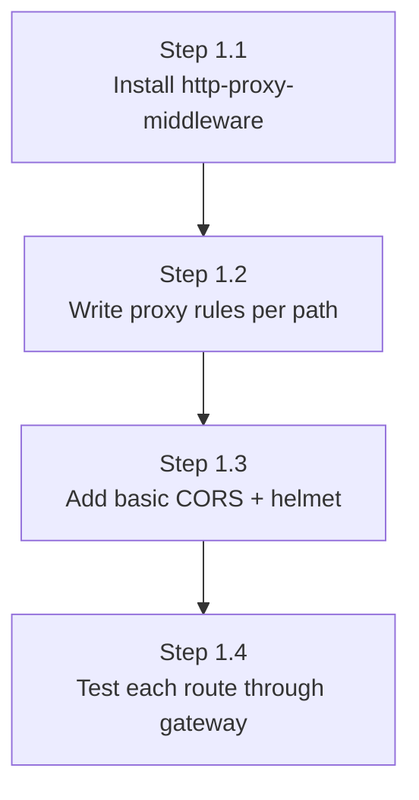

### Verification & Deliverable

- Running on Port `4000`.
- Proxies `/api/auth/*` → Auth Service (`4001`)
- Proxies `/api/users/*` → User Service (`4002`)
- Proxies `/api/v1/rooms/*` → Room Service (`4003`)
- Proxies `/api/v1/chat/*` → Chat Service (`4005`)
- Validates JWT tokens on protected routes via `gatewayAuth` middleware.

---

## Phase 2 — Auth Service [✅ COMPLETED]

**Goal:** Real signup/login with hashed passwords and JWTs, backed by Postgres.
**Tech:** PostgreSQL (`auth_db`), Prisma ORM, Bcrypt, JWT, Joi, Redis.

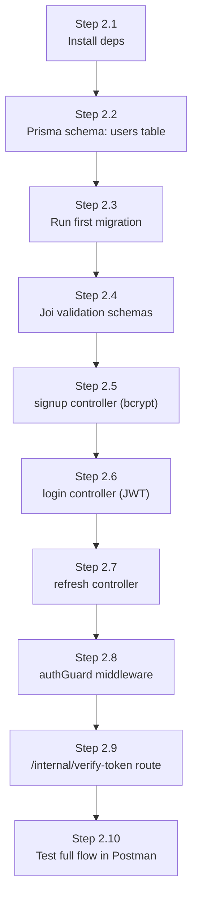

### Verification & Deliverable

- Running on Port `4001`.
- Endpoints: `POST /auth/signup`, `POST /auth/login`, `POST /auth/refresh`, `GET /auth/me`, `GET /auth/turn-credentials`, `GET /internal/verify-token`.
- Publishes `user-created` event to Redis on successful registration.
- Generates dynamic HMAC-SHA1 signed STUN/TURN credentials.

---

## Phase 3 — User Service [✅ COMPLETED]

**Goal:** Profile auto-created the moment someone signs up, via an event — not a direct call.
**Tech:** PostgreSQL (`user_db`), Prisma ORM, Redis Pub/Sub, Express.

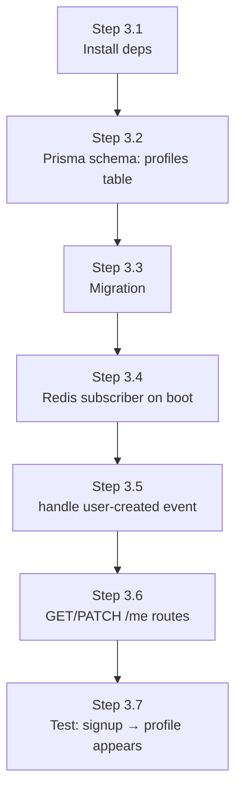

### Verification & Deliverable

- Running on Port `4002`.
- Listens to Redis `user-created` channel to create a default `Profile` row automatically.
- Endpoints: `GET /me` (fetch profile) and `PATCH /me` (update displayName, avatarUrl, preferences).

---

## Phase 4 — Room Service [✅ COMPLETED]

**Goal:** Authenticated users can create and join rooms, with real relational data.
**Tech:** PostgreSQL (`room_db`), Prisma ORM, NanoID, Axios.

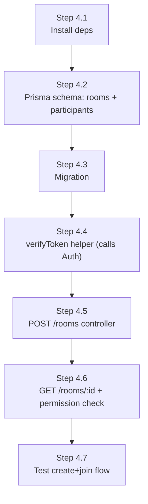

### Verification & Deliverable

- Running on Port `4003`.
- Endpoints: `POST /v1/rooms`, `GET /v1/rooms/:code`, `POST /v1/rooms/:code/join`, `POST /v1/rooms/:code/leave`, `POST /v1/rooms/:code/end`.
- Manages transactional creation of room codes and participant tracking.

---

## Phase 5 — Signaling Service [✅ COMPLETED]

**Goal:** Real-time WebRTC offer/answer/ICE candidate relay between peers via WebSocket.
**Tech:** Socket.io, TypeScript, Redis Sets for Presence.

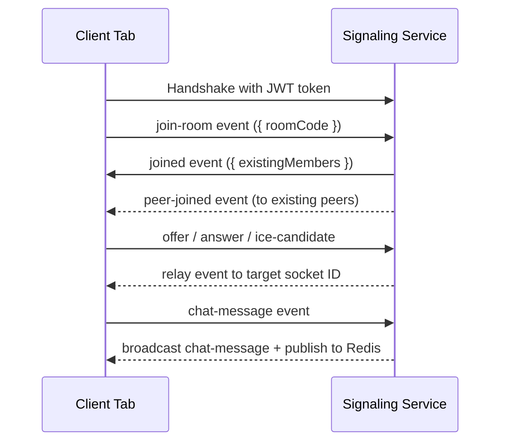

### Verification & Deliverable

- Running on Port `4004`.
- Validates room state with Room Service via REST.
- Handlers for `join-room`, `offer`, `answer`, `ice-candidate`, `chat-message`, `leave-room`.
- Publishes `chat-message` events to Redis Pub/Sub for persistent chat storage.

---

## Phase 6 — WebRTC Client Verification [✅ COMPLETED]

**Goal:** Verification of real 1:1 audio/video calling using WebRTC standards.
**Tech:** Vanilla JS, HTML5, `getUserMedia`, `RTCPeerConnection`.

### Verification & Deliverable

- Located in `/test-client`.
- Verifies real camera/microphone stream exchange over Socket.io signaling.
- Run via `npx serve .` inside `/test-client`.

---

## Phase 7 — TURN/STUN Infrastructure [✅ COMPLETED]

**Goal:** Ensure WebRTC connections succeed across restrictive NATs and firewalls.
**Tech:** Coturn Docker Container, HMAC-SHA1 dynamic secret generation.

### Verification & Deliverable

- Coturn configuration at `infra/coturn/turnserver.conf`.
- Auth Service endpoint `GET /auth/turn-credentials` issues temporary TURN credentials.

---

## Phase 8 — Chat Service [✅ COMPLETED]

**Goal:** Persistent in-meeting chat storage and historical retrieval.
**Tech:** MongoDB (`chat_db`), Mongoose, Redis Pub/Sub, Express.

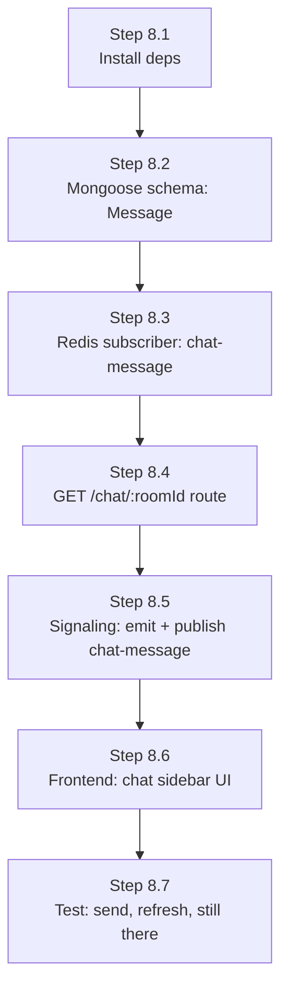

### Verification & Deliverable

- Running on Port `4005`.
- Subscribes to Redis `chat-message` channel to store chat logs asynchronously.
- Endpoint: `GET /api/v1/chat/:roomId/messages` returns paginated message history.

---

## Phase 9 — SFU Service (Group Calls) [✅ COMPLETED]

**Goal:** Support 3+ participants in group calls without client bandwidth overload.
**New concept:** mediasoup (Router, Producer, Consumer, Transport).

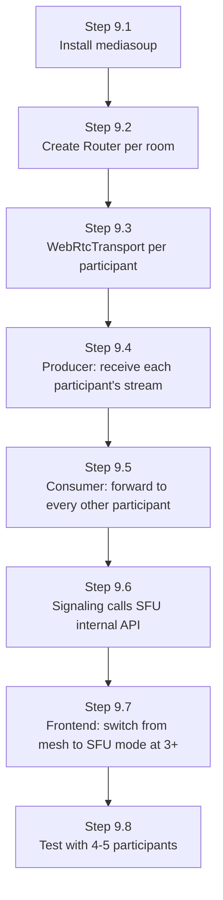

### Step 9.1 — Install

- `npm install mediasoup` in `/services/sfu-service`

### Step 9.2 — `/src/mediasoup/router.ts`

- One `mediasoup.Worker` per CPU core, one `Router` per active room created when the 3rd participant joins.

---

## Phase 10 — Recording Service [⏳ PENDING]

**Goal:** Downloadable video recordings produced asynchronously post-call.

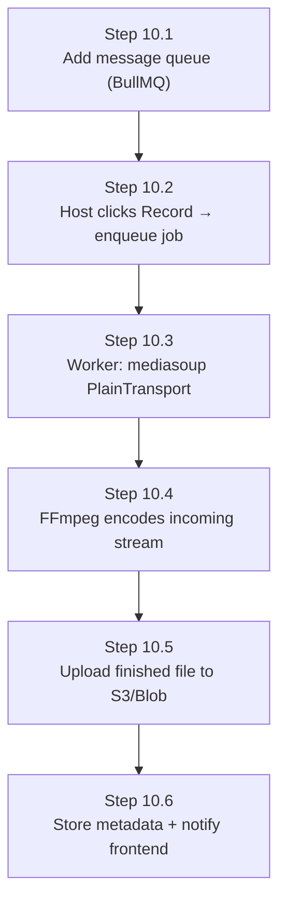

---

## Phase 11 — Notification Service [⏳ PENDING]

**Goal:** Async email invitations and scheduled meeting reminders.

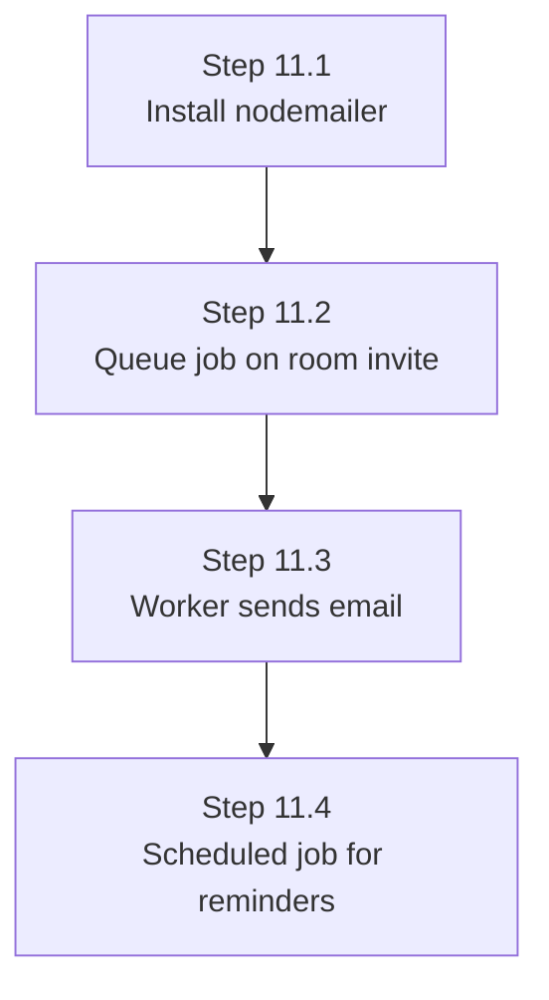

---

## Phase 12 — Gateway Hardening [⏳ PENDING]

- Enforce IP/user rate limiting (`express-rate-limit`).
- Centralize input error sanitization.

---

## Phase 13 — Observability [⏳ PENDING]

- Expose Prometheus `/metrics` endpoints across services.
- Setup Grafana dashboards and OpenTelemetry distributed tracing.

---

## Phase 14 — CI/CD [⏳ PENDING]

- GitHub Actions workflows for automated testing, linting, Docker image creation, and deployment.

---

## Phase 15 — Kubernetes Deployment [⏳ PENDING]

- Create K8s deployments, services, ingress controllers, HPAs, and Coturn StatefulSets.

---

## Phase 16 — Load Testing & Security [⏳ PENDING]

- Conduct Artillery load tests and security stress tests.

---

## Full Build Order — Architectural Diagram

```mermaid
flowchart TD
    P0["Phase 0<br/>Skeleton"] --> P1["Phase 1<br/>Gateway"]
    P1 --> P2["Phase 2<br/>Auth"]
    P2 --> P3["Phase 3<br/>User"]
    P3 --> P4["Phase 4<br/>Room"]
    P4 --> P5["Phase 5<br/>Signaling"]
    P5 --> P6["Phase 6<br/>Frontend Verification"]
    P6 --> P7["Phase 7<br/>TURN/STUN"]
    P7 --> P8["Phase 8<br/>Chat"]
    P8 --> P9["Phase 9<br/>SFU (Mediasoup)"]
    P9 --> P10["Phase 10<br/>Recording"]
    P10 --> P11["Phase 11<br/>Notifications"]
    P11 --> P12["Phase 12<br/>Gateway Hardening"]
    P12 --> P13["Phase 13<br/>Observability"]
    P13 --> P14["Phase 14<br/>CI/CD"]
    P14 --> P15["Phase 15<br/>Kubernetes"]
    P15 --> P16["Phase 16<br/>Load Test & Security"]
    P16 --> Launch(["🚀 Production Launch"])

    style P0 fill:#e8ffe8,stroke:#3fae3f
    style P1 fill:#e8ffe8,stroke:#3fae3f
    style P2 fill:#e8ffe8,stroke:#3fae3f
    style P3 fill:#e8ffe8,stroke:#3fae3f
    style P4 fill:#e8ffe8,stroke:#3fae3f
    style P5 fill:#e8ffe8,stroke:#3fae3f
    style P6 fill:#e8ffe8,stroke:#3fae3f
    style P7 fill:#e8ffe8,stroke:#3fae3f
    style P8 fill:#e8ffe8,stroke:#3fae3f
    style P9 fill:#fff4e0,stroke:#d99a2b
    style P10 fill:#fff4e0,stroke:#d99a2b
    style P11 fill:#fff4e0,stroke:#d99a2b
    style P12 fill:#fff4e0,stroke:#d99a2b
    style P13 fill:#fff4e0,stroke:#d99a2b
    style P14 fill:#fff4e0,stroke:#d99a2b
    style P15 fill:#fff4e0,stroke:#d99a2b
    style P16 fill:#fff4e0,stroke:#d99a2b
    style Launch fill:#eef3ff,stroke:#5b7fff
```
