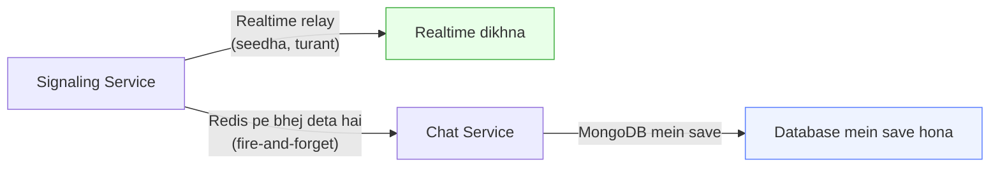
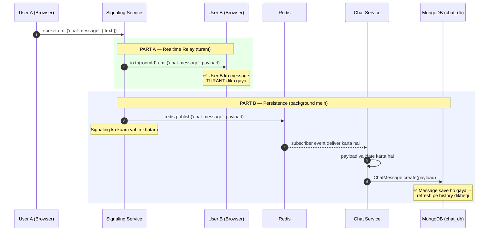
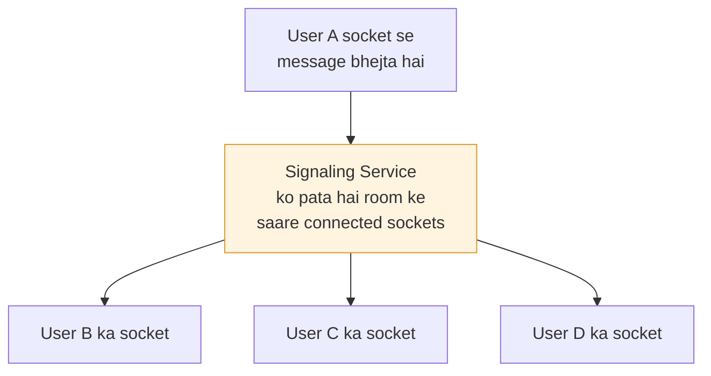
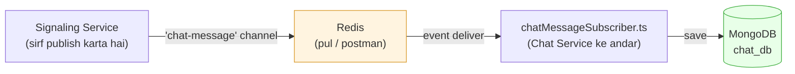
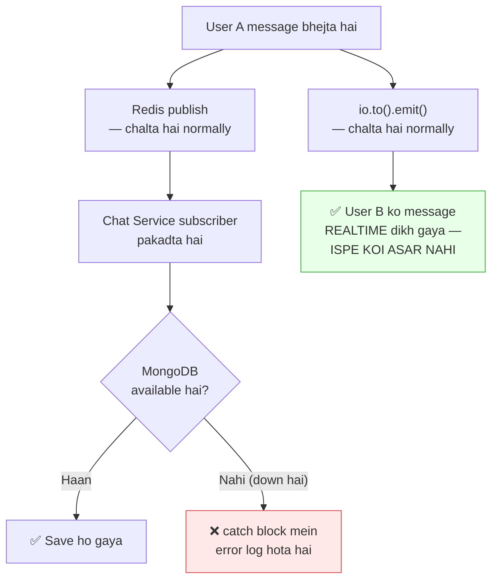

# Chat Flow — Realtime Relay vs Database Persistence

> **Ye doc kis confusion ko clear karta hai:** jab koi user chat message bhejta hai, to wo message **do jagah** jaata hai — turant doosre user ko dikhta hai, AUR database mein bhi save hota hai. Ye dono kaam **alag-alag services** karte hain, **alag-alag tarike se**, aur ek dusre ka wait nahi karte. Ye doc line-by-line dikhata hai ki kaun, kab, kya karta hai.

---

## Table of Contents

- [1. Do Kaam, Do Jagah — Core Idea](#1-do-kaam-do-jagah--core-idea)
- [2. Poora Flow — Ek Diagram Mein](#2-poora-flow--ek-diagram-mein)
- [3. Part A — Realtime Relay (Signaling ka kaam)](#3-part-a--realtime-relay-signaling-ka-kaam)
- [4. Part B — Database Persistence (Redis + Chat Service ka kaam)](#4-part-b--database-persistence-redis--chat-service-ka-kaam)
- [5. Dono Kaam Parallel Kyun Chalte Hain](#5-dono-kaam-parallel-kyun-chalte-hain)
- [6. Agar MongoDB Down Ho Jaye To Kya Hoga](#6-agar-mongodb-down-ho-jaye-to-kya-hoga)
- [7. Simple Table — Sab Kuch Ek Nazar Mein](#7-simple-table--sab-kuch-ek-nazar-mein)
- [8. Poora Code, Ek Saath](#8-poora-code-ek-saath)

---

## 1. Do Kaam, Do Jagah — Core Idea

Jab User A message bhejta hai, do alag cheezein honi chahiye:

| Kaam                              | Kyun zaroori hai                                                          |
| --------------------------------- | ------------------------------------------------------------------------- |
| **Realtime dikhna**         | User B call ke dauran turant message dekhe — wait nahi karna chahiye     |
| **Database mein save hona** | Agar koi refresh kare ya baad mein room join kare, history dikhni chahiye |

Ye dono kaam **do alag services** karte hain:



**Sabse important baat:** Signaling Service **khud kabhi MongoDB ko touch nahi karta.** Usके paas Mongoose installed bhi nahi hai. Wo sirf Redis ko bolta hai "ye message hai," aur apna kaam khatam kar leta hai.

---

## 2. Poora Flow — Ek Diagram Mein



Dono **rectangles** (green aur blue) ek hi function call ke andar, **parallel** chal rahe hain — ek doosre ka wait nahi karte.

---

## 3. Part A — Realtime Relay (Signaling ka kaam)	

### Ye kaise hota hai

Signaling Service ke paas **already** sab connected users ka socket handle hai (kyunki call ke dauran sab log Signaling se hi connected hain). Isliye jab bhi ek user message bhejta hai, Signaling seedha baaki sabko bhej sakta hai — **koi beech ka pul (Redis/DB) nahi lagta.**



### Code

```typescript
// signaling-service/src/handlers/chatMessage.ts
socket.on('chat-message', async ({ roomId, text }) => {
    const payload = {
        roomId,
        senderId: socket.data.userId,
        senderName: socket.data.userName,
        text,
    };

    // ── PART A: Instant relay — Redis/DB ki zaroorat NAHI ──
    io.to(roomId).emit('chat-message', payload);

    // (Part B neeche continue hota hai isi function mein)
});
```

### Kyun ye itna fast hai

`io.to(roomId).emit(...)` ek **in-memory operation** hai — Socket.io ke paas already pata hai kaunse sockets kaunse room mein hain, RAM mein hi data bhej deta hai. Koi disk-write, koi network call to another service — kuch bhi nahi lagta. Isliye ye **milliseconds** mein ho jaata hai.

---

## 4. Part B — Database Persistence (Redis + Chat Service ka kaam)

### Problem jo ye solve karta hai

Chat Service ka apna MongoDB hai (`chat_db`), lekin **rule ye hai ki koi bhi service doosri service ka database directly touch nahi kar sakti.** To Signaling seedha MongoDB mein likh **nahi** sakta.

Iska solution: **Redis ko beech ka postman banao.**



### Step-by-step, code ke saath

**Step 1 — Signaling, Redis pe publish karta hai:**

```typescript
// isi function ke andar, relay ke turant baad
await publishChatMessage(payload);
```

`publishChatMessage` bas ye karta hai:

```typescript
// signaling-service/src/config/redis.ts
export async function publishChatMessage(payload) {
    await redisClient.publish('chat-message', JSON.stringify(payload));
}
```

Signaling ka kaam **yahin khatam** — usko koi idea nahi ki iske baad kya hota hai, kaun sunta hai, kahan save hota hai.

**Step 2 — Chat Service, hamesha sunta rehta hai (subscriber):**

```typescript
// chat-service/src/subscribers/chatMessageSubscriber.ts
await subscriber.subscribe('chat-message', async (rawMessage) => {
    const payload = JSON.parse(rawMessage);

    // Validate karta hai — Signaling pe blindly trust nahi karta
    if (!payload.roomId || !payload.senderId || !payload.text) {
        logger.warn('Dropped malformed payload', payload);
        return;
    }

    // Ab MongoDB mein save karta hai
    await ChatMessage.create(payload);
});
```

Ye function **24x7 chalta rehta hai** — jaise koi radio permanently tune karke baitha ho. Jaise hi Redis pe kuch aata hai, ye pakadta hai.

### Simple analogy

Socho ek **letter box (Redis)** hai do offices ke beech:

- **Signaling** = office A ka banda jo chitthi daal deta hai letter box mein, bas
- **chatMessageSubscriber.ts** = office B ka banda jo **hamesha letter box ke paas baitha** rehta hai — jaise chitthi aaye, uthake file (database) mein daal deta hai

Dono offices kabhi seedha baat nahi karte — bas letter box use karte hain.

---

## 5. Dono Kaam Parallel Kyun Chalte Hain

Ye poora function dekho — dono steps **ek hi jagah**, **peeche peeche** likhe hain, lekin **result** parallel jaisa hota hai:

```typescript
socket.on('chat-message', async ({ roomId, text }) => {
    const payload = { roomId, senderId, senderName, text };

    // 1️⃣ Ye PEHLE chalta hai — INSTANT (milliseconds)
    io.to(roomId).emit('chat-message', payload);

    // 2️⃣ Ye ALAG se chalta hai — DB save hone mein time lage
    //    to bhi upar wala kaam already ho chuka hota hai
    await publishChatMessage(payload);
});
```



```mermaid
gantt
    dateFormat X
    axisFormat %L ms
    section Realtime
    io.to().emit() — User B ko dikha :done, a1, 0, 2
    section Persistence
    Redis publish :done, a2, 0, 3
    Chat Service subscriber pakadta hai :done, a3, 3, 8
    MongoDB mein save :done, a4, 8, 25
```

User B ko message **2 milliseconds** mein dikh jaata hai. MongoDB mein save hone mein **25 milliseconds** lagte hain — lekin User B ko iska wait **karna hi nahi padta**, kyunki relay already khatam ho chuka tha.

---

## 6. Agar MongoDB Down Ho Jaye To Kya Hoga

Ye is design ka **sabse bada fayda** hai — isko dhyan se samjho.



**Matlab:** agar MongoDB crash ho jaaye ya slow ho jaaye, **live call ki chat pe zero impact padta hai** — sirf itna hoga ki us waqt ke messages history mein save nahi honge (refresh karoge to nahi dikhenge), lekin call ke dauran sab kuch normally chalta rahega.

Ye exact wahi pattern hai jo Phase 3 mein `user-created` event ke liye use hua tha — do services jo kabhi seedha ek dusre ko call nahi karte, bas Redis se async connect hote hain.

---

## 7. Simple Table — Sab Kuch Ek Nazar Mein

| Sawal                                                          | Jawab                                                                                               |
| -------------------------------------------------------------- | --------------------------------------------------------------------------------------------------- |
| Realtime dikhana kaun karta hai?                               | **Signaling Service**, seedha `io.to(room).emit()` se                                       |
| Isme Redis lagta hai?                                          | **Nahi** — direct socket operation hai                                                       |
| Database mein save kaun karta hai?                             | **Chat Service**, apne subscriber ke through                                                  |
| Signaling khud MongoDB touch karta hai?                        | **Nahi, kabhi nahi** — usके paas Mongoose hai hi nahi                                      |
| Redis ka role kya hai yahan?                                   | Sirf ek**postman/pul** — Signaling se Chat Service tak message pahunchana                    |
| Dono kaam sequence mein hote hain ya parallel?                 | **Parallel** — relay pehle khatam ho jaata hai, persistence background mein chalti rehti hai |
| MongoDB down ho to live chat rukega?                           | **Nahi** — sirf history-save miss hogi, live chat normal chalegi                             |
| Chat Service, Signaling se bheja data blindly trust karta hai? | **Nahi** — subscriber khud validate karta hai (`roomId`, `senderId`, `text` check)     |

---

## 8. Poora Code, Ek Saath

### Signaling Service — `handlers/chatMessage.ts`

```typescript
import { Server, Socket } from 'socket.io';
import { publishChatMessage } from '../config/redis.js';

export const handleChatMessage = (io: Server, socket: Socket) => {
    socket.on('chat-message', async ({ roomId, text }) => {
        const payload = {
            roomId,
            senderId: socket.data.userId,
            senderName: socket.data.userName,
            text,
        };

        // PART A — Realtime relay. Sabko turant dikhta hai.
        io.to(roomId).emit('chat-message', payload);

        // PART B — Fire-and-forget. Chat Service background mein save karega.
        await publishChatMessage(payload);
    });
};
```

### Chat Service — `subscribers/chatMessageSubscriber.ts`

```typescript
import { createClient } from 'redis';
import { REDIS_URL } from '../config/env.js';
import { ChatMessage } from '../models/ChatMessage.js';
import logger from '../utils/logger.js';

export const startChatMessageSubscriber = async (): Promise<void> => {
    const subscriber = createClient({ url: REDIS_URL });
    subscriber.on('error', (err) => logger.error('[chat-subscriber] Redis error', err));
    await subscriber.connect();

    await subscriber.subscribe('chat-message', async (rawMessage) => {
        try {
            const payload = JSON.parse(rawMessage);

            if (!payload.roomId || !payload.senderId || !payload.text) {
                logger.warn('[chat-subscriber] Dropped malformed payload', payload);
                return;
            }

            await ChatMessage.create(payload);
            logger.info(`[chat-subscriber] Persisted message for room ${payload.roomId}`);
        } catch (err) {
            // Ek kharab message poore subscriber ko crash nahi karega
            logger.error('[chat-subscriber] Failed to persist message', err);
        }
    });

    logger.info('[chat-subscriber] Subscribed to "chat-message" channel');
};
```

---

## Ek Line Mein Yaad Rakhne Ke Liye

> **Realtime = Signaling seedha karta hai, Redis ki zaroorat nahi.**
> **Save = Signaling sirf Redis ko "batata" hai, aur Chat Service khud jaake MongoDB mein save karta hai.**
> **Dono kaam ek dusre ka wait nahi karte — isliye chat live bhi rehti hai, aur history bhi save hoti hai, dono bina ek dusre ko block kiye.**
>
>
