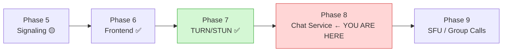
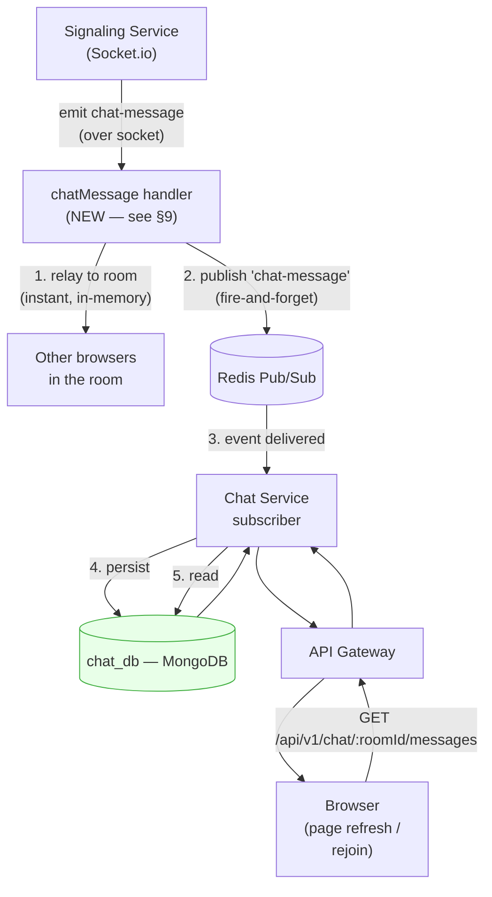
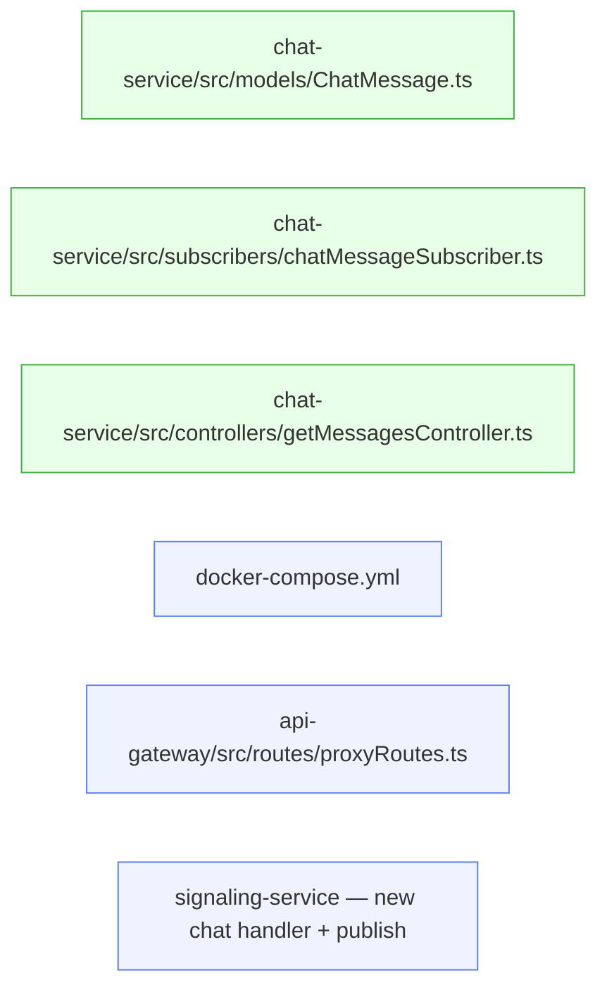
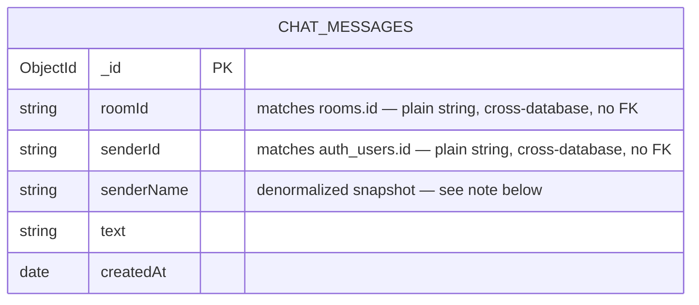
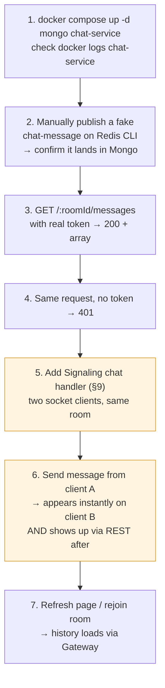

# Video Meet App — Phase 8 (Chat Service)

> **Stack for this service (matches every other service's pattern):** TypeScript, ES Modules (`"type": "module"`), Express, **Mongoose** (this is your one non-relational service — no Prisma here), MongoDB, Redis (subscriber only — no publishing from this service), Docker (per-service `Dockerfile` + root `docker-compose.yml` entry).
>
> **Prerequisite check before starting:** per your Master Status doc, Signaling Service is still early-stage (only D.1–D.3 done — folder structure + env files). Signaling does **not** yet have a `chat-message` handler or a Redis publish call for chat. Phase 8 as originally scoped assumes that piece exists. This doc builds Chat Service fully (it can be built and tested in isolation right now), and calls out exactly what small addition Signaling needs before the *end-to-end* flow works — same pattern as Phase 7's Test 6 being blocked on Signaling D.9.

---

## Part A — Where This Sits in the Roadmap



| Piece                                             | Status         | Notes                                                                                        |
| ------------------------------------------------- | -------------- | -------------------------------------------------------------------------------------------- |
| Chat Service (this doc)                           | 🔴 Not started | Fully buildable and testable in isolation today                                              |
| Signaling`chat-message` handler + Redis publish | 🔴 Not started | Small addition to Signaling Service — needed only for the*live* end-to-end path (see §9) |
| Gateway`/api/v1/chat/*` proxy                   | 🔴 Not started | Same`pathFilter` bug from Phase 1 applies here too — confirm fixed first                  |

---

## 1. Why This Phase Exists / Why MongoDB Here

Every other data-owning service (Auth, User, Room) uses Postgres because that data is genuinely relational — fixed shape, needs real transactions, benefits from constraints. Chat messages are the opposite shape:

- **High write volume** — potentially dozens of writes per second in a busy room, across many rooms simultaneously.
- **Schema-light** — a message today is `{ text }`; tomorrow it might be `{ text, attachmentUrl, reactions }`. You don't want a migration every time the shape grows.
- **Append-mostly, no cross-message transactions** — you never need "insert this message AND update that message atomically."
- **Naturally shards by `roomId`** — Mongo's sharding story fits this exactly, if/when you ever need it (you almost certainly won't at your current scale, but the data model already lines up with that future without any rework).

This is the same "polyglot persistence" principle from §2 of the master plan — Chat Service still owns its database exclusively (`chat_db`), still gets to zero, no other service ever queries it directly. The only thing that changes is the engine, because the *data shape* is different, not the isolation rules.



**Why the relay (step 1) and the persistence (step 4) are separate paths, not sequential:** the person in the room needs the message to appear *instantly* — it can't wait on a database write. Signaling relays it live over the socket the moment it arrives, and *separately* fires a Redis event so Chat Service can persist it in the background. If Chat Service is slow, restarting, or briefly down, live chat during the call is completely unaffected — only history-on-refresh is delayed. This is the same reasoning as Phase 3's `user-created` event: an async, fire-and-forget bridge between two services that never call each other directly.

---

## 2. Folder Structure (New Service)

Matches the internal shape of every other service — only the DB layer differs (`models/` with Mongoose schemas instead of a `prisma/` folder).

```
services/
└── chat-service/
    ├── src/
    │   ├── config/
    │   │   ├── db.ts                    ← Mongoose connection (replaces Prisma's db.ts)
    │   │   ├── env.ts
    │   │   └── redis.ts                 ← subscriber client only
    │   ├── models/
    │   │   └── ChatMessage.ts           ← Mongoose schema (replaces prisma/schema.prisma)
    │   ├── controllers/
    │   │   └── getMessagesController.ts
    │   ├── subscribers/
    │   │   └── chatMessageSubscriber.ts ← NEW pattern for this service — listens on Redis, persists
    │   ├── middleware/
    │   │   ├── authGuard.ts             ← copy pattern from room-service (calls Auth's verify-token)
    │   │   ├── errorHandler.ts
    │   │   └── validate.ts
    │   ├── routes/
    │   │   └── chatRoutes.ts
    │   ├── utils/
    │   │   ├── AppError.ts
    │   │   ├── logger.ts
    │   │   └── response.ts
    │   ├── validation/
    │   │   └── chatSchemas.ts
    │   └── app.ts
    ├── types/
    │   └── express/
    │       └── index.d.ts
    ├── .env
    ├── .env.docker
    ├── .env.example
    ├── dockerfile
    ├── package.json
    ├── package-lock.json
    ├── README.md
    ├── server.ts
    └── tsconfig.json
```



---

## 3. Data Model

Single collection, deliberately flat and denormalized — no `$lookup`/joins, since `roomId` and `senderId` are cross-database plain strings by design (see §9 of the master plan).



**Why `senderName` is denormalized (copied) into the message instead of looked up live:** Chat Service cannot join into `user_db` — different database, different engine. Two options exist for showing "who sent this": (a) a live REST call to User Service on every message read, or (b) copy the display name in at write time. Copying in is correct here because chat history is a log of what happened *at that moment* — if someone changes their display name later, old messages showing their old name is expected behavior (same as Slack/Discord), not a bug. This avoids an extra network call on every single chat read.

**Mongoose schema** (`src/models/ChatMessage.ts`):

```typescript
import mongoose, { Schema, Document } from 'mongoose';

export interface IChatMessage extends Document {
    roomId: string;
    senderId: string;
    senderName: string;
    text: string;
    createdAt: Date;
}

const chatMessageSchema = new Schema<IChatMessage>({
    roomId: { type: String, required: true, index: true },
    senderId: { type: String, required: true },
    senderName: { type: String, required: true },
    text: { type: String, required: true, maxlength: 2000 },
    createdAt: { type: Date, default: Date.now },
});

// Compound index: history reads are always "give me messages for this room,
// oldest to newest" — this index makes that query fast even at high volume.
chatMessageSchema.index({ roomId: 1, createdAt: 1 });

export const ChatMessage = mongoose.model<IChatMessage>('ChatMessage', chatMessageSchema);
```

---

## 4. `docker-compose.yml` Additions

Two additions: a `mongo` container (if not already present from Phase 0's skeleton) and the `chat-service` container itself.

```yaml
  mongo:
    image: mongo:7
    container_name: mongo
    restart: unless-stopped
    ports:
      - "27017:27017"
    volumes:
      - mongo_data:/data/db

  chat-service:
    build: ./services/chat-service
    container_name: chat-service
    restart: unless-stopped
    env_file:
      - ./services/chat-service/.env.docker
    depends_on:
      - mongo
      - redis
    ports:
      - "4005:4005"

volumes:
  mongo_data:
```

**Checkpoint:**

```powershell
docker compose config
```

should run with no syntax errors, and `mongo_data` should appear alongside your existing named volumes.

---

## 5. Env Vars

```powershell
cd services\chat-service
notepad .env
```

```dotenv
PORT=4005
MONGO_URI=mongodb://localhost:27017/chat_db
REDIS_URL=redis://localhost:6379
GATEWAY_SECRET=<same internal secret every other service uses>
AUTH_SERVICE_URL=http://localhost:4001
```

`.env.docker` (same values, container-network hostnames — matches the pattern every other service already follows):

```dotenv
PORT=4005
MONGO_URI=mongodb://mongo:27017/chat_db
REDIS_URL=redis://redis:6379
GATEWAY_SECRET=<same value>
AUTH_SERVICE_URL=http://auth-service:4001
```

`.env.example` (placeholder, committed to Git):

```dotenv
PORT=4005
MONGO_URI=mongodb://localhost:27017/chat_db
REDIS_URL=redis://localhost:6379
GATEWAY_SECRET=replace_with_shared_internal_secret
AUTH_SERVICE_URL=http://localhost:4001
```

`src/config/env.ts`:

```typescript
import 'dotenv/config';

export const PORT = process.env.PORT || 4005;
export const MONGO_URI = process.env.MONGO_URI as string;
export const REDIS_URL = process.env.REDIS_URL as string;
export const GATEWAY_SECRET = process.env.GATEWAY_SECRET as string;
export const AUTH_SERVICE_URL = process.env.AUTH_SERVICE_URL as string;
```

---

## 6. Mongoose Connection (`src/config/db.ts`)

This is the direct equivalent of every other service's `db.ts` — connect once, on boot, before the server starts accepting requests.

```typescript
import mongoose from 'mongoose';
import { MONGO_URI } from './env.js';
import logger from '../utils/logger.js';

export const connectDB = async (): Promise<void> => {
    try {
        await mongoose.connect(MONGO_URI);
        logger.info('[chat-service] MongoDB connected');
    } catch (err) {
        logger.error('[chat-service] MongoDB connection failed', err);
        process.exit(1);
    }
};
```

Call `await connectDB()` at the top of `server.ts`, same place every other service calls its own DB connector, before `app.listen(...)`.

---

## 7. Redis Subscriber (`src/subscribers/chatMessageSubscriber.ts`)

**Why a dedicated subscriber file, not inline in `app.ts`:** this is a new pattern for your codebase — every other service's Redis usage so far has been either publish-only (Auth) or presence-only (Signaling). Chat Service is your first pure *subscribe-and-persist* consumer. Keeping it isolated makes it easy to unit-test independently of Express entirely.

```typescript
import { createClient } from 'redis';
import { REDIS_URL } from '../config/env.js';
import { ChatMessage } from '../models/ChatMessage.js';
import logger from '../utils/logger.js';

interface ChatMessagePayload {
    roomId: string;
    senderId: string;
    senderName: string;
    text: string;
}

export const startChatMessageSubscriber = async (): Promise<void> => {
    const subscriber = createClient({ url: REDIS_URL });

    subscriber.on('error', (err) => logger.error('[chat-subscriber] Redis error', err));

    await subscriber.connect();

    await subscriber.subscribe('chat-message', async (rawMessage) => {
        try {
            const payload: ChatMessagePayload = JSON.parse(rawMessage);

            if (!payload.roomId || !payload.senderId || !payload.text) {
                logger.warn('[chat-subscriber] Dropped malformed payload', payload);
                return;
            }

            await ChatMessage.create({
                roomId: payload.roomId,
                senderId: payload.senderId,
                senderName: payload.senderName,
                text: payload.text,
            });

            logger.info(`[chat-subscriber] Persisted message for room ${payload.roomId}`);
        } catch (err) {
            // Deliberately swallow-and-log, not throw: a bad message must never
            // crash the subscriber loop and take down persistence for every
            // other room's messages.
            logger.error('[chat-subscriber] Failed to persist message', err);
        }
    });

    logger.info('[chat-subscriber] Subscribed to "chat-message" channel');
};
```

Call `await startChatMessageSubscriber()` in `server.ts`, right after `connectDB()`.

**Why validation happens here too, not just relying on Signaling to send clean data:** this service never trusts another service's output blindly — same "every service ships with the same standards" rule from §10 of the master plan. A malformed or malicious payload on the Redis channel should never crash a database write.

---

## 8. REST Read Path

### 8.1 Controller (`src/controllers/getMessagesController.ts`)

```typescript
import { Request, Response, NextFunction } from 'express';
import { ChatMessage } from '../models/ChatMessage.js';
import { successResponse } from '../utils/response.js';
import AppError from '../utils/AppError.js';

export const getMessages = async (
    req: Request,
    res: Response,
    next: NextFunction
) => {
    try {
        const { roomId } = req.params;
        const limit = Math.min(Number(req.query.limit) || 50, 200);

        const messages = await ChatMessage.find({ roomId })
            .sort({ createdAt: 1 })
            .limit(limit)
            .lean();

        successResponse(res, { messages });
    } catch (err) {
        next(new AppError('Failed to fetch chat history', 500));
    }
};
```

`.lean()` matters here specifically because chat history reads can be frequent (every page refresh, every rejoin) and return-heavy — skipping Mongoose's document-hydration overhead for a plain read is a real, easy win.

### 8.2 Route (`src/routes/chatRoutes.ts`)

Same `authGuard` pattern as Room Service — this service holds no user session itself, so it calls Auth's `/internal/verify-token` exactly like Room Service does.

```typescript
import { Router } from 'express';
import { authGuard } from '../middleware/authGuard.js';
import { getMessages } from '../controllers/getMessagesController.js';

const router = Router();

router.get('/:roomId/messages', authGuard, getMessages);

export default router;
```

Mount in `app.ts`:

```typescript
app.use('/api/v1/chat', chatRoutes);
```

---

## 9. The Piece This Phase Depends On: Signaling's `chat-message` Handler

This is **not** part of Chat Service itself, but Chat Service has nothing to persist until it exists. Add this to `signaling-service/src/handlers/` (new file, e.g. `chatMessage.ts`), following the exact same shape as your existing `joinRoom.ts` / `relay.ts` handlers:

```typescript
// signaling-service/src/handlers/chatMessage.ts  (illustrative — match your existing handler signature)
import { Server, Socket } from 'socket.io';
import { publishChatMessage } from '../config/redis.js'; // new small publish helper

export const handleChatMessage = (io: Server, socket: Socket) => {
    socket.on('chat-message', async ({ roomId, text }) => {
        const payload = {
            roomId,
            senderId: socket.data.userId,     // set during socketAuth
            senderName: socket.data.userName, // set during socketAuth, from verify-token response
            text,
        };

        // 1. Instant relay — everyone in the room sees it immediately
        io.to(roomId).emit('chat-message', payload);

        // 2. Fire-and-forget persistence — Chat Service picks this up async
        await publishChatMessage(payload);
    });
};
```

Wire it in `socket/index.ts` alongside your existing `join-room` / `leave-room` / `offer` / `answer` handler registrations. This is a small, self-contained addition — it does not require the rest of Signaling Service (D.4–D.16) to be finished, only that a socket connection and room-join already work, which Phase 5 already partially covers.

---

## 10. Gateway Proxy

Once the Phase 1 `pathFilter` bug is fixed (per your Master Status doc — same blocker Phase 7 flagged), add one line to `proxyRoutes.ts` following the exact pattern already used for `/api/auth`, `/api/users`, `/api/rooms`:

```typescript
router.use('/api/chat', gatewayAuth, createProxyMiddleware({
    target: 'http://chat-service:4005',
    changeOrigin: true,
    pathFilter: '/api/chat',
}));
```

**Checkpoint once Gateway is fixed:**

```powershell
curl.exe -H "Authorization: Bearer <a real token>" http://localhost:4000/api/chat/<roomId>/messages
```

should return the same JSON whether hit through the gateway (`:4000`) or chat-service directly (`:4005`).

---

## 11. Testing Plan



| # | Test                                     | How                                                                                                     | Expected                                                                                                                      |
| - | ---------------------------------------- | ------------------------------------------------------------------------------------------------------- | ----------------------------------------------------------------------------------------------------------------------------- |
| 1 | Service + Mongo start                    | `docker compose up -d mongo chat-service` → `docker logs chat-service`                             | No fatal errors,`MongoDB connected` + `Subscribed to "chat-message" channel` both logged                                  |
| 2 | Subscriber persists correctly (isolated) | `redis-cli PUBLISH chat-message '{"roomId":"test1","senderId":"u1","senderName":"Test","text":"hi"}'` | A new document appears in`chat_db.chatmessages` — provable **before** Signaling's handler even exists                |
| 3 | History read works                       | `GET /api/v1/chat/test1/messages` with real token                                                     | `200` with the message from Test 2 in the array                                                                             |
| 4 | No token → rejected                     | Same request, no`Authorization` header                                                                | `401`                                                                                                                       |
| 5 | Signaling handler wired (§9)            | Two socket clients join the same room                                                                   | Both connect, both join successfully                                                                                          |
| 6 | **Live send + persist together**   | Client A emits`chat-message`                                                                          | Client B receives it instantly over the socket; a moment later it's also queryable via REST                                   |
| 7 | **The actual deliverable**         | Refresh the page, rejoin the room                                                                       | Chat sidebar repopulates from history — this is what proves "history survives page refresh," the exact line from the roadmap |

**Why Test 2 is worth doing before Test 5/6:** it isolates whether Chat Service's own persistence logic is correct, independent of whether Signaling's new handler is wired up right. If Test 2 passes but Test 6 doesn't, you know the bug is in Signaling's handler or its Redis publish call — not in Chat Service.

---

## 12. Status Checklist

```
1. Branch: phase-8-chat-service                      [ ]
2. mongo + chat-service added to docker-compose.yml   [ ]
3. .env / .env.docker / .env.example                  [ ]
4. src/config/db.ts (Mongoose connect)                 [ ]
5. src/models/ChatMessage.ts                           [ ]
6. src/subscribers/chatMessageSubscriber.ts             [ ]
7. src/controllers/getMessagesController.ts             [ ]
8. src/routes/chatRoutes.ts + mounted in app.ts          [ ]
9. authGuard middleware (copied/adapted from room-service) [ ]
10. Gateway proxy entry (/api/chat)                    [ ] ← blocked on Phase 1 bug fix
11. Signaling: chat-message handler + Redis publish    [ ] ← separate small piece, see §9
12. Tests 1–4 (isolated Chat Service)                  [ ]
13. Tests 5–7 (end-to-end with Signaling)               [ ] ← blocked on item 11
```

**Immediate next action:** items 2–9 — build and test Chat Service fully in isolation (Tests 1–4) without touching Signaling at all. Only after that's confirmed working should you add the small Signaling handler in §9 to unlock the live end-to-end path.
