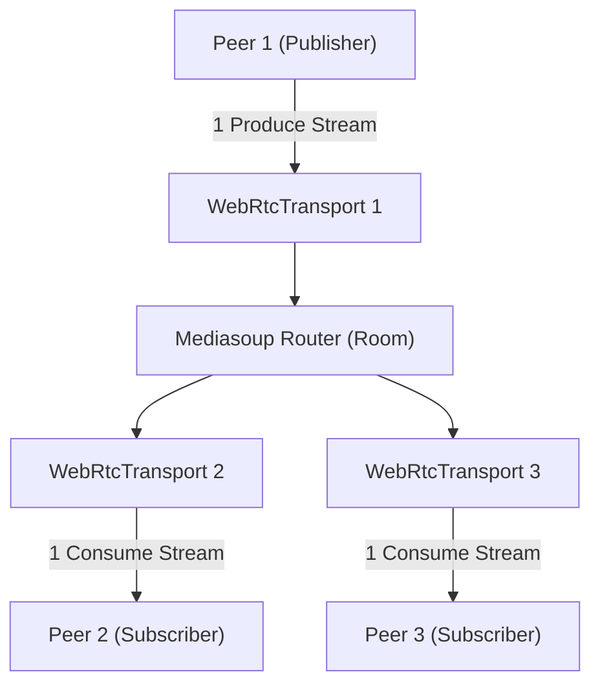

# sfu-service (Phase 9 — SFU Service for Group Calls)

**Port:** 4006 (Planned) | **Engine:** Mediasoup v3 (Node.js & C++ WebRTC Engine)  
**Status:** ⏳ Phase 9 Pending Implementation

Selective Forwarding Unit (SFU) microservice designed for multi-participant video calls (3+ participants). Solves full-mesh bandwidth bottlenecks by receiving media streams once per publisher and forwarding them selectively to all subscribers.

---

## Planned Architecture & Topologies

---

## Key Components to Implement (Phase 9)

1. **Worker Management:** Spawn Mediasoup Workers (`mediasoup.createWorker()`) tied to CPU cores.
2. **Router Allocation:** Create a Mediasoup `Router` per active room upon 3rd participant entry.
3. **WebRtcTransports:** Create sending (Produce) and receiving (Consume) WebRtcTransports per participant.
4. **Producers & Consumers:** Manage stream production (`transport.produce()`) and stream consumption (`transport.consume()`).
5. **Signaling Integration:** Expose internal HTTP/WS endpoints for Signaling Service coordination.

---

## Planned Environment Variables

| Variable | Example | Description |
|---|---|---|
| `PORT` | `4006` | Listening port |
| `MEDIASOUP_MIN_PORT` | `40000` | Minimum UDP port for WebRTC traffic |
| `MEDIASOUP_MAX_PORT` | `49999` | Maximum UDP port for WebRTC traffic |
| `ANNOUNCED_IP` | `127.0.0.1` | Public IP announced for WebRTC media |
