# Phase 9 — SFU Service: Progress, Pending Work & Proper Build Guide

> **Branch:** `phase-9-sfu-service`
> **Service folder:** `services/sfu-service` (HTTP Port `4006`, RTP/media ports `40000-40100`)
> **Stack:** TypeScript, Express 5, Mediasoup v3 (3.27), Pino, Node 22
> **Import style (CORRECTED):** `package.json` mein `"type": "module"` **hai** (ESM). Imports **`.ts` extension ke saath** likhte hain (`'../config/env.ts'`). `tsconfig` mein `allowImportingTsExtensions` + `rewriteRelativeImportExtensions` on hai, isliye `tsc` build ke baad `.js` ban jata hai.
> **Overall status:** 🟡 **IN PROGRESS — ~40% done.** Pehle ye doc "CommonJS, bina extension" bolta tha, wo galat tha. Code sahi tha, doc purana.

---

## 0. Kya change hua is version mein (Changelog)

| # | Change                                                              | Kyun                                                                                          |
| :-: | :------------------------------------------------------------------ | :-------------------------------------------------------------------------------------------- |
| 1 | Import-style note fix (ESM +`.ts`)                                | Doc aur real code contradict kar rahe the                                                     |
| 2 | Steps ko 11 se**15** mein tod diya                            | Cleanup, auth, docker signaling se**pehle** chahiye, warna signaling test nahi ho sakti |
| 3 | `peerManager` ka proper data model + diagram                      | Saari cleanup logic isi par tiki hai                                                          |
| 4 | Peer leave / cleanup flow add kiya                                  | Warna ports, memory aur routers leak hote hain                                                |
| 5 | Internal auth (`x-internal-secret`) design add kiya               | SFU ko koi bhi call na kar sake                                                               |
| 6 | Mesh → SFU switch ka**proper** flow + hysteresis             | Sirf "3rd user pe switch" likhna incomplete tha                                               |
| 7 | Server→client events (`producer-closed`, `peer-left`) add kiye | SFU HTTP hai, wo khud push nahi kar sakta                                                     |
| 8 | Known issues list (README env mismatch,`closeRoom` bug, etc.)     | Real code review se mile                                                                      |
| 9 | Main checklist mein Phase 9 ko**✅ se ⏳ IN PROGRESS** karna  | Abhi complete nahi hai                                                                        |

---

## 1. Status Dashboard

| Step | Kya banega                                                           |   Status   | Depends on |
| :--: | :------------------------------------------------------------------- | :--------: | :--------- |
|  1  | Skeleton (`server.ts`, `app.ts`, `/health`)                    |  ✅ Done  | —         |
|  2  | Dockerfile (multi-stage, healthcheck, non-root)                      |  ✅ Done  | —         |
|  3  | Mediasoup config (`config/mediasoup.ts`)                           |  ✅ Done  | —         |
|  4  | Worker pool (`workerPool.ts`)                                      |  ✅ Done  | 3          |
|  5  | Room manager +`GET /router-capabilities/:roomId`                   |  ✅ Done  | 4          |
|  6  | **Peer store** (`peerManager.ts`) + **Transports API** |  ⏳ Next  | 5          |
|  7  | **Produce API** + `GET /producers/:roomId`                   | ⏳ Pending | 6          |
|  8  | **Consume + Resume API**                                       | ⏳ Pending | 7          |
|  9  | **Peer leave + cleanup** (`POST /peers/leave`)               | ⏳ Pending | 6, 7, 8    |
|  10  | **Internal auth + validation** (`authGuard`, Joi)            | ⏳ Pending | 6          |
|  11  | **Docker compose** env + UDP/TCP ports                         | ⏳ Pending | 2          |
|  12  | **Signaling integration** (`sfuClient`, new socket events)   | ⏳ Pending | 6–11      |
|  13  | **Frontend** (`mediasoup-client`)                            | ⏳ Pending | 12         |
|  14  | **Mesh → SFU mode switch**                                    | ⏳ Pending | 13         |
|  15  | **Multi-tab testing** + docs + main checklist update           | ⏳ Pending | 14         |

> Naya order kyun: Step 9 (cleanup), 10 (auth) aur 11 (docker) pehle aate hain kyunki jab signaling se real traffic aayega tab bina cleanup ke har test run ports/memory leak karega, aur bina docker ports ke browser se media connect hi nahi hoga.

---

## 2. Architecture — Big Picture

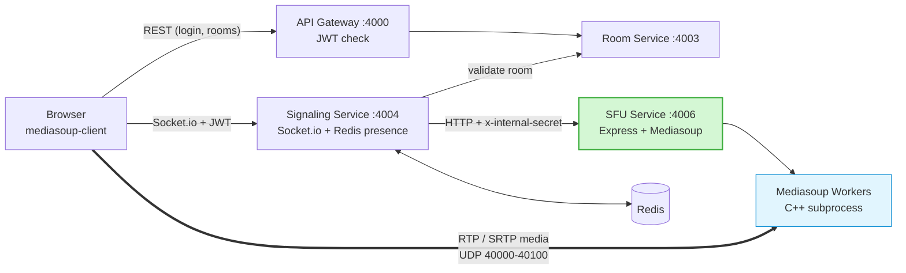

**Explanation (kyun aisa):**

- **Control plane** (kaun join hua, kaunsa transport bana) = `Browser → Signaling → SFU` over HTTP/WebSocket. Ye chhota JSON data hai.
- **Media plane** (asli video/audio packets) = `Browser ⇄ Mediasoup Worker` **directly** over UDP. Media kabhi Express ya Signaling se nahi guzarta.
- Browser SFU ko **direct HTTP call nahi karta**. Signaling beech mein hai kyunki wahi JWT verify karta hai, room membership jaanta hai, aur `peerId` trust kar sakta hai.

---

## 3. Ab tak kya bana hai (Done)

```
services/sfu-service/
├── server.ts                        ← pehle workers start, phir HTTP server
├── package.json                     ← "type": "module"
├── tsconfig.json                    ← NodeNext + rewriteRelativeImportExtensions
├── .env                             ← PORT, NUM_WORKERS, RTC ports, ANNOUNCED_IP
├── Dockerfile
└── src/
    ├── app.ts                       ← /health + /api/v1/sfu routes + errorHandler
    ├── config/
    │   ├── env.ts
    │   └── mediasoup.ts             ← codecs (Opus, VP8, H264), listenInfos
    ├── mediasoup/
    │   ├── workerPool.ts            ← round-robin getNextWorker()
    │   └── roomManager.ts           ← roomId → Promise<Router>
    ├── controllers/
    │   └── routerController.ts
    ├── routes/sfuRoutes.ts
    ├── middleware/errorHandler.ts
    └── utils/ (logger.ts, AppError.ts)
```

**Working API abhi:**

| Method | URL                                         | Result                                           |
| :----- | :------------------------------------------ | :----------------------------------------------- |
| GET    | `/health`                                 | `{ "status": "ok" }`                           |
| GET    | `/api/v1/sfu/router-capabilities/:roomId` | `{ success, data: { routerRtpCapabilities } }` |

**Verified:** 2 workers alag pid ke saath start hote hain, aur ek room ke liye Router sirf ek baar banta hai (Promise store ki wajah se).

---

## 4. Mediasoup Objects & In-Memory Data Model (Step 6 ki neev)

### 4.1 Objects ka relation

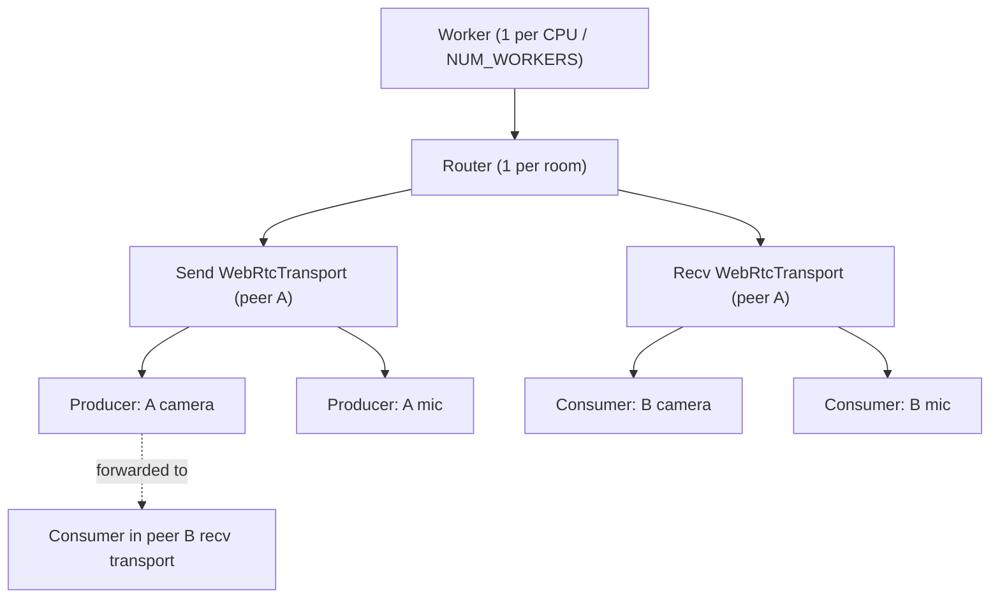

### 4.2 Hamara store kaisa hoga

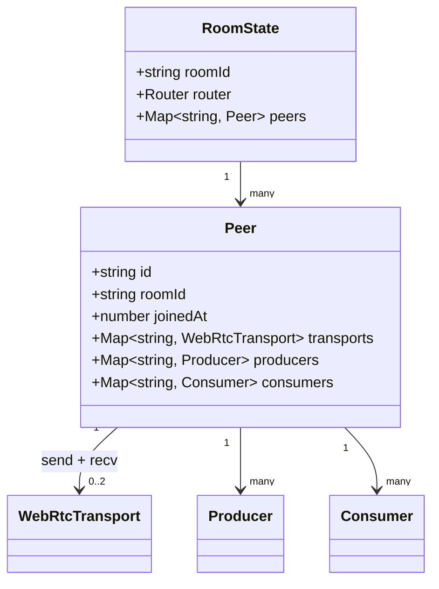

**Kyun `peerManager` alag chahiye:** `roomManager` sirf `roomId → Router` jaanta hai. Lekin cleanup ke liye humein "ye transport/producer/consumer kis peer ka hai" pata hona chahiye. Bina iske peer leave hone par kuch close nahi kar sakte.

### 4.3 `peerId` kaun dega? (Zaroori design decision)

| Option                     | Problem                                                          |
| :------------------------- | :--------------------------------------------------------------- |
| `userId`                 | Same user 2 tabs mein khole (testing mein hota hai) to collision |
| **`socket.id`** ✅ | Har tab/refresh ka unique, disconnect pe khud expire             |

**Rule:** `peerId` **hamesha Signaling set karega** (authenticated socket se), client ke body se **kabhi nahi**. Warna koi bhi dusre ka `peerId` bhej kar uska stream consume/close kar sakta hai.

### 4.4 `src/mediasoup/peerManager.ts` — skeleton

```ts
import * as mediasoup from 'mediasoup';
import AppError from '../utils/AppError.ts';

export interface Peer {
  id: string;
  roomId: string;
  joinedAt: number;
  transports: Map<string, mediasoup.types.WebRtcTransport>;
  producers: Map<string, mediasoup.types.Producer>;
  consumers: Map<string, mediasoup.types.Consumer>;
}

const rooms = new Map<string, Map<string, Peer>>();

export function getOrCreatePeer(roomId: string, peerId: string): Peer { /* ... */ }
export function getPeer(roomId: string, peerId: string): Peer {
  const peer = rooms.get(roomId)?.get(peerId);
  if (!peer) throw new AppError('Peer not found', 404);
  return peer;
}
export function findProducer(roomId: string, producerId: string) { /* { peer, producer } | undefined */ }
export function listProducers(roomId: string, exceptPeerId?: string) { /* [{ producerId, peerId, kind, source }] */ }
export function getPeerCount(roomId: string): number { /* ... */ }

// Peer ke saare transports close -> unke producers/consumers khud close ho jate hain
export function removePeer(roomId: string, peerId: string) {
  /* 1) closedProducerIds collect karo  2) transports close  3) map se hatao
     4) return { closedProducerIds, roomEmpty } */
}
```

---

## 5. Pending Work — Step by Step (Proper Way)

### Step 6 — Peer store + Transports API

**Goal:** Browser ke liye "pipe" (transport) ready karna.

**Kyun 2 transports:** WebRTC transport ek direction mein optimize hota hai. **Send** = upload (camera/mic), **Recv** = download. Dono alag rakhne se bitrate estimation aur cleanup saaf rehta hai.

**Nayi files:**

| File                                       | Kaam                                                |
| :----------------------------------------- | :-------------------------------------------------- |
| `src/mediasoup/peerManager.ts`           | Room → peer → transports/producers/consumers      |
| `src/mediasoup/transportManager.ts`      | `createWebRtcTransport`, `connect`, event hooks |
| `src/controllers/transportController.ts` | HTTP handlers                                       |

**Endpoints:**

| Method | URL                                | Body                                                | Returns (`data`)                                       |
| :----- | :--------------------------------- | :-------------------------------------------------- | :------------------------------------------------------- |
| POST   | `/api/v1/sfu/transports`         | `{ roomId, peerId, direction: 'send' \| 'recv' }`  | `{ id, iceParameters, iceCandidates, dtlsParameters }` |
| POST   | `/api/v1/sfu/transports/connect` | `{ roomId, peerId, transportId, dtlsParameters }` | `{ connected: true }`                                  |

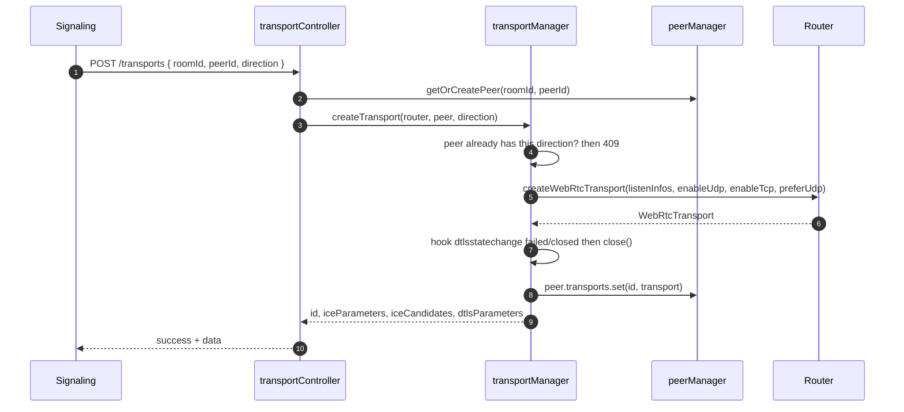

**Proper way (zaroori points):**

- `mediasoupConfig.webRtcTransport` spread karo, phir `enableUdp: true, enableTcp: true, preferUdp: true` aur `appData: { peerId, direction }` do.
- **Ek peer = max 1 send + 1 recv.** Duplicate direction pe `AppError(409)`. Isse client bug jaldi pakde jate hain.
- `transport.on('dtlsstatechange', s => { if (s === 'failed' || s === 'closed') transport.close(); })`. Browser tab crash ho to bhi transport free ho.
- `transport.observer.on('close', () => peer.transports.delete(transport.id))`. Map hamesha sach dikhaye.
- `connect` do baar call hua to mediasoup throw karta hai → catch karke `AppError(409)`.

**Test:** `curl -X POST .../transports` se `iceParameters`, `iceCandidates`, `dtlsParameters` aana chahiye. (Connect ka test sirf real browser se ho sakta hai, kyunki valid `dtlsParameters` mediasoup-client banata hai.)

---

### Step 7 — Produce API + Existing producers list

**Goal:** Browser apna camera/mic SFU ko bheje, aur naya joiner pehle se maujood streams dekh sake.

**Nayi files:** `src/mediasoup/producerManager.ts`, `src/controllers/produceController.ts`

| Method | URL                                             | Body                                                             | Returns (`data`)                         |
| :----- | :---------------------------------------------- | :--------------------------------------------------------------- | :----------------------------------------- |
| POST   | `/api/v1/sfu/produce`                         | `{ roomId, peerId, transportId, kind, rtpParameters, source }` | `{ producerId }`                         |
| GET    | `/api/v1/sfu/producers/:roomId?exceptPeerId=` | —                                                               | `[{ producerId, peerId, kind, source }]` |

**Proper way:**

- Check karo `transport.appData.direction === 'send'`, warna `AppError(400)` (recv transport pe produce galat hai).
- `source` (`'camera' | 'mic' | 'screen'`) ko `appData` mein rakho. Frontend ko tile type decide karne mein aur baad mein screen-share ke liye chahiye.
- `producer.on('transportclose', ...)` aur `producer.observer.on('close', ...)` se peer map saaf rakho.
- **Naye joiner ka problem:** `new-producer` event sirf unko milta hai jo pehle se room mein hain. Naya user jo baad mein aaya, wo purane producers ka event miss kar deta hai. Isliye `GET /producers/:roomId` zaroori hai. Signaling join ke baad ye list bhejegi.

---

### Step 8 — Consume + Resume API

**Goal:** Browser dusron ki video/audio download kare.

**Nayi files:** `src/mediasoup/consumerManager.ts`, `src/controllers/consumeController.ts`

| Method | URL                             | Body                                                | Returns (`data`)                                          |
| :----- | :------------------------------ | :-------------------------------------------------- | :---------------------------------------------------------- |
| POST   | `/api/v1/sfu/consume`         | `{ roomId, peerId, producerId, rtpCapabilities }` | `{ id, producerId, peerId, kind, source, rtpParameters }` |
| POST   | `/api/v1/sfu/consumer/resume` | `{ roomId, peerId, consumerId }`                  | `{ resumed: true }`                                       |

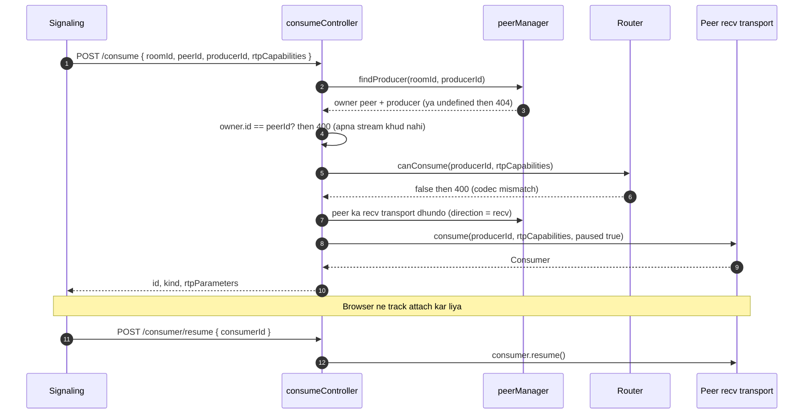

**Proper way:**

- **Recv transport server khud dhundhe** (`appData.direction === 'recv'`). Client se `transportId` mat lo, warna wo galat transport bhej sakta hai.
- `paused: true` pe banao, browser ready hone ke baad `resume`. Nahi to pehla keyframe miss hota hai aur video black rehti hai.
- `consumer.on('producerclose', ...)` aur `consumer.on('transportclose', ...)` mein map se hata do. Client ko batane ka kaam `producer-closed` event (Step 12) karega.
- Consume ke liye `roomManager` mein naya helper: `getRouter(roomId)` jo **naya Router nahi banata** (sirf existing return kare, warna `AppError(404)`). Warna ek galat `roomId` se khali Router ban jayega.

> **Note:** Produce/consume ka full test curl se nahi ho sakta (real `rtpParameters` mediasoup-client banata hai). Type-check + Step 13 mein browser test.

---

### Step 9 — Peer Leave + Cleanup (NAYA, zaroori)

**Goal:** User leave/disconnect/refresh kare to sab kuch saaf ho.

**Kyun zaroori:** Bina cleanup ke har refresh par 2 transports (2 UDP/TCP ports), producers, consumers aur Router memory mein padte rehte hain. 100 ports ki range jaldi khatam ho jayegi.

| Method | URL                         | Body                   | Returns (`data`)                                       |
| :----- | :-------------------------- | :--------------------- | :------------------------------------------------------- |
| POST   | `/api/v1/sfu/peers/leave` | `{ roomId, peerId }` | `{ closedProducerIds: string[], roomClosed: boolean }` |

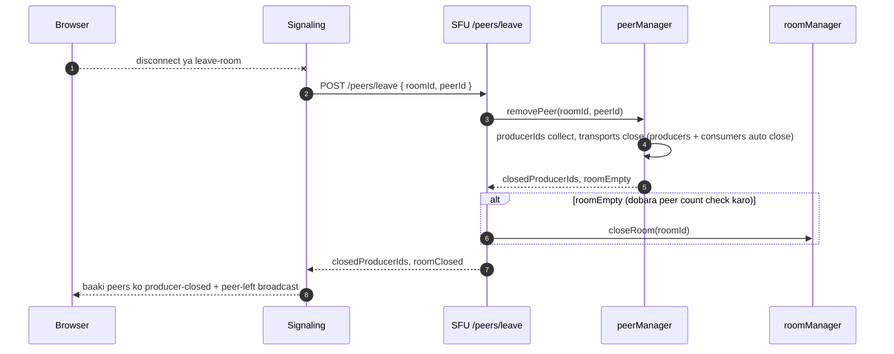

**Proper way:**

- **Idempotent** banao: peer pehle hi nahi hai to bhi `200` return karo. `disconnect` aur `leave-room` dono aa sakte hain.
- SFU HTTP hai, wo khud browser ko push nahi kar sakta. Isliye response mein `closedProducerIds` wapas karo, Signaling broadcast karega.
- `closeRoom` se pehle **peer count dobara check** karo (race: last peer gaya aur usi waqt naya aa gaya).
- Signaling ke `disconnect` handler mein ye call `try/catch` mein ho, taaki SFU down hone par bhi signaling crash na kare.

**Peer lifecycle:**

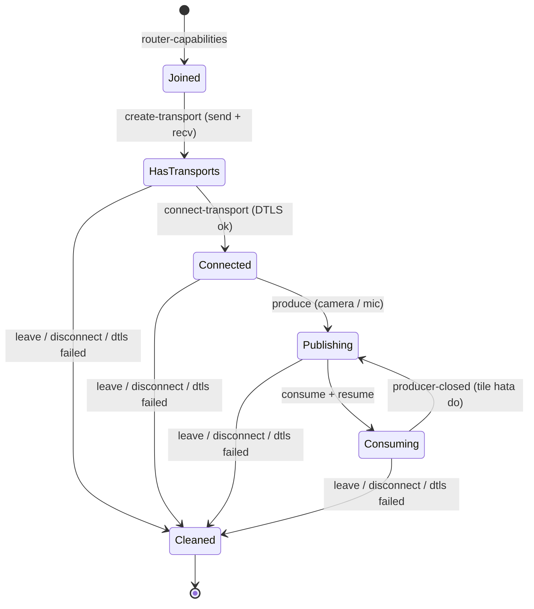

---

### Step 10 — Internal Auth + Validation (NAYA, zaroori)

**Goal:** Sirf Signaling SFU ko call kare, aur galat input pe saaf `400` mile.

**Kyun:** SFU browser ke liye nahi hai. Agar kabhi `4006` galti se expose ho gaya, to koi bhi transports/producers bana ya band kar sakta hai.

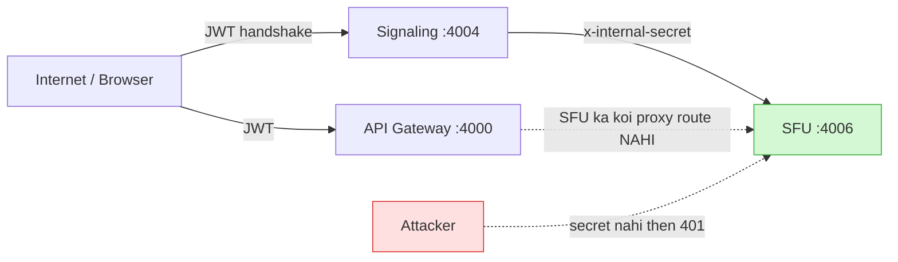

**Proper way:**

1. `.env` / compose mein `INTERNAL_SECRET` (lamba random string), Signaling aur SFU dono mein same. `env.ts` mein `internalSecret` add karo, aur agar missing ho to **startup pe fail** karo.
2. `src/middleware/authGuard.ts`: `x-internal-secret` header ko `crypto.timingSafeEqual` se compare karo (normal `===` timing leak karta hai). Fail pe `AppError('Unauthorized', 401)`.
3. `app.ts` mein `/health` **ke baad** `app.use('/api/v1/sfu', authGuard, sfuRoutes)`. Health open rahe taaki Docker healthcheck chale.
4. Validation ke liye **Joi** (project ke Auth service mein pehle se use ho raha hai, consistency). Har controller ke start mein schema validate, fail pe `AppError(400)`.
5. Gateway mein SFU ka koi proxy rule **mat** daalo.

> `authGuard.ts` ka comment purani docs mein "JWT validate karta hai" likha tha. Internal service-to-service ke liye shared secret kaafi aur simple hai. JWT user-facing Signaling handshake par pehle se hota hai.

---

### Step 11 — Docker Compose (env + ports)

**Kyun:** Media UDP/TCP ports container ke bahar publish na hon to browser ka ICE connect kabhi nahi hoga, chahe signaling sahi ho.

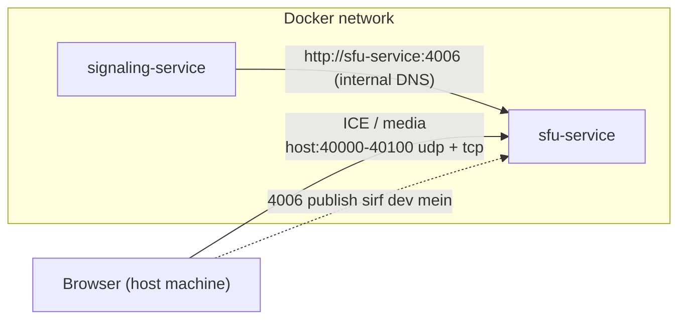

```yaml
  sfu-service:
    build: ./services/sfu-service
    restart: unless-stopped
    environment:
      - PORT=4006
      - NODE_ENV=development
      - NUM_WORKERS=2
      - RTC_MIN_PORT=40000
      - RTC_MAX_PORT=40100
      - ANNOUNCED_IP=127.0.0.1
      - INTERNAL_SECRET=${INTERNAL_SECRET}
    ports:
      - "4006:4006"                        # sirf dev. Prod mein hata do
      - "40000-40100:40000-40100/udp"
      - "40000-40100:40000-40100/tcp"

  signaling-service:
    environment:
      - SFU_SERVICE_URL=http://sfu-service:4006
      - INTERNAL_SECRET=${INTERNAL_SECRET}
    depends_on:
      - sfu-service
```

**Proper way / yaad rakho:**

- `RTC_MIN_PORT/RTC_MAX_PORT` compose ke range se **exactly match** hone chahiye.
- `ANNOUNCED_IP`: same laptop pe test = `127.0.0.1`, LAN pe dusra device = laptop ka LAN IP, production = public IP.
- Docker Desktop (Windows) pe bada port range (`40000-49999`) publish karna bahut slow hota hai. Range `100` ports hi rakho. Har transport 1 UDP + 1 TCP port leta hai, 5 users × 2 transports = 10 ports, kaafi hai.
- `worker.on('died')` mein process exit hota hai. `restart: unless-stopped` se container wapas uth jayega (rooms lose honge, ye abhi acceptable hai).

**Test:**

```bash
docker-compose config
docker-compose up --build sfu-service
curl http://localhost:4006/health
curl -H "x-internal-secret: <secret>" http://localhost:4006/api/v1/sfu/router-capabilities/test-room
curl http://localhost:4006/api/v1/sfu/router-capabilities/test-room     # secret ke bina: 401
```

---

### Step 12 — Signaling Service integration

**Kahan:** `services/signaling-service`

**Kyun:** Browser sirf Socket.io se baat karta hai. Signaling JWT verify karta hai, room membership check karta hai, `peerId = socket.id` set karta hai, phir SFU ko call karta hai.

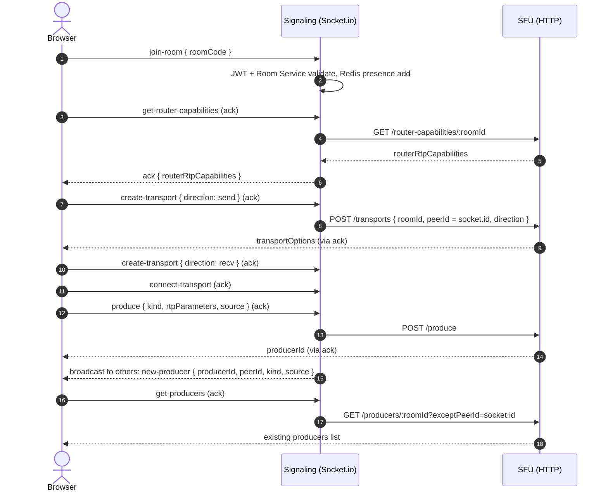

**Naye Socket.io events (client → server), sab ack callback ke saath:**

| Event                           | SFU call                                          | Ack response                                  |
| :------------------------------ | :------------------------------------------------ | :-------------------------------------------- |
| `get-router-capabilities`     | `GET /router-capabilities/:roomId`              | `{ routerRtpCapabilities }`                 |
| `create-transport`            | `POST /transports`                              | `{ transportOptions }`                      |
| `connect-transport`           | `POST /transports/connect`                      | `{ connected }`                             |
| `produce`                     | `POST /produce` then broadcast `new-producer` | `{ producerId }`                            |
| `get-producers`               | `GET /producers/:roomId`                        | `[{ producerId, peerId, kind, source }]`    |
| `consume`                     | `POST /consume`                                 | `{ consumerOptions }`                       |
| `resume-consumer`             | `POST /consumer/resume`                         | `{ resumed }`                               |
| `leave-room` / `disconnect` | `POST /peers/leave`                             | (broadcast`producer-closed`, `peer-left`) |

**Server → client (push) events:** `new-producer`, `producer-closed`, `peer-left`, `switch-to-sfu` (Step 14).

**Kyun ack callback, alag response event nahi:** Request-response ke liye ack callback simple hai, request aur response automatically match hote hain, aur error bhi wahi wapas aata hai. Alag `transport-created`/`produced` events se race conditions aur matching ka kaam badhta hai. Broadcast/push ke liye hi events use karo.

**Proper way:**

- Nayi file `services/signaling-service/src/services/sfuClient.ts`: ek chhota wrapper jo har call mein `x-internal-secret` header lagaye aur `AbortSignal.timeout(5000)` set kare. SFU hang ho to socket handler atka na rahe.
- `peerId` **hamesha `socket.id`**. Client ke payload ka `peerId` ignore karo.
- Har event pe check karo ki `socket` ne wo `roomId` join kiya hua hai (Redis presence ya `socket.rooms`).
- Env: `SFU_SERVICE_URL=http://sfu-service:4006`, `INTERNAL_SECRET`.

---

### Step 13 — Frontend (`mediasoup-client`)

```bash
npm i mediasoup-client
```

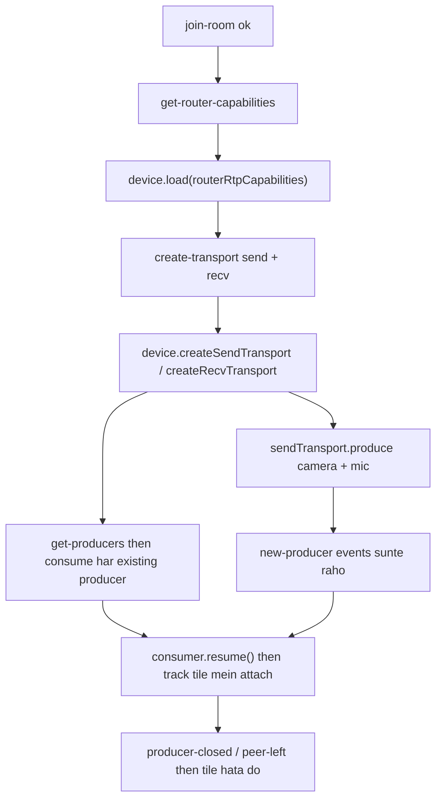

**Proper way (yahan sabse zyada bugs aate hain):**

1. `sendTransport.on('connect', ({ dtlsParameters }, cb, errback) => emit('connect-transport', ..., cb))`. Recv transport pe bhi wahi.
2. `sendTransport.on('produce', ({ kind, rtpParameters, appData }, cb, errback) => emit('produce', ..., ({ producerId }) => cb({ id: producerId })))`.
3. **Order:** Device load → transports → produce. Recv transport **consume se pehle** ready hona chahiye.
4. **Race:** `new-producer` event Device load hone se pehle aa sakta hai. Use queue mein daalo aur ready hone ke baad process karo.
5. Consume idempotent rakho (`producerId` pehle se consume ho raha ho to skip).
6. Har peer ke liye ek `MediaStream`, jismein uska video + audio track add karo. Tile `peerId` se key karo.
7. Cleanup: `producer-closed` pe consumer close + track hatao. Page unmount pe transports close karo.

---

### Step 14 — Mesh → SFU Mode Switch

**Problem:** 2 users abhi Mesh (P2P) mein hain. 3rd aate hi SFU chahiye, lekin purane 2 users ke `RTCPeerConnection` alag system ke hain. Beech call mein switch karna tricky hai.

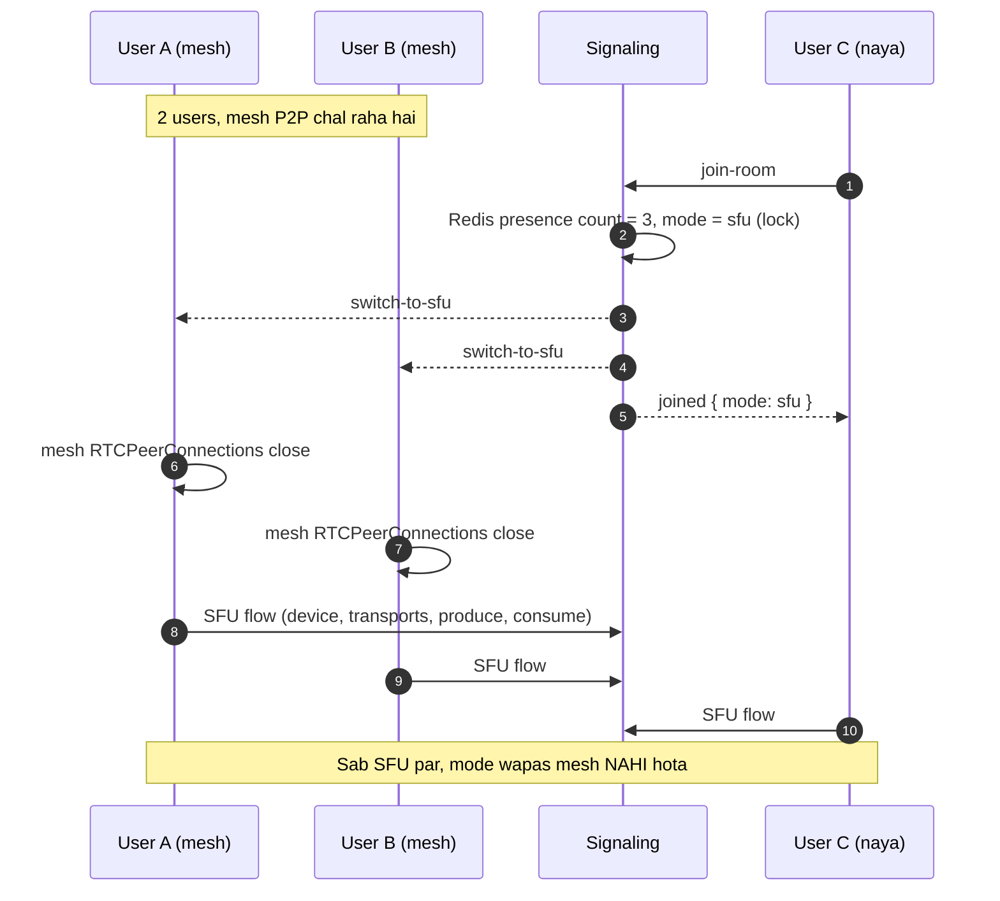

**Proper way:**

- Mode ka **decision server (Signaling) karta hai**, clients khud nahi. Room ki mode Redis mein rakho (`room:{code}:mode = mesh | sfu`), taaki sab ek hi baat maane.
- **Hysteresis:** Ek baar `sfu` ho gaya to 2 users bachne par bhi `sfu` hi raho. Nahi to log aate-jate rahenge to bar bar mesh ↔ SFU flip hoga aur call tootegi.
- **Simple alternative (recommended agar time kam ho):** Har room ko shuru se SFU mein hi rakho, mesh sirf fallback ke liye. Ye switch ka pura complexity hata deta hai aur 2-user call bhi SFU pe theek chalti hai.
- Purana mesh code hataane ki jagah feature flag `VITE_FORCE_SFU=true` rakho.

---

### Step 15 — Testing, Docs, Final Checklist

**Testing:**

- [ ] `npx tsc --noEmit` clean
- [ ] `docker-compose up --build sfu-service`, `/health` ok, secret ke bina API `401`
- [ ] 2 tabs: dono ko ek dusre ki video + audio dikhe
- [ ] 3 tabs: mode switch sahi ho, koi tile duplicate na ho
- [ ] 4-5 tabs: sabko sabki video dikhe (LAN pe ek dusra device bhi test karo, `ANNOUNCED_IP` badal kar)
- [ ] Ek user leave kare: baaki chalti rahe, uski tile hat jaye
- [ ] Sab leave karein: log mein `Router closed` dikhe, ports free
- [ ] Browser refresh: naya join clean, purani state leak na ho (peer count sahi)
- [ ] Ek user ka tab kill kare (bina leave): `disconnect` se cleanup ho
- [ ] SFU restart: signaling crash na kare, clients ko error mile

**Docs / housekeeping:**

- [ ] `services/sfu-service/README.md` update: "Pending Implementation" hatao, env names `RTC_MIN_PORT`, `RTC_MAX_PORT`, `INTERNAL_SECRET` likho (abhi `MEDIASOUP_MIN_PORT` likha hai jo code se match nahi karta)
- [ ] `md/readme.md` ka "Current Status" section update karo
- [ ] Main checklist mein Phase 9 → ✅ **sirf 4-5 tab test pass hone ke baad**

---

## 6. Known Issues (abhi code mein)

| # | Issue                                                                  | Fix                                                                   |
| :-: | :--------------------------------------------------------------------- | :-------------------------------------------------------------------- |
| 1 | Main checklist mein Phase 9 ✅ COMPLETED hai, jabki nahi hai           | ⏳ IN PROGRESS karo, aur Section 9 ka snippet dekho                   |
| 2 | Purana progress doc CommonJS bolta tha                                 | Ye version fix kar chuka hai                                          |
| 3 | `README.md` env names galat (`MEDIASOUP_MIN_PORT`)                 | `RTC_MIN_PORT` / `RTC_MAX_PORT`                                   |
| 4 | `closeRoom` mein rejected router promise pe `await` throw karega   | `try/catch` mein wrap karo aur map se hata do                       |
| 5 | `getOrCreateRouter` ka `.catch` original error swallow karta hai   | `logger.error({ err })` add karo phir `AppError` throw karo       |
| 6 | `typescript ^7.0.2`, `@types/node ^26` bahut naye hain             | Docker build fail ho to versions pin karo                             |
| 7 | `package.json` ki `description` mein purana "Phase 9 Pending" text | Saaf karo                                                             |
| 8 | `worker died` pe process exit (saare rooms band)                     | Abhi theek,`restart: unless-stopped` lagao                          |
| 9 | Ek Router ek hi Worker par rehta hai                                   | Abhi limit accept, bahut bade rooms ke liye`pipeToRouter` baad mein |

**`closeRoom` ka fixed version (idea):**

```ts
export async function closeRoom(roomId: string): Promise<void> {
  const routerPromise = routers.get(roomId);
  if (!routerPromise) return;
  routers.delete(roomId);                 // pehle hatao, taaki naya join naya Router bana sake
  try {
    const router = await routerPromise;
    router.close();
    logger.info({ roomId }, 'Router closed');
  } catch (err) {
    logger.warn({ err, roomId }, 'Router was already failed/closed');
  }
}
```

---

## 7. Common Galtiyan (dhyan rakhna)

1. **`ANNOUNCED_IP` galat:** ICE connect hi nahi hoga. Local = `127.0.0.1`, LAN = laptop IP, prod = public IP.
2. **UDP ports publish nahi kiye:** `40000-40100/udp` (aur tcp) compose mein zaroori.
3. **Range mismatch:** `.env` aur compose ka range exactly same.
4. **Consumer ko `paused: true` nahi banaya:** pehle frames miss, video black.
5. **Cleanup bhoolna:** ports aur memory leak. `disconnect` par `/peers/leave` zaroor.
6. **Ek Router 2 baar banana:** `roomManager` ka Promise store mat badalna.
7. **Import style mix karna:** poore project mein `.ts` extension wale imports, `package.json` `"type": "module"` rakho.
8. **Client se `peerId` lena:** hamesha Signaling `socket.id` se set kare.
9. **Recv transport ka `transportId` client se lena:** server khud peer ka recv transport dhundhe.
10. **`new-producer` ko Device ready hone se pehle process karna:** queue karo.
11. **SFU ko Gateway se expose karna:** kabhi nahi.
12. **Mode flip-flop:** ek baar SFU to SFU hi.

---

## 8. Useful Commands

```bash
# Dev (auto-restart)
npm run dev

# Type check (koi output nahi = sab sahi)
npx tsc --noEmit

# Build + run
npm run build && npm start

# Router capabilities (secret ke saath, Step 10 ke baad)
curl -H "x-internal-secret: $INTERNAL_SECRET" \
  http://localhost:4006/api/v1/sfu/router-capabilities/test-room

# Transport banake dekho
curl -X POST http://localhost:4006/api/v1/sfu/transports \
  -H "Content-Type: application/json" \
  -H "x-internal-secret: $INTERNAL_SECRET" \
  -d '{"roomId":"test-room","peerId":"peer-1","direction":"send"}'

# Docker
docker-compose up --build sfu-service
docker-compose logs -f sfu-service
docker-compose down
```

---

## 9. Main Checklist mein ye change karo

`Video Meet App — Detailed File-by-File Build Steps` mein:

```diff
- | **Phase 9**  | **SFU Service**          |  ⏳ PENDING  | Folder created ...
+ | **Phase 9**  | **SFU Service**          | 🟡 IN PROGRESS | Steps 1-5 done (workers, routers, capabilities). Transports, produce/consume, cleanup, signaling, frontend pending. |

- ## Phase 9 — SFU Service (Group Calls) [✅ COMPLETED]
+ ## Phase 9 — SFU Service (Group Calls) [🟡 IN PROGRESS]
```

Aur Full Build Order diagram mein `P9` ka style `fill:#fff4e0` (pending/orange) hi rehne do, jab tak 4-5 tab test pass na ho.

---

## 10. Git Checkpoints

```bash
git add .
git commit -m "phase-9: step 6 peer store and transports api"
```

Suggested commits:

- `phase-9: step 7 produce api and producers list`
- `phase-9: step 8 consume and resume api`
- `phase-9: step 9 peer leave and cleanup`
- `phase-9: step 10 internal auth and validation`
- `phase-9: step 11 docker compose env and ports`
- `phase-9: step 12 signaling integration`
- `phase-9: step 13 frontend mediasoup client`
- `phase-9: step 14 mesh to sfu switch`
- `phase-9: step 15 testing docs and status update`

---

## 11. Build Order (dependency map)

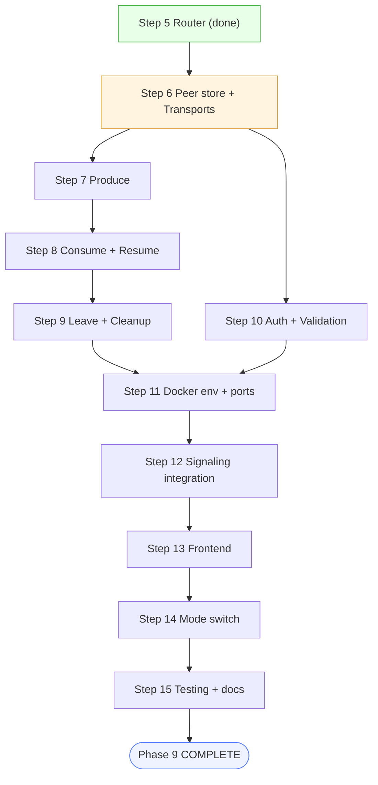

---

## 12. Next Action

**Ab karna hai:** Step 6 shuru karo.

1. `src/mediasoup/peerManager.ts` (Section 4.4 ka skeleton)
2. `src/mediasoup/transportManager.ts` (`createTransport`, `connectTransport`)
3. `src/controllers/transportController.ts` + `sfuRoutes.ts` mein 2 POST routes
4. `roomManager.ts` mein `getRouter(roomId)` helper (bina create kiye)
5. `POST /transports` curl se test karo aur `iceParameters` / `iceCandidates` / `dtlsParameters` check karo, phir commi

# Phase 9 — SFU Service: Progress & Pending Work

> **Branch:** `phase-9-sfu-service`
> **Service folder:** `services/sfu-service` (Port `4006`)
> **Stack:** TypeScript, Express, Mediasoup v3, Pino
> **Import style:** Normal TS imports, bina extension (`'../config/env'`). `package.json` mein `"type": "module"` **nahi** hai (CommonJS mode).

---

## 1. Status Dashboard

| Step | Kya banega                                         |                    Status                    |
| :--: | :------------------------------------------------- | :-------------------------------------------: |
|  1  | Skeleton (`server.ts`, `app.ts`, `/health`)  |                    ✅ Done                    |
|  2  | Docker (`Dockerfile`, compose entry)             | ✅ Done (env vars update baaki, neeche dekho) |
|  3  | Mediasoup config (`config/mediasoup.ts`)         |                    ✅ Done                    |
|  4  | Worker pool (`workerPool.ts`)                    |                    ✅ Done                    |
|  5  | Room manager +`GET /router-capabilities/:roomId` |                    ✅ Done                    |
|  6  | Transports + Produce API                           |                    ⏳ Next                    |
|  7  | Consume + Resume API                               |                  ⏳ Pending                  |
|  8  | Signaling service se integration                   |                  ⏳ Pending                  |
|  9  | Frontend (`mediasoup-client`)                    |                  ⏳ Pending                  |
|  10  | Multi-tab testing (4-5 users)                      |                  ⏳ Pending                  |
|  11  | Hardening (auth, cleanup, docs)                    |                  ⏳ Pending                  |

---

## 2. Ab tak kya bana hai (Done)

```
services/sfu-service/
├── server.ts                        ← pehle workers start, phir HTTP server
├── package.json
├── tsconfig.json
├── .env                             ← PORT, NUM_WORKERS, RTC ports, ANNOUNCED_IP
├── Dockerfile
└── src/
    ├── app.ts                       ← /health + /api/v1/sfu routes + errorHandler
    ├── config/
    │   ├── env.ts                   ← saari env variables
    │   └── mediasoup.ts             ← codecs (Opus, VP8, H264), ports, listenInfos
    ├── mediasoup/
    │   ├── workerPool.ts            ← C++ workers, round-robin getNextWorker()
    │   └── roomManager.ts           ← roomId → Router (getOrCreateRouter, closeRoom)
    ├── controllers/
    │   └── routerController.ts      ← router capabilities return karta hai
    ├── routes/
    │   └── sfuRoutes.ts
    ├── middleware/
    │   └── errorHandler.ts
    └── utils/
        ├── logger.ts
        └── AppError.ts
```

**Working API abhi:**

| Method | URL                                         | Result                                       |
| :----- | :------------------------------------------ | :------------------------------------------- |
| GET    | `/health`                                 | `{ "status": "ok" }`                       |
| GET    | `/api/v1/sfu/router-capabilities/:roomId` | Router ke codecs (`routerRtpCapabilities`) |

**Verified:** 2 workers start hote hain (alag pid), aur ek room ke liye Router sirf ek baar banta hai.

---

## 3. Pending Work (kya karna hai, kis order mein)

### Step 6 — Transports + Produce API

**Goal:** Browser apni camera/mic SFU ko bhej sake (upload path).

**Kyun:** Transport = browser aur server ke beech ka pipe. Har user ko 2 chahiye: **send** (upload) aur **recv** (download). Producer = uploaded track.

**Nayi files:**

| File                                       | Kaam                                                               |
| :----------------------------------------- | :----------------------------------------------------------------- |
| `src/mediasoup/peerManager.ts`           | Room → peer → { transports, producers, consumers } ka data store |
| `src/mediasoup/transportManager.ts`      | `router.createWebRtcTransport()` aur `transport.connect()`     |
| `src/mediasoup/producerManager.ts`       | `transport.produce()` aur producers ki list                      |
| `src/controllers/transportController.ts` | HTTP handlers for transports                                       |
| `src/controllers/produceController.ts`   | HTTP handler for produce                                           |

**Endpoints:**

| Method | URL                                | Body                                                     | Returns                                                  |
| :----- | :--------------------------------- | :------------------------------------------------------- | :------------------------------------------------------- |
| POST   | `/api/v1/sfu/transports`         | `{ roomId, peerId, direction: 'send' \| 'recv' }`       | `{ id, iceParameters, iceCandidates, dtlsParameters }` |
| POST   | `/api/v1/sfu/transports/connect` | `{ roomId, peerId, transportId, dtlsParameters }`      | `{ connected: true }`                                  |
| POST   | `/api/v1/sfu/produce`            | `{ roomId, peerId, transportId, kind, rtpParameters }` | `{ producerId }`                                       |
| GET    | `/api/v1/sfu/producers/:roomId`  | (none)                                                   | Room ke existing producers (naye joiner ke liye)         |

**Zaroori points:**

- `createWebRtcTransport` mein `mediasoupConfig.webRtcTransport` use karo (`listenInfos` + `announcedAddress`).
- Transport banate waqt `enableUdp: true`, `enableTcp: true`, `preferUdp: true` rakho.
- Har transport, producer ko `peerId` ke saath store karo, taaki leave hone pe cleanup ho sake.

**Test:** `POST /transports` se `iceParameters`, `iceCandidates`, `dtlsParameters` aana chahiye.

---

### Step 7 — Consume + Resume API

**Goal:** Browser dusre users ki video download kar sake.

**Nayi files:**

| File                                     | Kaam                                   |
| :--------------------------------------- | :------------------------------------- |
| `src/mediasoup/consumerManager.ts`     | `recvTransport.consume()` aur resume |
| `src/controllers/consumeController.ts` | HTTP handlers                          |

**Endpoints:**

| Method | URL                             | Body                                                | Returns                                     |
| :----- | :------------------------------ | :-------------------------------------------------- | :------------------------------------------ |
| POST   | `/api/v1/sfu/consume`         | `{ roomId, peerId, producerId, rtpCapabilities }` | `{ id, producerId, kind, rtpParameters }` |
| POST   | `/api/v1/sfu/consumer/resume` | `{ roomId, peerId, consumerId }`                  | `{ resumed: true }`                       |

**Zaroori points:**

- Pehle check: `router.canConsume({ producerId, rtpCapabilities })`. False ho to `AppError(400)`.
- Consumer ko `paused: true` pe banao, browser ready hone ke baad `resume` karo (warna pehle frames miss ho jate hain).
- Apna hi producer khud consume mat karo (`producer.peerId !== peerId` check).

**Test:** `POST /consume` se valid consumer parameters aane chahiye.

---

### Step 8 — Signaling Service se jodna

**Goal:** Browser Socket.io se baat kare, Signaling service andar se SFU ko HTTP call kare.

**Flow:** `Browser ↔ Signaling (Socket.io) ↔ SFU (HTTP) ↔ Mediasoup`

**Kahan:** `services/signaling-service`

**Naye Socket.io events:**

| Event (client → server)        | SFU call                                                   |
| :------------------------------ | :--------------------------------------------------------- |
| `get-router-capabilities`     | `GET /router-capabilities/:roomId`                       |
| `create-transport`            | `POST /transports`                                       |
| `connect-transport`           | `POST /transports/connect`                               |
| `produce`                     | `POST /produce`, phir room ko `new-producer` broadcast |
| `consume`                     | `POST /consume`                                          |
| `resume-consumer`             | `POST /consumer/resume`                                  |
| `leave-room` / `disconnect` | `POST /peers/leave` (cleanup)                            |

**Server → client events:** `router-capabilities`, `transport-created`, `produced`, `consumed`, `new-producer`, `producer-closed`.

**Naye users ke liye:** Join karte hi existing producers ki list (`GET /producers/:roomId`) bhejo, taaki wo pehle se maujood logon ko consume kar sakein.

**Env add karo (signaling):** `SFU_SERVICE_URL=http://sfu-service:4006`

---

### Step 9 — Frontend (`mediasoup-client`)

**Goal:** Browser mein SFU mode.

```bash
npm i mediasoup-client
```

**Kya banana hai:**

1. `Device` load karo `routerRtpCapabilities` se.
2. Send transport banao (`device.createSendTransport`), camera + mic `produce()` karo.
3. Recv transport banao (`device.createRecvTransport`).
4. `new-producer` event pe `consume()` karo, `resume` karo, video tile dikhao.
5. **Mode switch:** 2 users ho to purana Mesh, 3rd user aate hi SFU mode.

**Zaroori points:**

- `transport.on('connect')` mein `connect-transport` emit karo.
- `transport.on('produce')` mein `produce` emit karo aur callback mein `producerId` do.
- Video aur audio ko alag `MediaStream` track ke saath attach karo.

---

### Step 10 — Testing

- [ ] 2 tabs: dono ko ek dusre ki video/audio dikhe
- [ ] 3 tabs: SFU mode switch sahi ho
- [ ] 4-5 tabs: sabko sabki video dikhe
- [ ] Ek user leave kare: baaki ki video chalti rahe, uski tile hat jaye
- [ ] Sab leave karein: Router band ho (`closeRoom`)
- [ ] Browser refresh: naya join clean ho, purani state leak na ho

---

### Step 11 — Hardening

- [ ] **Internal auth:** Signaling se aane wale calls pe `x-internal-secret` header check karo (`middleware/authGuard.ts`).
- [ ] SFU ko API Gateway se **public mat karo**. Sirf internal Docker network se access ho.
- [ ] **Cleanup:** Peer leave/disconnect pe uske transports, producers, consumers close karo. Room khali ho to `closeRoom(roomId)`.
- [ ] Validation: request body check karo (Joi ya manual), galat input pe `AppError(400)`.
- [ ] Logs: har major event (transport created, produced, consumed) log karo.
- [ ] Docs update karo: `services/sfu-service/md/readme.md`.
- [ ] Main checklist mein Phase 9 ko ✅ COMPLETED mark karo.

---

## 4. Docker Pending Items

`docker-compose.yml` ke `sfu-service` mein ye environment variables add karo:

```yaml
    environment:
      - PORT=4006
      - NODE_ENV=development
      - NUM_WORKERS=2
      - RTC_MIN_PORT=40000
      - RTC_MAX_PORT=40100
      - ANNOUNCED_IP=127.0.0.1
    ports:
      - "4006:4006"
      - "40000-40100:40000-40100/udp"
      - "40000-40100:40000-40100/tcp"
```

**Test:**

```bash
docker-compose config
docker-compose up --build sfu-service
curl http://localhost:4006/api/v1/sfu/router-capabilities/test-room
```

`RTC_MIN_PORT` / `RTC_MAX_PORT` compose ke port range se **exactly match** hone chahiye.

---

## 5. Common Galtiyan (dhyan rakhna)

1. **`ANNOUNCED_IP` galat:** Connection ban hi nahi hoga. Local mein `127.0.0.1`, LAN test mein apne laptop ka IP, production mein public IP.
2. **UDP ports publish nahi kiye:** Docker mein `40000-40100/udp` zaroori hai.
3. **Range mismatch:** `.env` ka port range aur Docker ka range alag hoga to media flow nahi hoga.
4. **Consumer ko paused nahi banaya:** Pehle frames miss ho jate hain.
5. **Cleanup bhoolna:** Leave pe transports close nahi kiye to memory aur ports leak honge.
6. **Ek Router ko 2 baar banana:** `roomManager` mein Promise store isi ke liye hai, use mat badalna.
7. **Import style mix karna:** Poore project mein bina extension wale imports rakho.

---

## 6. Useful Commands

```bash
# Dev mode (auto-restart)
npm run dev

# Type check (koi output nahi = sab sahi)
npx tsc --noEmit

# Build + production run
npm run build && npm start

# Router capabilities test
curl http://localhost:4006/api/v1/sfu/router-capabilities/test-room

# Docker
docker-compose up --build sfu-service
docker-compose logs -f sfu-service
docker-compose down
```

---

## 7. Git Checkpoints

Har step ke baad commit karo:

```bash
git add .
git commit -m "phase-9: step 5 room manager + router capabilities"
```

Suggested commit messages:

- `phase-9: step 6 transports and produce api`
- `phase-9: step 7 consume and resume api`
- `phase-9: step 8 signaling integration`
- `phase-9: step 9 frontend sfu mode`
- `phase-9: hardening and cleanup`

---

## 8. Next Action

**Ab karna hai:** Step 6 shuru karo (`peerManager.ts` se), `POST /transports` endpoint banao, aur `iceParameters` / `dtlsParameters` wala response test karo.
go throguh this - [claude.ai/chat/2488fe4f-aff4-42c4-a573-acf962d752f1](https://claude.ai/chat/2488fe4f-aff4-42c4-a573-acf962d752f1)
