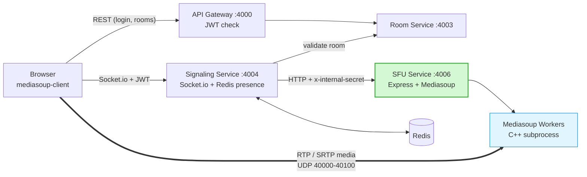
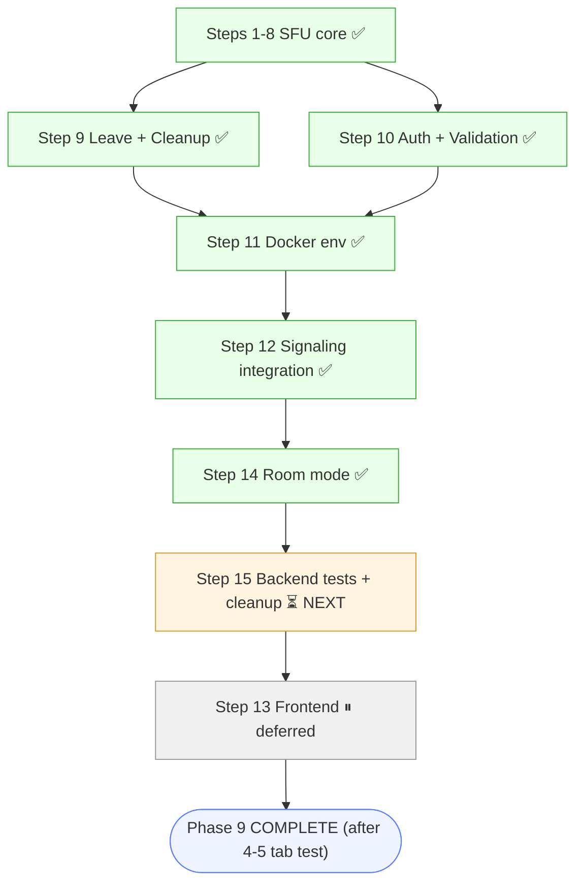
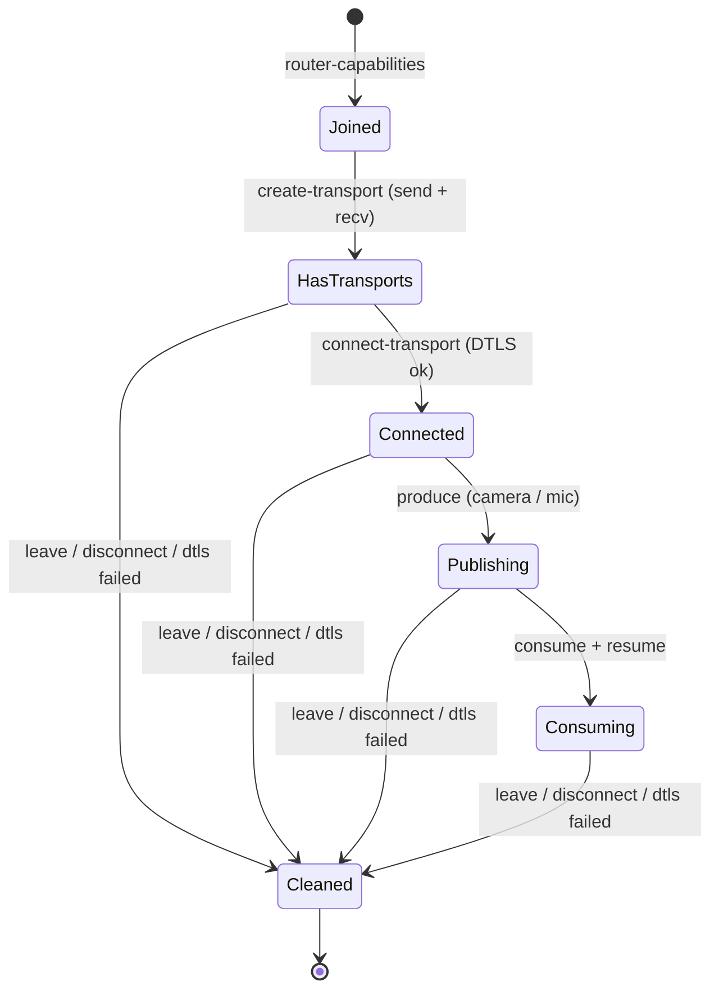
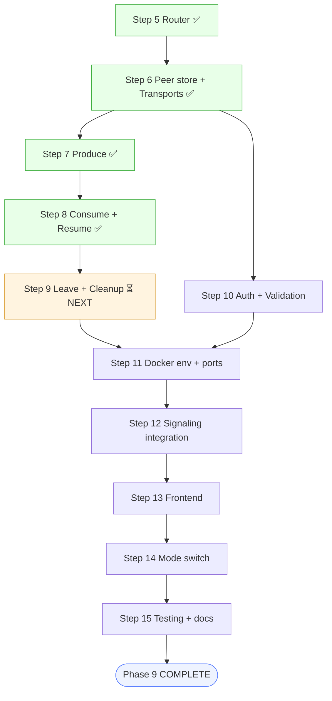

# Phase 9 — SFU Service: Progress, Pending Work & Guide

> **Branch:** `phase-9-sfu-service`
> **SFU service:** `services/sfu-service` (HTTP `4006`, RTP/media ports `40000-40100`)
> **Signaling service:** `services/signaling-service` (Socket.io `4004`)
> **Stack:** TypeScript, Express 5, Mediasoup v3 (3.27), Pino, Joi, Node 22 (SFU) / Node 20 (signaling)
> **Import style:** both services use `"type": "module"` (ESM).
> SFU imports end in **`.ts`** (`'../config/env.ts'`), signaling imports end in **`.js`** (`'../utils/logger.js'`).
> **Overall status:** 🟡 **Backend complete. Steps 1–12 and 14 are built. Step 13 (frontend) is deferred until all backend work is finished. Step 15 (final backend tests, cleanup, docs) is the only pending backend work.**
> The frontend plan lives in `phase-9-sfu-frontend-guide.md`.

---

## 0. What changed in this version (Changelog)

| # | Change                                                                                                                  | Why                                                                                                                                                    |
| :-: | :---------------------------------------------------------------------------------------------------------------------- | :----------------------------------------------------------------------------------------------------------------------------------------------------- |
| 1 | Step 9 (Peer leave + cleanup) →**✅ Done & tested**                                                              | `removePeer()` + `POST /peers/leave`, tested in `sfu-one-click.html` Part 2 (6/6)                                                                |
| 2 | Step 10 (Internal auth + Joi validation) →**✅ Done & tested**                                                   | `authGuard` + `validate` + `sfuSchemas`, tested in Part 3 (5/5)                                                                                  |
| 3 | Step 11 (Docker Compose env) →**✅ Done**                                                                        | `INTERNAL_SECRET`, `SFU_SERVICE_URL`, `DEFAULT_ROOM_MODE` added                                                                                  |
| 4 | Step 12 (Signaling integration) →**✅ Done & tested**                                                            | `config/sfuClient.ts`, `handlers/sfu.ts`, SFU cleanup inside `handlers/leaveRoom.ts`. `tests/manual/sfu.client.ts` passed 10/10 on two clients |
| 5 | Step 14 changed meaning:**room mode in signaling** (not a runtime mesh→SFU switch) → **✅ Done & tested** | Every room starts on SFU by default. Mesh stays as a fallback flag                                                                                     |
| 6 | Step 13 (Frontend) →**⏸ Deferred**                                                                              | There is no React app yet. Backend is finished first, frontend comes last                                                                              |
| 7 | `sfu-one-click.html` now has 3 parts (21 checks) and a secret input                                                   | Covers media flow, leave/cleanup, auth                                                                                                                 |
| 8 | Dev CORS is now`devCors.ts` (one origin, development only), not `*`                                                 | Still to be removed in Step 15                                                                                                                         |
| 9 | `switch-to-sfu` socket event **removed from the plan**                                                          | Not needed. The mode comes in the`joined` event                                                                                                      |
| 10 | Signaling file locations differ from the old plan                                                                       | `config/sfuClient.ts` (not `services/`), `handlers/sfu.ts`. See section 3                                                                        |
| 11 | Signaling duplicate`peer-left` fixed                                                                                  | `cleanUp()` is now idempotent (clears `roomCode` first)                                                                                            |
| 12 | Join twice without leaving is now refused                                                                               | `join-error: Already in a room. Leave it first.`                                                                                                     |

---

## 1. Status Dashboard

| Step | What                                                          |                    Status                    | Depends on |
| :--: | :------------------------------------------------------------ | :------------------------------------------: | :--------- |
|  1  | Skeleton (`server.ts`, `app.ts`, `/health`)             |                   ✅ Done                   | —         |
|  2  | Dockerfile (multi-stage, healthcheck, non-root)               |                   ✅ Done                   | —         |
|  3  | Mediasoup config (`config/mediasoup.ts`)                    |                   ✅ Done                   | —         |
|  4  | Worker pool (`workerPool.ts`)                               |                   ✅ Done                   | 3          |
|  5  | Room manager +`GET /router-capabilities/:roomId`            |                   ✅ Done                   | 4          |
|  6  | Peer store + Transports API                                   |               ✅ Done & tested               | 5          |
|  7  | Produce API +`GET /producers/:roomId`                       |               ✅ Done & tested               | 6          |
|  8  | Consume + Resume API                                          |               ✅ Done & tested               | 7          |
|  9  | Peer leave + cleanup (`POST /peers/leave`)                  |               ✅ Done & tested               | 6, 7, 8    |
|  10  | Internal auth + Joi validation                                |               ✅ Done & tested               | 6          |
|  11  | Docker Compose env + ports                                    |                   ✅ Done                   | 2          |
|  12  | Signaling integration (`sfuClient`, socket events, cleanup) |               ✅ Done & tested               | 6–11      |
|  13  | Frontend (`mediasoup-client`)                               |   ⏸ Deferred (do after all backend work)   | 12         |
|  14  | Room mode in signaling (`sfu` default, `mesh` fallback)   |               ✅ Done & tested               | 12         |
|  15  | Final backend tests + cleanup + docs                          | ⏳**Pending (only backend work left)** | 14         |

**Counting:** 13 of 15 steps built. Features pending in the SFU or signaling: **none**.

---

## 2. Architecture — Big Picture


```mermaid
flowchart LR
    Browser["Browser<br/>mediasoup-client"]
    GW["API Gateway :4000<br/>JWT check"]
    Sig["Signaling Service :4004<br/>Socket.io + Redis presence"]
    Room["Room Service :4003"]
    SFU["SFU Service :4006<br/>Express + Mediasoup"]
    W["Mediasoup Workers<br/>C++ subprocess"]
    Redis[("Redis")]

    Browser -- "REST (login, rooms)" --> GW
    GW --> Room
    Browser -- "Socket.io + JWT" --> Sig
    Sig -- "validate room" --> Room
    Sig <--> Redis
    Sig -- "HTTP + x-internal-secret" --> SFU
    SFU --> W
    Browser == "RTP / SRTP media<br/>UDP 40000-40100" ==> W

    style SFU fill:#d4f7d4,stroke:#3fae3f,stroke-width:2px
    style W fill:#e1f5fe,stroke:#0288d1
```

- **Control plane** (who joined, which transport exists) = `Browser → Signaling (Socket.io) → SFU (HTTP)`. Small JSON.
- **Media plane** (real video and audio) = `Browser ⇄ Mediasoup Worker` directly over UDP/TCP. Media never goes through Express or Signaling.
- The browser **never calls the SFU over HTTP**. Only Signaling holds `x-internal-secret`.
- Never expose the SFU through the API Gateway.

---

## 3. What is built

### 3.1 SFU service

```
services/sfu-service/
├── server.ts
├── package.json                     ← "type": "module"
├── tsconfig.json
├── .env                             ← PORT, NUM_WORKERS, RTC ports, ANNOUNCED_IP, INTERNAL_SECRET
├── Dockerfile
└── src/
    ├── app.ts                       ← devCors → /health (open) → authGuard + /api/v1/sfu → errorHandler
    ├── config/
    │   ├── env.ts                   ← fails at startup if INTERNAL_SECRET < 16 chars
    │   └── mediasoup.ts             ← codecs (Opus, VP8, H264), listenInfos
    ├── controllers/
    │   ├── routerController.ts
    │   ├── transportController.ts
    │   ├── produceController.ts
    │   ├── consumeController.ts
    │   └── peerController.ts        ← leavePeerHandler
    ├── mediasoup/
    │   ├── workerPool.ts            ← round-robin getNextWorker()
    │   ├── roomManager.ts           ← roomId → Promise<Router>, getRouter, closeRoom
    │   ├── peerManager.ts           ← getOrCreatePeer, getPeer, getPeerCount, findProducer, listProducers, removePeer
    │   ├── transportManager.ts      ← createTransport, connectTransport, findTransportByDirection
    │   ├── producerManager.ts       ← createProducer, isValidKind, isValidSource
    │   └── consumerManager.ts       ← createConsumer, resumeConsumer
    ├── middleware/
    │   ├── authGuard.ts             ← x-internal-secret, SHA-256 + timingSafeEqual
    │   ├── devCors.ts               ← DEV ONLY, one origin (remove in Step 15)
    │   ├── errorHandler.ts
    │   └── validate.ts              ← Joi middleware (body / params / query)
    ├── routes/sfuRoutes.ts
    ├── validation/sfuSchemas.ts
    └── utils/ (logger.ts, AppError.ts)
```

### 3.2 SFU endpoints (all under `/api/v1/sfu`, all need `x-internal-secret`)

| Method | URL                                          | Body                                                             | Returns (`data`)                                          |
| :----- | :------------------------------------------- | :--------------------------------------------------------------- | :---------------------------------------------------------- |
| GET    | `/health` (no prefix, **no secret**) | —                                                               | `{ status: 'ok' }`                                        |
| GET    | `/router-capabilities/:roomId`             | —                                                               | `{ routerRtpCapabilities }`                               |
| POST   | `/transports`                              | `{ roomId, peerId, direction }`                                | `{ id, iceParameters, iceCandidates, dtlsParameters }`    |
| POST   | `/transports/connect`                      | `{ roomId, peerId, transportId, dtlsParameters }`              | `{ connected: true }`                                     |
| POST   | `/produce`                                 | `{ roomId, peerId, transportId, kind, rtpParameters, source }` | `{ producerId }`                                          |
| GET    | `/producers/:roomId?exceptPeerId=`         | —                                                               | `[{ producerId, peerId, kind, source }]`                  |
| POST   | `/consume`                                 | `{ roomId, peerId, producerId, rtpCapabilities }`              | `{ id, producerId, peerId, kind, source, rtpParameters }` |
| POST   | `/consumer/resume`                         | `{ roomId, peerId, consumerId }`                               | `{ resumed: true }`                                       |
| POST   | `/peers/leave`                             | `{ roomId, peerId }`                                           | `{ closedProducerIds: string[], roomClosed: boolean }`    |

Error shape: `{ success: false, message }`. Status codes: 400 bad input, 401 bad or missing secret, 404 not found, 409 duplicate, 500 unexpected.

### 3.3 Signaling service (SFU related files)

```
services/signaling-service/src/
├── config/
│   ├── env.ts                       ← INTERNAL_SECRET (>=16 chars, fails at startup), SFU_SERVICE_URL, DEFAULT_ROOM_MODE
│   ├── redis.ts
│   ├── roomServiceClient.ts
│   └── sfuClient.ts                 ← NEW: only place that calls the SFU (secret header + 5s timeout)
├── handlers/
│   ├── joinRoom.ts                  ← CHANGED: duplicate-join guard, room mode in "joined"
│   ├── leaveRoom.ts                 ← CHANGED: idempotent cleanUp + SFU leave + producer-closed + peer-left
│   ├── sfu.ts                       ← NEW: 7 SFU socket events with ack callbacks
│   ├── relay.ts                     ← mesh offer/answer/ice-candidate (unchanged)
│   └── chatMessage.ts
├── socket/index.ts                  ← registerSfuHandlers(socket) added
└── tests/manual/sfu.client.ts       ← NEW: control-plane test script
```

### 3.4 Socket events (browser ↔ signaling)

**Client → server (all use an ack callback).** The client never sends `roomId` or `peerId`. The room is `socket.data.roomCode` and `peerId` is always `socket.id`.

| Event                       | Payload                                          | Ack`data`                                                 |
| :-------------------------- | :----------------------------------------------- | :---------------------------------------------------------- |
| `join-room`               | `{ roomCode }`                                 | (answered with the`joined` event, no ack)                 |
| `leave-room`              | —                                               | —                                                          |
| `get-router-capabilities` | —                                               | `{ routerRtpCapabilities }`                               |
| `create-transport`        | `{ direction: 'send' \| 'recv' }`               | `{ id, iceParameters, iceCandidates, dtlsParameters }`    |
| `connect-transport`       | `{ transportId, dtlsParameters }`              | `{ connected }`                                           |
| `produce`                 | `{ transportId, kind, rtpParameters, source }` | `{ producerId }`                                          |
| `get-producers`           | —                                               | `[{ producerId, peerId, kind, source }]`                  |
| `consume`                 | `{ producerId, rtpCapabilities }`              | `{ id, producerId, peerId, kind, source, rtpParameters }` |
| `resume-consumer`         | `{ consumerId }`                               | `{ resumed }`                                             |

**Ack shape:** success `{ success: true, data }`, failure `{ success: false, statusCode, message }`. Calling an SFU event before `join-room` gives `403 Join a room first`.

**Server → client pushes:**

| Event               | Payload                                                 |
| :------------------ | :------------------------------------------------------ |
| `joined`          | `{ existingMembers: string[], mode: 'sfu' \| 'mesh' }` |
| `join-error`      | `string`                                              |
| `peer-joined`     | `{ socketId, userId }`                                |
| `peer-left`       | `{ socketId }`                                        |
| `new-producer`    | `{ producerId, socketId, kind, source }`              |
| `producer-closed` | `{ producerId, socketId }`                            |

### 3.5 Room mode (Step 14)

- Redis key `room:{code}:mode` holds `sfu` or `mesh`.
- The **first joiner decides** (`SET ... NX`, 24h expiry). Everyone after reads the same value, so it never flip-flops.
- `DEFAULT_ROOM_MODE` env var in signaling: `sfu` (default) or `mesh` (fallback).
- The key is deleted when the last member leaves. If you change the env while a room is still occupied, the room keeps its old mode.
- The mode is sent to the client in the `joined` event.

### 3.6 Key behaviours

- **Transports:** max 1 send + 1 recv per peer (duplicate → 409). `dtlsstatechange` `failed/closed` closes the transport.
- **Produce:** transport must be `send` (else 400). `source` must match `kind` (`camera/screen → video`, `mic → audio`).
- **Consume:** the server finds the peer's recv transport itself. Consumer is created `paused: true`, then `/consumer/resume`. Own producer → 400. Duplicate → 409.
- **Leave:** idempotent. Closes all transports, returns `closedProducerIds`, closes the Router when the room is empty (re-checks the peer count first).
- **Signaling cleanup:** `leave-room` and `disconnect` both run the same idempotent `cleanUp()`. A dead SFU never crashes signaling (error is logged, `peer-left` is still sent).

---

## 4. Testing Log

### 4.1 `test-client/sfu-one-click.html` (real browser, real media)

Serve: `cd test-client && npx serve .` → `http://localhost:3000/sfu-one-click.html`. Type the same value as `INTERNAL_SECRET` in the secret box.

| Part                                                                                                                                                             | Checks |    Result    |
| :--------------------------------------------------------------------------------------------------------------------------------------------------------------- | :----: | :----------: |
| Part 1: media flow (capabilities, devices, transports, produce, consume, video frames, own-stream 400, duplicate 409)                                            |   10   | ✅ all green |
| Part 2: leave and cleanup (400 on missing fields, leave closes 2 producers, idempotent leave, empty producer list, last peer closes room, room can be recreated) |   6   | ✅ all green |
| Part 3: internal auth (health open, no secret 401, wrong secret 401, correct secret 200, bad input 400)                                                          |   5   | ✅ all green |

### 4.2 `signaling-service/tests/manual/sfu.client.ts` (control plane through Socket.io)

Run: `npx tsx tests/manual/sfu.client.ts <token> <roomCode>` in two terminals with two different users.

| Check                                                                                      | Result |
| :----------------------------------------------------------------------------------------- | :----: |
| SFU event before join → 403                                                               |   ✅   |
| `joined` carries `mode` (`sfu`), both clients see the same mode                      |   ✅   |
| Second`join-room` refused                                                                |   ✅   |
| Router capabilities, send transport, duplicate send 409, recv transport, bad direction 400 |   ✅   |
| `get-producers` empty, consume unknown producer 404                                      |   ✅   |
| Second client sees`existingMembers`, first client gets `peer-joined`                   |   ✅   |

**Result: 10 passed, 0 failed on both clients.**

### 4.3 Still to run (backend only)

| Test                               | How                                                  | Expected                                                                                                                                                                |
| :--------------------------------- | :--------------------------------------------------- | :---------------------------------------------------------------------------------------------------------------------------------------------------------------------- |
| Disconnect cleanup                 | Ctrl+C one client, then the other                    | Other client logs`peer-left` once. SFU logs `Transport closed` ×2, `Peer removed`. After the last leave: `Router closed`. `redis-cli keys "room:*"` is empty |
| SFU-down                           | `docker compose stop sfu-service`, Ctrl+C a client | Signaling logs`SFU leave failed` (503), stays Up. Other client still gets `peer-left`                                                                               |
| End-to-end media through signaling | Test page (Browser → Signaling → SFU → media)     | Real video frames,`new-producer`, `producer-closed`                                                                                                                 |

### 4.4 Lesson: stale Docker container = fake 404

|                      |                                                                                                                                                                    |
| :------------------- | :----------------------------------------------------------------------------------------------------------------------------------------------------------------- |
| **Symptom**    | A new route returned a bare 404 (`Cannot POST`)                                                                                                                  |
| **Reason**     | The container was running an old build. Code is baked into the image                                                                                               |
| **Diagnosis**  | `curl.exe -i -X POST http://localhost:4006/api/v1/sfu/consume -H "Content-Type: application/json" -d "{}"` → "Cannot POST" = stale, JSON 400/401 = route exists |
| **Fix / rule** | After adding any route or code:`docker compose up -d --build <service>`. `restart` is not enough                                                               |

---

## 5. Pending Work

### 5.1 Step 15 — backend part (the only backend work left)

**Tests**

- [ ] Disconnect cleanup test (4.3)
- [ ] SFU-down test (4.3)
- [ ] `npx tsc --noEmit` clean in `sfu-service` and `signaling-service`
- [ ] End-to-end media test page through signaling (needs `server.ts` CORS check in signaling)

**Cleanup**

- [ ] Remove `devCors.ts`, its import and `app.use(devCors)` in `app.ts`, and `devCorsOrigin` in `env.ts`
- [ ] Remove `DEV_CORS_ORIGIN` and the `"4006:4006"` port from `docker-compose.yml` (keep `40000-40100`)
- [ ] Delete the old commented `# - INTERNAL_SECRET=...` line in the compose file
- [ ] Fix `services/sfu-service/README.md` env names: `RTC_MIN_PORT`, `RTC_MAX_PORT`, `INTERNAL_SECRET` (it says `MEDIASOUP_MIN_PORT`)
- [ ] Change the signaling startup log from `https://localhost:4004` to `http://localhost:4004`

**Docs and git**

- [ ] Update `md/readme.md` "Current Status"
- [ ] Update the main checklist (section 9). Phase 9 stays 🟡
- [ ] Commit (section 10)

### 5.2 Deferred until the frontend exists

- [ ] **Step 13** — React + `mediasoup-client` (see `phase-9-sfu-frontend-guide.md`)
- [ ] 2, 3, and 4–5 tab tests with real tiles (no duplicate tiles)
- [ ] LAN device test (set `ANNOUNCED_IP` to the laptop's LAN IP)
- [ ] Browser refresh and tab kill in a real browser
- [ ] Mark Phase 9 ✅ in the main checklist, **only after the 4–5 tab test passes**

### 5.3 Compose reference (current)

```yaml
  signaling-service:
    environment:
      - SFU_SERVICE_URL=http://sfu-service:4006
      - INTERNAL_SECRET=${INTERNAL_SECRET}
      - DEFAULT_ROOM_MODE=sfu          # "sfu" (default) or "mesh" (fallback)
    depends_on:
      - redis
      - room-service
      - sfu-service

  sfu-service:
    environment:
      - PORT=4006
      - NODE_ENV=development
      - LOG_LEVEL=info
      - NUM_WORKERS=2
      - RTC_MIN_PORT=40000
      - RTC_MAX_PORT=40100
      - ANNOUNCED_IP=127.0.0.1
      - INTERNAL_SECRET=${INTERNAL_SECRET}
    ports:
      - "4006:4006"                    # dev only, remove in Step 15
      - "40000-40100:40000-40100/udp"
      - "40000-40100:40000-40100/tcp"
```

- `INTERNAL_SECRET` lives in a root `.env` (gitignored), at least 16 characters, **same value** for SFU and Signaling.
- `RTC_MIN_PORT` / `RTC_MAX_PORT` must match the compose port range exactly.
- `ANNOUNCED_IP`: same laptop = `127.0.0.1`, LAN device = laptop LAN IP, production = public IP.
- Windows Docker Desktop is slow with large port ranges. Keep 100 ports (each transport uses 1 UDP + 1 TCP).

---

## 6. Known Issues

| # | Issue                                                                                                 |                                                         Status                                                         |
| :-: | :---------------------------------------------------------------------------------------------------- | :--------------------------------------------------------------------------------------------------------------------: |
| 1 | `transportController` catch blocks turned every `AppError` into 500                               |                                                        ✅ Fixed                                                        |
| 2 | `routerController` catch was an unconditional 500                                                   |                                                        ✅ Fixed                                                        |
| 3 | `getOrCreateRouter` `.catch` swallowed the original error                                         |                                                        ✅ Fixed                                                        |
| 4 | `closeRoom` awaited without `try/catch`                                                           |                                                        ✅ Fixed                                                        |
| 5 | Dev CORS in`app.ts`                                                                                 |                             🟡 Now`devCors.ts` (one origin, dev only). Remove in Step 15                             |
| 6 | No internal auth on`4006`                                                                           |                                                ✅ Fixed (`authGuard`)                                                |
| 7 | No peer leave / cleanup                                                                               |                                      ✅ Fixed (`removePeer` + `/peers/leave`)                                      |
| 8 | `INTERNAL_SECRET` missing in compose                                                                |                                                        ✅ Fixed                                                        |
| 9 | SFU`README.md` has wrong env names (`MEDIASOUP_MIN_PORT`)                                         |                                                       ⏳ Step 15                                                       |
| 10 | `typescript ^7.0.2`, `@types/node ^26` are very new                                               |                                                 Pin if the build fails                                                 |
| 11 | `worker died` exits the process (all rooms close)                                                   |                                          Accepted,`restart: unless-stopped`                                          |
| 12 | One Router lives on one Worker                                                                        |                                     Accepted,`pipeToRouter` later for big rooms                                     |
| 13 | `pending` guard in `consumerManager` is a module-level `Set`                                    |                                           Accepted, single SFU instance only                                           |
| 14 | SFU restart loses all state. Clients must rejoin                                                      |                                           Accepted. Frontend must handle it                                           |
| 15 | A socket that leaves while an SFU call is still running can leave an orphan peer on the SFU           | Optional hardening: re-check`socket.data.roomCode` after the `await` in `handlers/sfu.ts` and call `leavePeer` |
| 16 | `chatMessage.ts` trusts a client-sent `roomId` (a user can post into any room)                    |                                          ⏳ Fix: use`socket.data.roomCode`                                          |
| 17 | Redis members set holds only socket ids. A late joiner does not learn the`userId` of existing peers |                                ⏳ Needed only if the UI shows names. See frontend guide                                |
| 18 | JWT expires after 15 minutes. An expired token fails the socket handshake                             |                                     Frontend must refresh the token and reconnect                                     |
| 19 | Signaling startup log says`https://` but it is HTTP                                                 |                                                      ⏳ Cosmetic                                                      |
| 20 | No server-side mute/pause events (producer pause is not synced to other peers)                        |                                 Not built. See frontend guide, section "Backend gaps"                                 |

---

## 7. Common Mistakes (watch out)

1. **Forgetting to rebuild Docker:** new route or code but old container → bare `404 Cannot POST`. Run `docker compose up -d --build <service>`.
2. **Wrong `ANNOUNCED_IP`:** ICE never connects. Local = `127.0.0.1`, LAN = laptop IP, production = public IP.
3. **UDP/TCP ports not published:** `40000-40100` for both `udp` and `tcp`. Symptom: transport stuck on `connecting`, no video frames.
4. **Port range mismatch** between `.env` and compose.
5. **Consumer not created `paused: true`:** first frames are missed, video stays black.
6. **Skipping cleanup:** leaks ports and memory.
7. **Creating a Router twice:** do not change `roomManager`'s Promise store.
8. **Mixing import styles:** SFU uses `.ts`, signaling uses `.js`, both ESM.
9. **Taking `peerId` from the client:** always `socket.id` on the server.
10. **Taking the recv `transportId` from the client:** the SFU finds it itself.
11. **Handling `new-producer` before the Device is loaded:** queue it.
12. **Exposing the SFU through the Gateway:** never.
13. **Mode flip-flop:** once a room is `sfu`, it stays `sfu`.
14. **Opening a test page from `file://`:** `getUserMedia` is blocked. Use `npx serve .`.
15. **Old or expired JWT in tests:** tokens last 15 minutes. Get a fresh one.
16. **Joining a second room without `leave-room`:** refused with `join-error`.
17. **Testing a mode change in an occupied room:** the room keeps its old mode until everyone leaves (or `redis-cli del room:<code>:mode`).

---

## 8. Useful Commands

```bash
# SFU dev (auto-restart) / type check / build
npm run dev
npx tsc --noEmit
npm run build && npm start

# Docker (always --build after code changes)
docker compose up -d --build sfu-service signaling-service
docker compose logs -f sfu-service
docker compose logs -f signaling-service
docker compose down

# Is the route there? (stale container check)
curl.exe -i -X POST http://localhost:4006/api/v1/sfu/consume -H "Content-Type: application/json" -d "{}"

# Redis room state
docker compose exec redis redis-cli keys "room:*"
docker compose exec redis redis-cli smembers room:<code>:members
docker compose exec redis redis-cli get room:<code>:mode

# Test pages and scripts
cd test-client && npx serve .          # http://localhost:3000/sfu-one-click.html
npx tsx tests/manual/sfu.client.ts <token> <roomCode>   # in services/signaling-service

# Random secret
node -e "console.log(require('crypto').randomBytes(32).toString('hex'))"
```

---

## 9. Main Checklist — change this

```diff
- | **Phase 9**  | **SFU Service**          | ⏳ PENDING | Folder created ...
+ | **Phase 9**  | **SFU Service**          | 🟡 IN PROGRESS | Backend done and tested: SFU service (workers, routers, transports, produce, consume, leave), internal auth + validation, Docker env, signaling integration, room mode. Pending: final backend cleanup, frontend (mediasoup-client) and multi-tab tests. |

- ## Phase 9 — SFU Service (Group Calls) [✅ COMPLETED]
+ ## Phase 9 — SFU Service (Group Calls) [🟡 IN PROGRESS]
```

Keep the `P9` node orange (`fill:#fff4e0`) until the 4–5 tab test passes.

---

## 10. Git Checkpoints

Commit in this order (skip any that are already committed):

```bash
git commit -m "phase-9: step 9 peer leave and cleanup"
git commit -m "phase-9: step 10 internal auth and validation"
git commit -m "phase-9: step 11 docker compose env and ports"
git commit -m "phase-9: step 12 signaling integration with sfu"
git commit -m "phase-9: step 14 room mode in signaling"
```

Later:

- `phase-9: step 15 backend cleanup, tests and docs`
- `phase-9: step 13 frontend mediasoup client` (when the frontend is built)

---

## 11. Build Order


```mermaid
flowchart TD
    S8["Steps 1-8 SFU core ✅"] --> S9["Step 9 Leave + Cleanup ✅"]
    S8 --> S10["Step 10 Auth + Validation ✅"]
    S9 --> S11["Step 11 Docker env ✅"]
    S10 --> S11
    S11 --> S12["Step 12 Signaling integration ✅"]
    S12 --> S14["Step 14 Room mode ✅"]
    S14 --> S15["Step 15 Backend tests + cleanup ⏳ NEXT"]
    S15 --> S13["Step 13 Frontend ⏸ deferred"]
    S13 --> Done(["Phase 9 COMPLETE (after 4-5 tab test)"])

    style S8 fill:#e8ffe8,stroke:#3fae3f
    style S9 fill:#e8ffe8,stroke:#3fae3f
    style S10 fill:#e8ffe8,stroke:#3fae3f
    style S11 fill:#e8ffe8,stroke:#3fae3f
    style S12 fill:#e8ffe8,stroke:#3fae3f
    style S14 fill:#e8ffe8,stroke:#3fae3f
    style S15 fill:#fff4e0,stroke:#d99a2b
    style S13 fill:#f0f0f0,stroke:#999999
    style Done fill:#eef3ff,stroke:#5b7fff
```

---

## 12. Next Action

1. Run the two remaining backend tests (disconnect cleanup, SFU-down), section 4.3.
2. Write and run the end-to-end media test page through signaling.
3. Do the Step 15 cleanup list (section 5.1): remove dev CORS and the `4006` port, fix the README, fix the log string.
4. Update this file and the main checklist, then commit.
5. After every other backend phase is finished, start the frontend with `phase-9-sfu-frontend-guide.md`

# Phase 9 — SFU Service: Progress, Pending Work & Build Guide

> **Branch:** `phase-9-sfu-service`
> **Service folder:** `services/sfu-service` (HTTP Port `4006`, RTP/media ports `40000-40100`)
> **Stack:** TypeScript, Express 5, Mediasoup v3 (3.27), Pino, Node 22
> **Import style:** `package.json` mein `"type": "module"` (ESM). Imports **`.ts` extension ke saath** (`'../config/env.ts'`). `tsconfig` mein `allowImportingTsExtensions` + `rewriteRelativeImportExtensions` on hai, `tsc` build ke baad `.js` ban jata hai.
> **Overall status:** 🟡 **IN PROGRESS — ~55% done. Steps 1–8 complete & tested. Step 9 (Peer leave + cleanup) is next.**

---

## 0. Kya change hua is version mein (Changelog)

| # | Change                                                                                                     | Kyun                                                                                                     |
| :-: | :--------------------------------------------------------------------------------------------------------- | :------------------------------------------------------------------------------------------------------- |
| 1 | Step 6 (Peer store + Transports), Step 7 (Produce), Step 8 (Consume + Resume) →**✅ Done & Tested** | Real browser +`mediasoup-client` se one-click test page (`sfu-one-click.html`) chala kar verify kiya |
| 2 | Naya test tool:`test-client/sfu-one-click.html`                                                          | Ek click mein 10 checks: 2 peers, produce, consume, video frames, error paths                            |
| 3 | Known issues#2, #3, #4 (router/roomManager error handling) → **✅ Fixed**                           | Code mein ab`instanceof AppError`, `logger.error` aur `try/catch` in `closeRoom` maujood hai     |
| 4 | Naya lesson logged:**stale Docker container = fake 404**                                             | `/consume` pe bare 404 aaya tha kyunki container purani build chala raha tha. Rebuild ke baad sab pass |
| 5 | `peerManager.ts` ab `findProducer` + `listProducers` deta hai                                        | Produce/consume ke liye zaroori tha                                                                      |
| 6 | Dev-only CORS middleware`app.ts` mein hai                                                                | Sirf browser test page ke liye.**Step 10 se pehle hatana hai**                                     |
| 7 | Docs mein 3 alag versions the (CommonJS wala, 15-step wala, Step-6-tested wala) → ek merged doc           | Contradictions hata diye                                                                                 |

---

## 1. Status Dashboard

|    Step    | Kya banega                                             |                                    Status                                    | Depends on |
| :---------: | :----------------------------------------------------- | :---------------------------------------------------------------------------: | :--------- |
|      1      | Skeleton (`server.ts`, `app.ts`, `/health`)      |                                    ✅ Done                                    | —         |
|      2      | Dockerfile (multi-stage, healthcheck, non-root)        |                                    ✅ Done                                    | —         |
|      3      | Mediasoup config (`config/mediasoup.ts`)             |                                    ✅ Done                                    | —         |
|      4      | Worker pool (`workerPool.ts`)                        |                                    ✅ Done                                    | 3          |
|      5      | Room manager +`GET /router-capabilities/:roomId`     |                                    ✅ Done                                    | 4          |
|      6      | Peer store (`peerManager.ts`) + Transports API       |                           ✅**Done & tested**                           | 5          |
|      7      | Produce API +`GET /producers/:roomId`                |                           ✅**Done & tested**                           | 6          |
|      8      | Consume + Resume API                                   |                           ✅**Done & tested**                           | 7          |
| **9** | **Peer leave + cleanup** (`POST /peers/leave`) |                               ⏳**Next**                               | 6, 7, 8    |
|     10     | Internal auth + validation (`authGuard`, Joi)        |                                  ⏳ Pending                                  | 6          |
|     11     | Docker Compose env (`INTERNAL_SECRET`) + ports       | 🟡 Ports publish ho rahe hain (media chal raha hai),`INTERNAL_SECRET` baaki | 2          |
|     12     | Signaling integration (`sfuClient`, socket events)   |                                  ⏳ Pending                                  | 6–11      |
|     13     | Frontend (`mediasoup-client`)                        |                                  ⏳ Pending                                  | 12         |
|     14     | Mesh → SFU mode switch                                |                                  ⏳ Pending                                  | 13         |
|     15     | Multi-tab testing + docs + main checklist update       |                                  ⏳ Pending                                  | 14         |

---

## 2. Architecture — Big Picture


```mermaid
flowchart LR
    Browser["Browser<br/>mediasoup-client"]
    GW["API Gateway :4000<br/>JWT check"]
    Sig["Signaling Service :4004<br/>Socket.io + Redis presence"]
    Room["Room Service :4003"]
    SFU["SFU Service :4006<br/>Express + Mediasoup"]
    W["Mediasoup Workers<br/>C++ subprocess"]
    Redis[("Redis")]

    Browser -- "REST (login, rooms)" --> GW
    GW --> Room
    Browser -- "Socket.io + JWT" --> Sig
    Sig -- "validate room" --> Room
    Sig <--> Redis
    Sig -- "HTTP + x-internal-secret" --> SFU
    SFU --> W
    Browser == "RTP / SRTP media<br/>UDP 40000-40100" ==> W

    style SFU fill:#d4f7d4,stroke:#3fae3f,stroke-width:2px
    style W fill:#e1f5fe,stroke:#0288d1
```

- **Control plane** (kaun join hua, kaunsa transport bana) = `Browser → Signaling → SFU` over HTTP/WebSocket. Chhota JSON.
- **Media plane** (asli video/audio) = `Browser ⇄ Mediasoup Worker` directly over UDP. Media kabhi Express ya Signaling se nahi guzarta.
- Browser SFU ko **direct HTTP call nahi karta** (final design). Abhi test page direct call karta hai, wo sirf dev ke liye hai.

---

## 3. Ab tak kya bana hai (Done)

```
services/sfu-service/
├── server.ts
├── package.json                     ← "type": "module"
├── tsconfig.json
├── .env                             ← PORT, NUM_WORKERS, RTC ports, ANNOUNCED_IP
├── Dockerfile
└── src/
    ├── app.ts                       ← /health + dev CORS + /api/v1/sfu + errorHandler
    ├── config/
    │   ├── env.ts
    │   └── mediasoup.ts             ← codecs (Opus, VP8, H264), listenInfos
    ├── mediasoup/
    │   ├── workerPool.ts            ← round-robin getNextWorker()
    │   ├── roomManager.ts           ← roomId → Promise<Router>, getRouter, closeRoom
    │   ├── peerManager.ts           ← getOrCreatePeer, getPeer, getPeerCount, findProducer, listProducers
    │   ├── transportManager.ts      ← createTransport, connectTransport, findTransportByDirection
    │   ├── producerManager.ts       ← createProducer, isValidKind, isValidSource
    │   └── consumerManager.ts       ← createConsumer, resumeConsumer
    ├── controllers/
    │   ├── routerController.ts
    │   ├── transportController.ts
    │   ├── produceController.ts
    │   └── consumeController.ts
    ├── routes/sfuRoutes.ts
    ├── middleware/errorHandler.ts
    └── utils/ (logger.ts, AppError.ts)

test-client/
├── index.html / app.js              ← Phase 6/7 mesh (P2P) test client
├── sfu-test.html                    ← Step 6/7 API error-path checks + real produce
└── sfu-one-click.html               ← NEW: full SFU check in one click
```

### Working & tested endpoints

| Method | URL                                             | Body                                                             | Returns (`data`)                                          |
| :----- | :---------------------------------------------- | :--------------------------------------------------------------- | :---------------------------------------------------------- |
| GET    | `/health`                                     | —                                                               | `{ status: 'ok' }`                                        |
| GET    | `/api/v1/sfu/router-capabilities/:roomId`     | —                                                               | `{ routerRtpCapabilities }`                               |
| POST   | `/api/v1/sfu/transports`                      | `{ roomId, peerId, direction }`                                | `{ id, iceParameters, iceCandidates, dtlsParameters }`    |
| POST   | `/api/v1/sfu/transports/connect`              | `{ roomId, peerId, transportId, dtlsParameters }`              | `{ connected: true }`                                     |
| POST   | `/api/v1/sfu/produce`                         | `{ roomId, peerId, transportId, kind, rtpParameters, source }` | `{ producerId }`                                          |
| GET    | `/api/v1/sfu/producers/:roomId?exceptPeerId=` | —                                                               | `[{ producerId, peerId, kind, source }]`                  |
| POST   | `/api/v1/sfu/consume`                         | `{ roomId, peerId, producerId, rtpCapabilities }`              | `{ id, producerId, peerId, kind, source, rtpParameters }` |
| POST   | `/api/v1/sfu/consumer/resume`                 | `{ roomId, peerId, consumerId }`                               | `{ resumed: true }`                                       |

### Key implementation details (as coded)

- **Transports:** max 1 send + 1 recv per peer (duplicate → 409). `dtlsstatechange` `failed/closed` → `transport.close()`. `observer.on('close')` map ko sync rakhta hai.
- **Produce:** transport `direction === 'send'` hona chahiye (warna 400). `source` (`camera | mic | screen`) ka `kind` se match hona zaroori (`camera/screen → video`, `mic → audio`).
- **Consume:** server khud peer ka **recv transport** dhundhta hai (client se `transportId` nahi leta). Consumer `paused: true` pe banta hai, phir `/consumer/resume`. Apna producer consume karna → 400. Duplicate consume → 409 (in-flight `pending` guard ke saath). `router.canConsume` fail → 400.
- **Errors:** har controller `next(err instanceof AppError ? err : new AppError('...', 500))` use karta hai, isliye real 400/404/409 bahar aate hain.

---

## 4. Testing Log

### 4.1 One-click test (`sfu-one-click.html`) — real browser, real media

Serve: `cd test-client && npx serve .` → `http://localhost:3000/sfu-one-click.html` → **Run full test**.

| # | Check                               | Expected                                         |
| :-: | :---------------------------------- | :----------------------------------------------- |
| 1 | Get router capabilities             | 200                                              |
| 2 | Load devices for both peers         | `device.load` ok, `canProduce('video')` true |
| 3 | Peer A: send transport              | 200 + DTLS connect on first produce              |
| 4 | Peer A: send camera and mic         | 2 producers created                              |
| 5 | Peer B: receive transport           | 200                                              |
| 6 | Peer B sees A's producers           | list length = 2                                  |
| 7 | Peer B consumes video + audio       | `/consume` 200, `/consumer/resume` 200       |
| 8 | Video frames arrive at Peer B       | `videoWidth > 0` within 10 s                   |
| 9 | Rejects consuming own stream        | 400                                              |
| 10 | Rejects duplicate consume           | 409                                              |
| — | **Clean up and check** button | Send transport close → producers list empty     |

**Result:** ✅ Steps 1–7 pehle hi pass the; Step 7 (consume) pe 404 aaya tha, root cause neeche (4.2). Container rebuild ke baad flow chal raha hai (user ne confirm kiya). *Checks 8–10 aur cleanup ka final pass/fail screenshot is doc mein attach karna baaki hai.*

### 4.2 Incident: `/consume` returned bare 404

|                     |                                                                                                                                                                 |
| :------------------ | :-------------------------------------------------------------------------------------------------------------------------------------------------------------- |
| **Symptom**   | Step "Peer B: consume" →`consume video: got 404`. Server log mein `Transport created` ke baad koi `Failed to consume` line nahi                          |
| **Reason**    | Docker container purani build chala raha tha jisme`/consume` route tha hi nahi. Express ne khud "Cannot POST" 404 diya                                        |
| **Diagnosis** | `curl.exe -i -X POST http://localhost:4006/api/v1/sfu/consume -H "Content-Type: application/json" -d "{}"` → "Cannot POST" = stale, JSON 400 = route maujood |
| **Fix**       | `docker compose up -d --build sfu-service`                                                                                                                    |
| **Rule**      | Naya route/controller add karne ke baad**hamesha rebuild** karo. Sirf `restart` kaafi nahi, kyunki code image ke andar baked hai                        |

### 4.3 Step 6 API error-path checks (purane, still valid)

| Case                                                                                               | Expected                          |              Status              |
| :------------------------------------------------------------------------------------------------- | :-------------------------------- | :------------------------------: |
| `GET /router-capabilities/:roomId`                                                               | 200                               |                ✅                |
| `POST /transports` send                                                                          | 200                               |                ✅                |
| `POST /transports` duplicate send                                                                | 409                               |                ✅                |
| `POST /transports` recv                                                                          | 200                               | ✅ (one-click test mein covered) |
| `POST /transports` missing fields                                                                | 400                               |                ✅                |
| `POST /transports` nonexistent room                                                              | 404                               |                ✅                |
| `POST /transports/connect` missing fields                                                        | 400                               |                ✅                |
| `POST /transports/connect` ghost peer                                                            | 404                               |  ✅ (`sfu-test.html` Part 1)  |
| `POST /transports/connect` bad transportId                                                       | 404                               |  ✅ (`sfu-test.html` Part 1)  |
| `POST /produce` empty / bad source / kind mismatch / ghost peer / bad transport / recv transport | 400 / 400 / 400 / 404 / 404 / 400 |  ✅ (`sfu-test.html` Part 1)  |

---

## 5. Pending Work — Step by Step

### Step 9 — Peer Leave + Cleanup (NEXT)

**Goal:** User leave / disconnect / refresh kare to sab kuch saaf ho.

**Kyun zaroori:** Cleanup ke bina har refresh 2 transports (2 UDP/TCP ports), producers, consumers aur Router memory mein chhod deta hai. 100 ports ki range jaldi khatam ho jayegi.

| Method | URL                         | Body                   | Returns (`data`)                                       |
| :----- | :-------------------------- | :--------------------- | :------------------------------------------------------- |
| POST   | `/api/v1/sfu/peers/leave` | `{ roomId, peerId }` | `{ closedProducerIds: string[], roomClosed: boolean }` |

**Nayi cheezein:**

1. `peerManager.ts` mein `removePeer(roomId, peerId)`:
   - `closedProducerIds` collect karo (transports close karne se pehle)
   - Saare transports close karo (producers + consumers khud close ho jate hain)
   - Peer ko map se hatao; room map khali ho to room map bhi hatao
   - Return `{ closedProducerIds, roomEmpty }`
2. `src/controllers/peerController.ts` → `leavePeerHandler`
3. `sfuRoutes.ts` mein `router.post('/peers/leave', leavePeerHandler)`
4. Room khali ho to `closeRoom(roomId)`. Isse pehle `getPeerCount(roomId)` **dobara check** karo (race: last peer gaya aur usi waqt naya aa gaya).

**Rules:**

- **Idempotent:** peer pehle hi nahi hai to bhi `200` return karo (`disconnect` aur `leave-room` dono aa sakte hain).
- SFU HTTP hai, browser ko push nahi kar sakta. Isliye `closedProducerIds` wapas karo, Signaling `producer-closed` + `peer-left` broadcast karega.
- Signaling ke `disconnect` handler mein ye call `try/catch` mein ho, taaki SFU down ho to bhi signaling crash na kare.

**Test (one-click page mein add karna):**

- Peer A leave → `/peers/leave` 200, `closedProducerIds.length === 2`
- Dobara leave → 200 (idempotent)
- `GET /producers/:roomId` → empty
- Log mein `Router closed` (room khali hone par)
- Docker: ports free hue (naye join pe `Transport created` phir chale)

**Peer lifecycle:**


```mermaid
stateDiagram-v2
    [*] --> Joined: router-capabilities
    Joined --> HasTransports: create-transport (send + recv)
    HasTransports --> Connected: connect-transport (DTLS ok)
    Connected --> Publishing: produce (camera / mic)
    Publishing --> Consuming: consume + resume
    HasTransports --> Cleaned: leave / disconnect / dtls failed
    Connected --> Cleaned: leave / disconnect / dtls failed
    Publishing --> Cleaned: leave / disconnect / dtls failed
    Consuming --> Cleaned: leave / disconnect / dtls failed
    Cleaned --> [*]
```

---

### Step 10 — Internal Auth + Validation

**Goal:** Sirf Signaling SFU ko call kare, aur galat input pe saaf `400` mile.

1. `.env` / compose mein `INTERNAL_SECRET` (lamba random string), Signaling aur SFU dono mein same. `env.ts` mein `internalSecret` add karo; missing ho to **startup pe fail**.
2. `src/middleware/authGuard.ts`: `x-internal-secret` ko `crypto.timingSafeEqual` se compare karo. Fail → `AppError('Unauthorized', 401)`.
3. `app.ts` mein `/health` **ke baad** `app.use('/api/v1/sfu', authGuard, sfuRoutes)`. Health open rahe (Docker healthcheck).
4. **Dev CORS block hatao** (`// DEV ONLY ... Remove before Step 10`). Iske baad browser test pages seedha SFU nahi bula sakenge. Test ke liye signaling ke through jao, ya test page ko temporarily secret header ke saath serve karo.
5. Validation: **Joi** (Auth service ke saath consistent). Har controller ke start mein schema validate, fail → `AppError(400)`.
6. Gateway mein SFU ka koi proxy rule **mat** daalo.

---

### Step 11 — Docker Compose (env + ports)

Ports publish ho chuke hain (media test pass ho raha hai). Baaki: `INTERNAL_SECRET`, Signaling ke liye `SFU_SERVICE_URL`.

```yaml
  sfu-service:
    build: ./services/sfu-service
    restart: unless-stopped
    environment:
      - PORT=4006
      - NODE_ENV=development
      - NUM_WORKERS=2
      - RTC_MIN_PORT=40000
      - RTC_MAX_PORT=40100
      - ANNOUNCED_IP=127.0.0.1
      - INTERNAL_SECRET=${INTERNAL_SECRET}
    ports:
      - "4006:4006"                        # sirf dev. Prod mein hata do
      - "40000-40100:40000-40100/udp"
      - "40000-40100:40000-40100/tcp"

  signaling-service:
    environment:
      - SFU_SERVICE_URL=http://sfu-service:4006
      - INTERNAL_SECRET=${INTERNAL_SECRET}
    depends_on:
      - sfu-service
```

- `RTC_MIN_PORT/RTC_MAX_PORT` compose range se **exactly match** hone chahiye.
- `ANNOUNCED_IP`: same laptop = `127.0.0.1`, LAN device = laptop LAN IP, prod = public IP.
- Windows Docker Desktop pe bada range publish karna slow hota hai. 100 ports rakho (har transport 1 UDP + 1 TCP).

---

### Step 12 — Signaling Service integration

Browser sirf Socket.io se baat karta hai. Signaling JWT verify karta hai, room membership check karta hai, `peerId = socket.id` set karta hai, phir SFU ko call karta hai.

| Event (client → server, ack callback) | SFU call                                        | Ack response                                |
| :------------------------------------- | :---------------------------------------------- | :------------------------------------------ |
| `get-router-capabilities`            | `GET /router-capabilities/:roomId`            | `{ routerRtpCapabilities }`               |
| `create-transport`                   | `POST /transports`                            | `{ transportOptions }`                    |
| `connect-transport`                  | `POST /transports/connect`                    | `{ connected }`                           |
| `produce`                            | `POST /produce` → broadcast `new-producer` | `{ producerId }`                          |
| `get-producers`                      | `GET /producers/:roomId?exceptPeerId=`        | `[{ producerId, peerId, kind, source }]`  |
| `consume`                            | `POST /consume`                               | `{ consumerOptions }`                     |
| `resume-consumer`                    | `POST /consumer/resume`                       | `{ resumed }`                             |
| `leave-room` / `disconnect`        | `POST /peers/leave`                           | broadcast`producer-closed`, `peer-left` |

**Server → client push:** `new-producer`, `producer-closed`, `peer-left`, `switch-to-sfu` (Step 14).

**Rules:**

- `services/signaling-service/src/services/sfuClient.ts`: chhota wrapper jo har call pe `x-internal-secret` lagaye aur `AbortSignal.timeout(5000)` set kare.
- `peerId` **hamesha `socket.id`**, client ke payload ka `peerId` ignore karo.
- Har event pe check karo ki socket ne wo `roomId` join kiya hua hai.
- Ack callback use karo (request-response), broadcast ke liye hi events.

---

### Step 13 — Frontend (`mediasoup-client`)

`sfu-one-click.html` ka code hi is step ka blueprint hai. Wahi flow React app mein jayega:

1. `device.load(routerRtpCapabilities)`
2. Send + recv transport, `connect` aur `produce` events ko socket ack se jodo
3. `get-producers` se existing streams consume karo, `new-producer` pe naye
4. `consume` → `recvTransport.consume(...)` → `resume-consumer` → track tile mein
5. `producer-closed` / `peer-left` pe tile hatao

**Race:** `new-producer` Device load se pehle aa sakta hai → queue karo. Consume idempotent rakho (`producerId` dekh kar skip). Har peer ke liye ek `MediaStream`, tile `peerId` se key karo.

---

### Step 14 — Mesh → SFU Mode Switch

- Mode ka decision **Signaling** karta hai, Redis mein `room:{code}:mode = mesh | sfu`.
- **Hysteresis:** ek baar `sfu` to `sfu` hi, warna log aate-jate call toot'ti rahegi.
- **Recommended shortcut:** har room shuru se SFU pe. 2-user call bhi SFU pe theek chalti hai aur switch ka pura complexity hat jata hai. Mesh ko feature flag (`VITE_FORCE_SFU`) ke peeche fallback rakho.

---

### Step 15 — Testing, Docs, Final Checklist

- [ ] `npx tsc --noEmit` clean
- [ ] `docker compose up --build sfu-service`, `/health` ok, secret ke bina API `401`
- [ ] 2 tabs: dono ko ek dusre ki video + audio
- [ ] 3 tabs: mode switch sahi, koi tile duplicate nahi
- [ ] 4-5 tabs: sabko sabki video (LAN pe ek dusra device bhi, `ANNOUNCED_IP` badal kar)
- [ ] Ek user leave: baaki chalti rahe, tile hat jaye
- [ ] Sab leave: log mein `Router closed`, ports free
- [ ] Browser refresh: clean join, peer count sahi
- [ ] Tab kill (bina leave): `disconnect` se cleanup
- [ ] SFU restart: signaling crash na kare
- [ ] `services/sfu-service/README.md`: env names `RTC_MIN_PORT`, `RTC_MAX_PORT`, `INTERNAL_SECRET` (abhi `MEDIASOUP_MIN_PORT` likha hai, galat)
- [ ] `md/readme.md` "Current Status" update
- [ ] Main checklist mein Phase 9 → ✅ **sirf 4-5 tab test pass hone ke baad**

---

## 6. Known Issues

| # | Issue                                                                                                               |                        Status                        |
| :-: | :------------------------------------------------------------------------------------------------------------------ | :--------------------------------------------------: |
| 1 | `transportController` catch blocks har `AppError` ko 500 bana dete the                                          |                       ✅ Fixed                       |
| 2 | `routerController` catch unconditional 500                                                                        |      ✅ Fixed (`instanceof AppError` maujood)      |
| 3 | `getOrCreateRouter` `.catch` original error swallow karta tha                                                   | ✅ Fixed (`logger.error({ err, roomId })` add hai) |
| 4 | `closeRoom` bina `try/catch` await karta tha                                                                    |                       ✅ Fixed                       |
| 5 | Dev CORS (`Access-Control-Allow-Origin: *`) `app.ts` mein                                                       |                ⏳ Step 10 mein hatao                |
| 6 | Koi internal auth nahi,`4006` pe koi bhi call kar sakta hai                                                       |                      ⏳ Step 10                      |
| 7 | Peer leave / cleanup endpoint nahi (`removePeer` missing). Transport close hone par hi producers hataye jate hain |              ⏳**Step 9 (next)**              |
| 8 | Docker compose mein`INTERNAL_SECRET` nahi                                                                         |                      ⏳ Step 11                      |
| 9 | `README.md` env names galat (`MEDIASOUP_MIN_PORT`)                                                              |                      ⏳ Step 15                      |
| 10 | `typescript ^7.0.2`, `@types/node ^26` bahut naye                                                               |              Build fail ho to pin karo              |
| 11 | `worker died` pe process exit (saare rooms band)                                                                  |        Acceptable,`restart: unless-stopped`        |
| 12 | Ek Router ek hi Worker par                                                                                          | Accept, bade rooms ke liye`pipeToRouter` baad mein |
| 13 | `pending` guard `consumerManager` mein module-level `Set` hai, multi-instance SFU mein kaam nahi karega       |             Abhi single instance, theek             |

---

## 7. Common Galtiyan (dhyan rakhna)

1. **Docker rebuild bhoolna:** naya route add kiya, container purana chal raha hai → bare `404 Cannot POST`. `docker compose up -d --build sfu-service`.
2. **`ANNOUNCED_IP` galat:** ICE connect nahi hoga. Local = `127.0.0.1`, LAN = laptop IP, prod = public IP.
3. **UDP ports publish nahi kiye:** `40000-40100/udp` (aur tcp) compose mein zaroori. Symptom: transport `connecting` pe atka, video frames nahi.
4. **Range mismatch:** `.env` aur compose ka range exactly same.
5. **Consumer `paused: true` nahi:** pehle frames miss, video black.
6. **Cleanup bhoolna:** ports aur memory leak.
7. **Ek Router 2 baar banana:** `roomManager` ka Promise store mat badalna.
8. **Import style mix karna:** `.ts` extension wale imports, `"type": "module"`.
9. **Client se `peerId` lena:** hamesha Signaling `socket.id` se.
10. **Recv `transportId` client se lena:** server khud dhundhe.
11. **`new-producer` ko Device ready hone se pehle process karna:** queue karo.
12. **SFU ko Gateway se expose karna:** kabhi nahi.
13. **Mode flip-flop:** ek baar SFU to SFU hi.
14. **Test page ko `file://` se kholna:** `getUserMedia` block hoga. `npx serve .` use karo.

---

## 8. Useful Commands

```bash
# Dev (auto-restart)
npm run dev

# Type check (koi output nahi = sab sahi)
npx tsc --noEmit

# Build + run
npm run build && npm start

# Docker (code badalne ke baad hamesha --build)
docker compose up -d --build sfu-service
docker compose logs -f sfu-service
docker compose down

# Route maujood hai ya nahi (stale container check)
curl.exe -i -X POST http://localhost:4006/api/v1/sfu/consume -H "Content-Type: application/json" -d "{}"

# Test pages
cd test-client && npx serve .
# http://localhost:3000/sfu-one-click.html
```

---

## 9. Main Checklist mein ye change karo

```diff
- | **Phase 9**  | **SFU Service**          |  ⏳ PENDING  | Folder created ...
+ | **Phase 9**  | **SFU Service**          | 🟡 IN PROGRESS | Steps 1-8 done & tested (workers, routers, transports, produce, consume/resume). Cleanup, auth, signaling, frontend pending. |

- ## Phase 9 — SFU Service (Group Calls) [✅ COMPLETED]
+ ## Phase 9 — SFU Service (Group Calls) [🟡 IN PROGRESS]
```

`P9` ka style orange (`fill:#fff4e0`) hi rehne do jab tak 4-5 tab test pass na ho.

---

## 10. Git Checkpoints

```bash
git add .
git commit -m "phase-9: steps 6-8 transports, produce, consume verified with one-click test"
```

Aage ke commits:

- `phase-9: step 9 peer leave and cleanup`
- `phase-9: step 10 internal auth and validation`
- `phase-9: step 11 docker compose env and ports`
- `phase-9: step 12 signaling integration`
- `phase-9: step 13 frontend mediasoup client`
- `phase-9: step 14 mesh to sfu switch`
- `phase-9: step 15 testing docs and status update`

---

## 11. Build Order (dependency map)


```mermaid
flowchart TD
    S5["Step 5 Router ✅"] --> S6["Step 6 Peer store + Transports ✅"]
    S6 --> S7["Step 7 Produce ✅"]
    S7 --> S8["Step 8 Consume + Resume ✅"]
    S8 --> S9["Step 9 Leave + Cleanup ⏳ NEXT"]
    S6 --> S10["Step 10 Auth + Validation"]
    S9 --> S11["Step 11 Docker env + ports"]
    S10 --> S11
    S11 --> S12["Step 12 Signaling integration"]
    S12 --> S13["Step 13 Frontend"]
    S13 --> S14["Step 14 Mode switch"]
    S14 --> S15["Step 15 Testing + docs"]
    S15 --> Done(["Phase 9 COMPLETE"])

    style S5 fill:#e8ffe8,stroke:#3fae3f
    style S6 fill:#e8ffe8,stroke:#3fae3f
    style S7 fill:#e8ffe8,stroke:#3fae3f
    style S8 fill:#e8ffe8,stroke:#3fae3f
    style S9 fill:#fff4e0,stroke:#d99a2b
    style Done fill:#eef3ff,stroke:#5b7fff
```

---

## 12. Next Action

**Ab karna hai: Step 9.**

1. `peerManager.ts` mein `removePeer(roomId, peerId)` likho (closedProducerIds collect → transports close → map se hatao).
2. `peerController.ts` + `POST /peers/leave` route, idempotent.
3. Room khali ho to peer count dobara check karke `closeRoom(roomId)`.
4. `docker compose up -d --build sfu-service`, phir `sfu-one-click.html` mein leave check add karke test karo.
5. Commit: `phase-9: step 9 peer leave and cleanup`.
