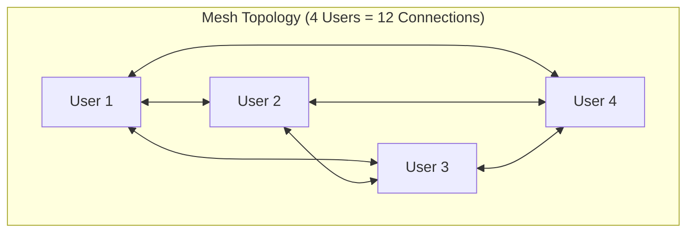
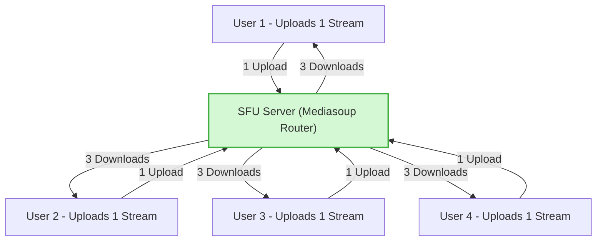
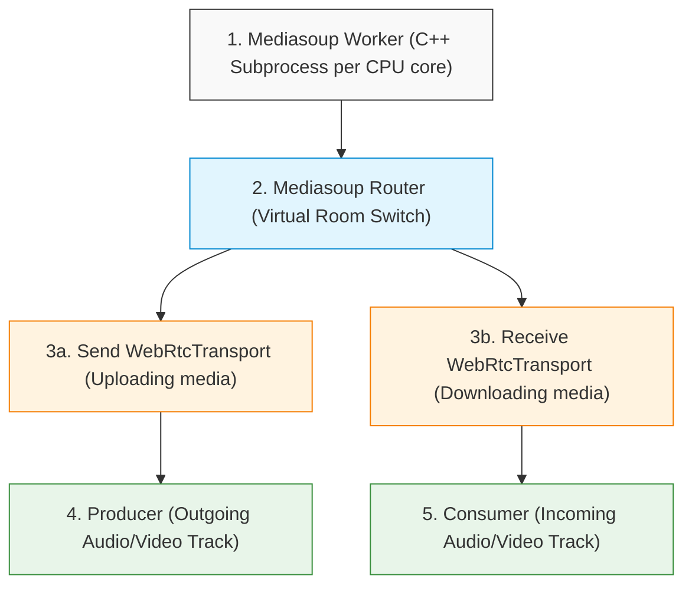
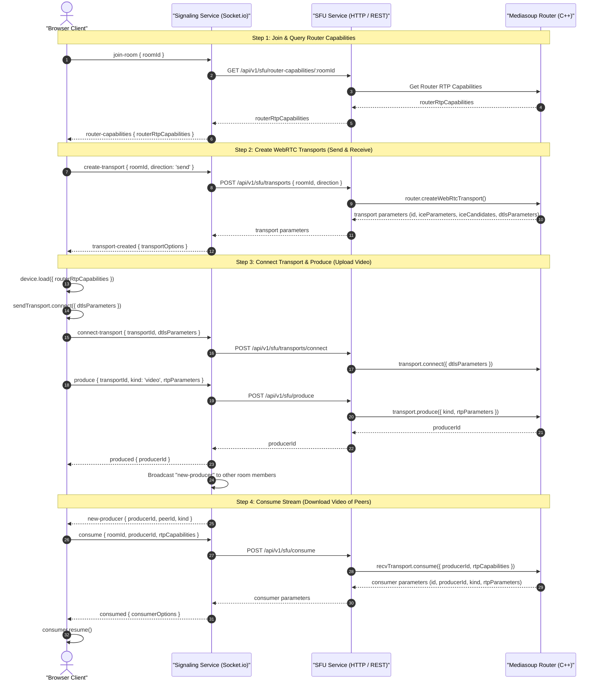

# Video Meet App — Phase 9 (SFU Service & Group Video Calls)

> **Stack for this service:** TypeScript, ES Modules (`"type": "module"`), Express, **Mediasoup v3** (Node.js + C++ WebRTC Media Engine), Redis (state & pub/sub), Docker (`Dockerfile` + root `docker-compose.yml` entry).

---

## Part A — System Architecture & Concept Guide

### 1. Why Mesh (Peer-to-Peer) Fails for Group Calls (3+ Users)

In **Phase 6 & 7**, we built **Mesh WebRTC (P2P)**. In a 2-person call, user A sends 1 stream to user B, and receives 1 stream.

```
Mesh 1:1 Call (2 Users)
[ User A ] <======== 1 Stream Upload / 1 Stream Download ========> [ User B ]
```

When a 4th or 5th user joins a Mesh call, **every user must send their video to EVERY other user directly**:



| Participants ($N$) | Connections per User | Total Uploads per User | Client CPU & Bandwidth Load |
| :---: | :---: | :---: | :---: |
| **2** | 1 | 1 | 🟢 Minimal |
| **4** | 3 | 3 | 🟡 High CPU & 720p Upload Lag |
| **8** | 7 | 7 | 🔴 **Browser Crash / Severe Lag** |

---

### 2. The Solution: Selective Forwarding Unit (SFU) with Mediasoup

An **SFU (Selective Forwarding Unit)** acts as a central intelligent WebRTC media server.

- Each user uploads their audio/video **ONCE** to the SFU server.
- The SFU receives the stream and **forwards (routes)** it to all other participants in the room.



---

## Part B — Mediasoup Core Concepts Explained Simply

Mediasoup uses specific WebRTC abstractions:



1. **Worker**: A C++ native subprocess spawned by Node.js. Handles real-time WebRTC RTP/RTCP packets with zero garbage collection pauses.
2. **Router**: Created inside a Worker for each `roomId`. Acts as the virtual room switch that knows how to route codecs (VP8, H264, Opus).
3. **WebRtcTransport**: ICE candidate & DTLS handshake endpoint between a client browser and the Mediasoup Router. Each client opens:
   - **1 Send Transport** (to send camera & mic to SFU)
   - **1 Receive Transport** (to receive other users' streams from SFU)
4. **Producer**: Represents an active track (e.g. Video camera or Audio mic) pushed into the SFU by a client.
5. **Consumer**: Represents a track forwarded from an existing Producer out to a receiving client.

---

## Part C — Full End-to-End Signaling & WebRTC Sequence



---

## Part D — Folder & Service Structure

```
services/
└── sfu-service/
    ├── src/
    │   ├── config/
    │   │   ├── env.ts                   ← Service environment variables & port (4006)
    │   │   └── mediasoup.ts             ← Worker settings, RTC ports range & codecs configuration
    │   ├── mediasoup/
    │   │   ├── workerPool.ts            ← Spawns & balances Mediasoup C++ Workers
    │   │   ├── roomManager.ts           ← Manages active Routers per roomId
    │   │   ├── transportManager.ts      ← Handles WebRtcTransport creation & connection
    │   │   ├── producerManager.ts       ← Tracks active Producers by producerId & roomId
    │   │   └── consumerManager.ts       ← Manages Consumers and resume lifecycle
    │   ├── controllers/
    │   │   ├── routerController.ts      ← GET /router-capabilities/:roomId
    │   │   ├── transportController.ts   ← POST /transports, POST /transports/connect
    │   │   ├── produceController.ts     ← POST /produce
    │   │   └── consumeController.ts     ← POST /consume
    │   ├── middleware/
    │   │   ├── authGuard.ts             ← Validates JWT tokens
    │   │   └── errorHandler.ts          ← Central error handling
    │   ├── routes/
    │   │   └── sfuRoutes.ts             ← Express endpoints for internal Signaling calls
    │   ├── utils/
    │   │   ├── AppError.ts
    │   │   ├── logger.ts
    │   │   └── response.ts
    │   └── app.ts
    ├── dockerfile
    ├── package.json
    ├── server.ts
    └── tsconfig.json
```

---

## Part E — Step-by-Step Build & Verification Checklist

| Step | Action | Description | Verification Checkpoint |
| :---: | :--- | :--- | :--- |
| **1** | **Branch & Skeleton** | Create `phase-9-sfu-service` branch and `sfu-service` directory structure. | `git status` shows clean branch `phase-9-sfu-service`. |
| **2** | **Docker & Config** | Add `sfu-service` to `docker-compose.yml` (Port 4006) with RTC port ranges (`40000-49999/udp`). | `docker-compose config` succeeds with no syntax errors. |
| **3** | **Package & Mediasoup** | Setup `package.json` with `mediasoup`, `express`, `dotenv`, `pino`, `jsonwebtoken`. | `npm install` completes cleanly. |
| **4** | **Mediasoup Config** | Define Worker & Router Codecs (`VP8`, `H264`, `Opus`) in `src/config/mediasoup.ts`. | Code compiles with TypeScript without errors. |
| **5** | **Worker & Room Manager** | Implement `workerPool.ts` (worker lifecycle) and `roomManager.ts` (router creation per `roomId`). | Service starts and logs `Mediasoup Worker created`. |
| **6** | **Transport & Produce API** | Implement `/transports` and `/produce` endpoints for SFU ingress. | `POST /transports` returns ICE/DTLS parameters. |
| **7** | **Consume API** | Implement `/consume` and `/consumer/resume` endpoints for SFU egress forwarding. | `POST /consume` creates valid consumer parameters. |
| **8** | **Integration** | Rebuild `sfu-service` container in Docker Compose and run health/API verification tests. | `GET /health` returns `{ status: "ok" }`. |

---

## 🎯 Current Status

- ✅ **Branch Created**: `phase-9-sfu-service`
- ✅ **Documentation Created**: [`services/sfu-service/md/readme.md`](file:///c:/Users/swaru/OneDrive/Desktop/PROJECT/GOOGLE_MEET/services/sfu-service/md/readme.md)
- 🚀 **Next Phase Action**: Begin implementing Step 1-3 (Folder skeleton, `package.json`, `tsconfig.json`, and Mediasoup configuration).
