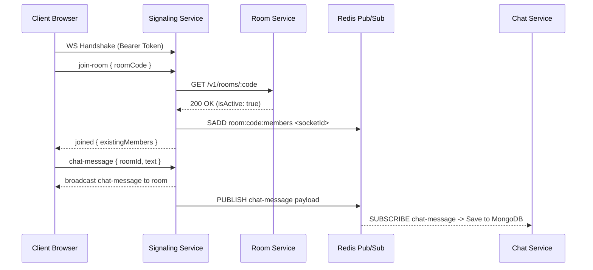

# signaling-service

**Port:** 4004 | **Database:** None (Redis for presence & Pub/Sub)  
**Status:** ✅ Phase 5 & Phase 8 Completed

WebRTC signaling and real-time messaging server built on Socket.io and TypeScript. Clients connect directly via WebSocket (`ws://localhost:4004`). Authenticates connections via JWT on the WebSocket handshake, verifies room active status by calling room-service over HTTP, relays WebRTC offer/answer/ICE-candidate messages between peers, and broadcasts live chat messages while publishing them to Redis Pub/Sub.

---

## Key Features

- **JWT Authentication (`socketAuth` middleware):** Inspects incoming socket handshake (`auth.token` or `query.token`) via Auth Service `/internal/verify-token`.
- **Room Validation:** Verifies room active status by querying Room Service (`GET /v1/rooms/:code`).
- **Presence Tracking:** Tracks active socket IDs per room code in Redis sets (`room:<code>:members`).
- **WebRTC Relay:** Pure relay for `offer`, `answer`, and `ice-candidate` signaling payloads between callers and receivers.
- **Realtime & Persistent Chat Relay:** Listens for `chat-message`, broadcasts instantly to all room participants, and publishes the payload to the Redis `chat-message` Pub/Sub channel for background persistence by Chat Service.

---

## Socket.io Events Reference

### Client → Server

| Event | Payload | Action |
|---|---|---|
| `join-room` | `{ roomCode: string }` | Verifies room via Room Service, joins Socket.io room, adds to Redis set, emits `joined` to sender and `peer-joined` to room. |
| `offer` | `{ targetSocketId: string, sdp: any }` | Relays SDP offer to target socket with `fromSocketId`. |
| `answer` | `{ targetSocketId: string, sdp: any }` | Relays SDP answer to target socket with `fromSocketId`. |
| `ice-candidate` | `{ targetSocketId: string, candidate: any }` | Relays ICE candidate to target socket with `fromSocketId`. |
| `chat-message` | `{ roomId: string, text: string, senderName?: string }` | Broadcasts message to room (`io.to(roomId).emit('chat-message')`) and publishes payload to Redis channel. |
| `leave-room` | `{ roomCode: string }` | Removes socket from Redis member set and notifies room via `peer-left`. |
| `disconnect` | — | Cleans up socket from Redis sets and notifies remaining room members. |

### Server → Client

| Event | Payload | Description |
|---|---|---|
| `joined` | `{ existingMembers: string[] }` | Sent to client upon successfully joining a room. |
| `peer-joined` | `{ socketId: string, userId: string }` | Sent to existing room members when a new peer joins. |
| `peer-left` | `{ socketId: string }` | Sent to room members when a peer leaves or disconnects. |
| `offer` | `{ fromSocketId: string, sdp: any }` | Relayed SDP offer from peer. |
| `answer` | `{ fromSocketId: string, sdp: any }` | Relayed SDP answer from peer. |
| `ice-candidate` | `{ fromSocketId: string, candidate: any }` | Relayed ICE candidate from peer. |
| `chat-message` | `{ roomId: string, senderId: string, senderName: string, text: string }` | Broadcast chat message. |
| `join-error` / `chat-error` | `string` | Error response message. |

---

## Architecture & Data Flow



---

## Environment Variables

Source: `.env.docker`

| Variable | Example | Description |
|---|---|---|
| `PORT` | `4004` | Listening port for Socket.io |
| `JWT_ACCESS_SECRET` | `secret` | Shared secret for verifying JWT tokens |
| `REDIS_URL` | `redis://redis:6379` | Redis connection URL for presence and Pub/Sub |
| `ROOM_SERVICE_URL` | `http://room-service:4003` | Room Service internal URL |
| `NODE_ENV` | `development` | Environment mode |

---

## Running & Testing

```bash
# Install dependencies
npm install

# Run in development mode
npm run dev
```
